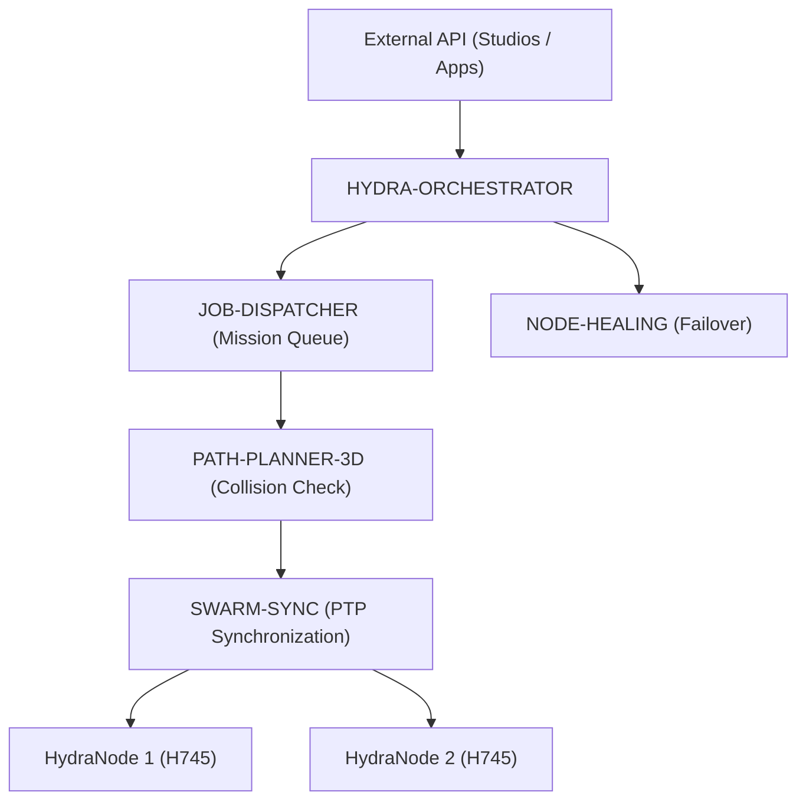

<p align="center">
  
</p>

# 🕸️ HYDRA-UMC-ORCHESTRATOR

<p align="center">🇺🇸 <b>English</b> | <a href="README_spa.md">🇪🇸 Español</a> | <a href="README_fra.md">🇫🇷 Français</a> | <a href="README_ita.md">🇮🇹 Italiano</a> | <a href="README_deu.md">🇩🇪 Deutsch</a> | <a href="README_zho.md">🇨🇳 简体中文</a> | <a href="README_jpn.md">🇯🇵 日本語</a></p>

### 🤖 Distributed Swarm Manager & Multi-Node Coordinator

<p align="left">
  
  
  
  
</p>

---

## 1. 🛠️ TECHNICAL OVERVIEW

**HYDRA-UMC-ORCHESTRATOR** is the high-level coordination layer of the HYDRA-UMC ecosystem. It manages multiple HydraNodes (Kinematic Brains, Vision Nodes, and Cognitive Nodes) as a single, unified swarm.

It handles global mission planning, load balancing across the fleet, and real-time synchronization between robots to prevent physical collisions and ensure millimetric precision in multi-robot collaborative tasks.

### Key Features:
* 🕸️ **Swarm Coordination:** Orchestrates up to 32+ independent robot arms across multiple controllers.
* ⚖️ **Load Balancing:** Automatically assigns missions to the most available or best-equipped robot.
* 🛡️ **Centralized Safety:** Global E-STOP management and fleet-wide health monitoring.
* 📡 **Unified API:** Provides a single entry point for APPs and Studios to interact with the entire factory.
* 🧩 **Real v0 - Mission State Machine:** `mission.rs` tracks every mission through `Pending -> Dispatched -> InProgress -> Completed` (plus `Cancelled`/`Failed` terminal states), with idempotent cancellation and real recovery when a node is reported unreachable/invalid - see `mission-demo` below. Pure in-memory logic - no live JOB-DISPATCHER/NODE-HEALING gRPC peer needed to run or test it.

---

## 2. 🔄 ORCHESTRATION ARCHITECTURE



---

## 3. 🧠 ARCHITECTURE & DESIGN DECISIONS

> The internal layers below are the planned design for the logic that will
> sit behind this entry point - see "🔧 BUILD & RUN" further down for what
> actually runs today: a real, pure in-memory mission state machine
> (`mission.rs`), still without any live network peer to talk to.

**Planned internal layers**, to be built out incrementally on top of the
real state machine that already exists:
* **API layer** — receives high-level mission requests from Studios/Apps
  and translates them into fleet-level actions.
* **Mission queue integration** — hands accepted missions off to
  JOB-DISPATCHER and tracks their lifecycle across the fleet using the
  real `Mission`/`MissionRegistry` state machine that already exists in
  `mission.rs` - what's still missing is the gRPC wiring to a real
  JOB-DISPATCHER to hand missions off to.
* **PTP-synced dispatch** — coordinates timing with SWARM-SYNC so multiple
  robots executing the same mission stay collision-free per
  PATH-PLANNER-3D's checks.
* **Fleet health aggregation** — consumes NODE-HEALING's per-node signals
  into a single fleet-wide view and calls `MissionRegistry::recover_node_unavailable()`
  (already real) once each signal arrives; this is also the path a global
  E-STOP would travel through to reach every node at once.

### Why Rust for this specific service
This process is the one with the most authority over the fleet: it is what
would issue a global E-STOP and arbitrate which robot gets which mission.
That role needs deterministic, low-latency coordination — no garbage
collector pauses that could delay a safety-critical stop — and
compile-time memory/type safety, since a crash or a data race here does
not stay local: it can leave the whole swarm without its coordinator
mid-mission. Two of this orchestrator's own children (JOB-DISPATCHER,
NODE-HEALING) use Go instead, a good fit for their simpler, more isolated
jobs; it is not the trade-off this particular "brain" process needs.

### Design decisions
* **Only process with a family-wide `docker-compose.yml`.** As the
  integration parent of SWARM-SYNC, PATH-PLANNER-3D, JOB-DISPATCHER and
  NODE-HEALING, this repository is the natural place to describe how the
  whole family runs together — each child's own repo stays focused on
  itself.
* **Exposes a "Unified API" for Apps/Studios.** Rather than every client
  (mobile apps, desktop Studios) talking to 4 separate child services
  directly, they talk to one stable entry point here, which stays free to
  route to whichever child implementation changes underneath it.
* **Why `cancel()` is idempotent instead of erroring on an already-cancelled mission.** A cancel request can legitimately arrive twice - a client retrying after a dropped response, an operator clicking cancel again before seeing confirmation. Treating the second call as a success (`AlreadyCancelled`, not an error) means the caller never has to distinguish "my cancel worked" from "someone else's cancel already worked" - both are the same good outcome. Cancelling a `Completed`/`Failed` mission is still refused: that is a genuinely different, non-idempotent situation (undoing finished work), not a retry.
* **Why node-failure recovery requeues to `Pending` instead of failing the mission outright.** A node reporting `UNREACHABLE` might be mid-restart rather than permanently gone (see `HYDRA-UMC-NODE-HEALING`'s own bounded-retry logic, which already absorbs transient blips before ever reporting a node down at all) - so a mission caught on that node gets a fresh shot at a different node via `Pending`, rather than being marked `Failed` on the first sign of trouble. `fail()` still exists for when redispatch genuinely runs out of options.

For every real `mission-demo`/CLI example (captured from an actual built binary), see [`docs/CLI_REFERENCE.md`](docs/CLI_REFERENCE.md). For the shared `hydra.common.v1` gRPC contract itself - what it defines, why it lives in this repo, and how each language generates its own bindings from it - see [`proto/README.md`](proto/README.md).

---

## 📂 DIRECTORY STRUCTURE

```text
HYDRA-UMC-ORCHESTRATOR/
├── src/
│   ├── mission.rs         # Real mission state machine (Mission, MissionRegistry)
│   ├── job_dispatcher.rs  # Real client for HYDRA-UMC-JOB-DISPATCHER's own HTTP API
│   ├── server.rs          # Plain JSON/HTTP surface (tiny_http, blocking, no async runtime)
│   └── main.rs            # Entry point + real `mission-demo` subcommand
├── proto/            # Shared gRPC contract for node-to-node traffic
│                     # across the ecosystem (see proto/README.md) -
│                     # not just this repo's own API
├── docs/             # Documentation and architecture guides
├── build/            # Compiled binaries (build.sh/build.bat output)
├── images/           # Media and diagrams
├── systemd/
│   └── hydra-umc-orchestrator.service # Local CM5 mission/dispatch API systemd unit
├── tools/
│   ├── build_test.py # Non-versioning build/compile check
│   └── ci_validate.py # Manifest/CHANGELOG/docs validation used by CI
├── Cargo.toml        # Rust package manifest (name, version, deps)
├── bump_version.py   # Odometer-style native version bump, run by build.sh/.bat
├── bump_manifest_version.py # Syncs hydra-umc.project.json's version to the native one (--sync)
├── build.sh/.bat     # Bumps version, then `cargo build --release`
├── build-test.sh/.bat # Non-versioning build check (no CHANGELOG/version bump)
├── run.sh/.bat       # Runs the compiled binary
├── docker-compose.yml # Integrates this repo with its 4 real children
└── README.md
```

Pruned from the original template: `hardware/`, `firmware/` and `os/` — this
is a pure software service (Rust binary) with no dedicated hardware or
firmware of its own, and no operating system image to maintain.

---

## 🔧 BUILD & RUN GUIDE

Bare invocation stays a minimal skeleton (prints identity, exits 0); the
real mission state machine is exercisable today via `mission-demo`.

```bash
# Windows
build.bat
run.bat
run.bat mission-demo

# Linux / macOS
./build.sh
./run.sh
./run.sh mission-demo
```

`build.sh`/`build.bat` bump the version in `Cargo.toml` (ecosystem-wide
odometer rule, see `bump_version.py`) and then run `cargo build --release`.
`run.sh`/`run.bat` execute the resulting binary directly.

`mission-demo` runs a real scenario end-to-end against `mission.rs`'s
`MissionRegistry` and prints every real transition:

```text
[orchestrator] mission-1: dispatched -> InProgress(node=node-a)
[orchestrator] mission-2: dispatched -> Dispatched(node=node-a)
[orchestrator] mission-3: dispatched -> InProgress(node=node-b)
[orchestrator] node-a reported UNREACHABLE by NODE-HEALING - recovering its missions
[orchestrator] mission-1: requeued -> Pending
[orchestrator] mission-2: requeued -> Pending
[orchestrator] mission-3: unaffected (different node) -> InProgress(node=node-b)
[orchestrator] mission-2: cancel() -> Cancelled -> Cancelled
[orchestrator] mission-2: cancel() again (idempotent) -> AlreadyCancelled -> Cancelled
[orchestrator] mission-3: complete() -> Completed(node=node-b)
[orchestrator] mission-4: fail() -> Failed(no healthy node accepted redispatch after 3 attempts)
[orchestrator] final registry state:
  mission-1: Pending (terminal=false)
  mission-2: Cancelled (terminal=true)
  mission-3: Completed(node=node-b) (terminal=true)
  mission-4: Failed(no healthy node accepted redispatch after 3 attempts) (terminal=true)
```

```bash
cargo test   # 42 tests: every transition, every invalid-transition
             # rejection, idempotent cancel, and node-failure recovery
```

As the ecosystem's integration parent, this repo also ships a real
`docker-compose.yml` that builds and runs itself together with its 4
children (SWARM-SYNC, PATH-PLANNER-3D, JOB-DISPATCHER, NODE-HEALING),
checked out as sibling folders:

```bash
docker compose up --build
```

---

## 🚀 ROADMAP
* **Phase 1:** Deterministic swarm synchronization over TSN and sub-ms jitter reduction.
* **Phase 2:** 3D Path planning with dynamic obstacle avoidance in multi-robot cells.
* **Phase 3:** Multi-robot job dispatching optimization using real-time resource availability.
* **Phase 4:** High-availability failover cluster implementation and heterogeneous robot support.

---

## 🔗 Related Projects

This project is part of the HYDRA-UMC robotics ecosystem by the same author (JuanenRac / Electro Hobby 3D). Worth knowing about, since a request might actually be about one of these rather than this repository.

**Child Projects** — each one is a service this orchestrator coordinates or feeds directly
- **[HYDRA-UMC-SWARM-SYNC](https://github.com/JuanenRac/HYDRA-UMC-SWARM-SYNC)** — real CRDT LWW-Element-Map state sync, property-tested for multi-cell convergence.
- **[HYDRA-UMC-PATH-PLANNER-3D](https://github.com/JuanenRac/HYDRA-UMC-PATH-PLANNER-3D)** — real RRT-based 3D path planner with real obstacle/workspace collision validation.
- **[HYDRA-UMC-JOB-DISPATCHER](https://github.com/JuanenRac/HYDRA-UMC-JOB-DISPATCHER)** — real priority-based job queue with deduplication, over a real HTTP API.
- **[HYDRA-UMC-NODE-HEALING](https://github.com/JuanenRac/HYDRA-UMC-NODE-HEALING)** — real gRPC-based fleet health watchdog with retry/backoff and identity-mismatch detection.

**Directly Related**
- **[HYDRA-UMC-SERVER](https://github.com/JuanenRac/HYDRA-UMC-SERVER)** — the real headless backend (REST/WebSocket) every control client actually talks to; this orchestrator coordinates multiple instances of it.
- **[HYDRA-UMC-COGNITIVE-NODE](https://github.com/JuanenRac/HYDRA-UMC-COGNITIVE-NODE)** — integration hub for the Hailo-10 cognitive pipeline (LLM/VLA/voice orchestration); it receives mission-level orders from here.
- **[HYDRA-UMC-SUITE](https://github.com/JuanenRac/HYDRA-UMC-SUITE)** — desktop (PySide6) swarm command center for multiple servers at once, packaged as a standalone executable; the swarm command center this orchestrator backs.

**Also Part of the Ecosystem**

*Core Hardware & Platform*
- **[HYDRA-UMC](https://github.com/JuanenRac/HYDRA-UMC)** — the physical robot-arm motherboard: CM5 host + dual-core STM32H745, orchestrating up to 8 tool arms over CAN-OTA/SPI-OTA.
- **[HYDRA-UMC-OS](https://github.com/JuanenRac/HYDRA-UMC-OS)** — reproducible Raspberry Pi OS product layer for the CM5: read-only agent, validated config/profiles, WiFi first-contact provisioning.
- **[HYDRA-UMC-SDK](https://github.com/JuanenRac/HYDRA-UMC-SDK)** — the shared JSON-Schema contract and safety-gate boundary every bridge validates its commands against.

*Core Backend & Clients*
- **[HYDRA-UMC-STUDIO](https://github.com/JuanenRac/HYDRA-UMC-STUDIO)** — web control dashboard with real-time multi-robot 3D visualization.
- **[HYDRA-UMC-ANDROID-CONTROL](https://github.com/JuanenRac/HYDRA-UMC-ANDROID-CONTROL)** — native Android control app with biometric login and a paired Wear OS companion.
- **[HYDRA-UMC-IOS-CONTROL](https://github.com/JuanenRac/HYDRA-UMC-IOS-CONTROL)** — iOS/iPadOS control app (Flutter) with real-time WebSocket sync.
- **[HYDRA-UMC-DSI](https://github.com/JuanenRac/HYDRA-UMC-DSI)** — native touch UI for the onboard 7" DSI touchscreen, embedded on the CM5 itself.
- **[HYDRA-UMC-EDITOR-URDF](https://github.com/JuanenRac/HYDRA-UMC-EDITOR-URDF)** — desktop graphical URDF creator/editor that pushes finished models into STUDIO's own catalog.
- **[HYDRA-UMC-BRIDGE-AMR](https://github.com/JuanenRac/HYDRA-UMC-BRIDGE-AMR)** — coordination boundary for AGV/AMR fleets via a real VDA 5050 MQTT publisher.
- **[HYDRA-UMC-BRIDGE-CNC](https://github.com/JuanenRac/HYDRA-UMC-BRIDGE-CNC)** — high-level CNC-cell coordinator with real GRBL status/control-byte access.
- **[HYDRA-UMC-BRIDGE-DROIDS](https://github.com/JuanenRac/HYDRA-UMC-BRIDGE-DROIDS)** — coordination boundary for legged/humanoid droids, with a real Boston Dynamics Spot command sender.
- **[HYDRA-UMC-BRIDGE-LASER](https://github.com/JuanenRac/HYDRA-UMC-BRIDGE-LASER)** — laser-cell safety coordinator reading 3 real key/enclosure/interlock GPIO safeguards.
- **[HYDRA-UMC-BRIDGE-OPENPNP](https://github.com/JuanenRac/HYDRA-UMC-BRIDGE-OPENPNP)** — safe high-level board-flow coordinator for OpenPnP pick-and-place.
- **[HYDRA-UMC-BRIDGE-PRINTER3D](https://github.com/JuanenRac/HYDRA-UMC-BRIDGE-PRINTER3D)** — safe coordination boundary for Moonraker/Klipper 3D printers, with real gated job commands.
- **[HYDRA-UMC-BRIDGE-ROS2](https://github.com/JuanenRac/HYDRA-UMC-BRIDGE-ROS2)** — safety coordinator with a real, lazily-imported rclpy ROS 2 transport.
- **[HYDRA-UMC-BRIDGE-UAV](https://github.com/JuanenRac/HYDRA-UMC-BRIDGE-UAV)** — coordination boundary for camera-equipped UAVs, with a real MAVLink command sender.

*URTC Tool Platform*
- **[URTC](https://github.com/JuanenRac/URTC)** — firmware for the physical Universal Robot Tool Controller PCB, 25+ tool profiles over CAN bus.
- **[URTC-FLASHER](https://github.com/JuanenRac/URTC-FLASHER)** — desktop GUI flashing tool for URTC boards, CAN-OTA plus full-chip SWD/JTAG.
- **[URTC-TESTER](https://github.com/JuanenRac/URTC-TESTER)** — desktop live CAN-bus diagnostic tool for URTC boards, one panel per tool profile.
- **[URTC-WEB-STUDIO](https://github.com/JuanenRac/URTC-WEB-STUDIO)** — browser-based alternative to URTC-TESTER via the Web Serial API, no local install needed.

*Vision AI Node (Hailo-8)*
- **[HYDRA-UMC-VISION-NODE](https://github.com/JuanenRac/HYDRA-UMC-VISION-NODE)** — integration hub for the Hailo-8 vision pipeline, with a real per-stage hardware-readiness check.
- **[HYDRA-UMC-DETECTION-HEF](https://github.com/JuanenRac/HYDRA-UMC-DETECTION-HEF)** — real compiled-model registry with Hailo-architecture/checksum safe-load verification.
- **[HYDRA-UMC-VISION-STREAMER](https://github.com/JuanenRac/HYDRA-UMC-VISION-STREAMER)** — real GStreamer pipeline + MediaMTX config generator with a real HailoRT integration boundary.
- **[HYDRA-UMC-VISUAL-SERVOING-API](https://github.com/JuanenRac/HYDRA-UMC-VISUAL-SERVOING-API)** — real Position-Based Visual Servoing correction law, safety-gated on upstream zone state.
- **[HYDRA-UMC-SAFETY-ZONES](https://github.com/JuanenRac/HYDRA-UMC-SAFETY-ZONES)** — real zone-breach checking and E-STOP requesting, with calibration-freshness enforcement.

*Cognitive AI Node (Hailo-10)*
- **[HYDRA-UMC-VLA-ENGINE](https://github.com/JuanenRac/HYDRA-UMC-VLA-ENGINE)** — real action-token encoding/decoding and trajectory generation for a Vision-Language-Action model.
- **[HYDRA-UMC-VOICE-UI](https://github.com/JuanenRac/HYDRA-UMC-VOICE-UI)** — real voice front-end (VAD + intent parser) with a bounded, confirmation-gated Watch relay.
- **[HYDRA-UMC-SEMANTIC-PLANNER](https://github.com/JuanenRac/HYDRA-UMC-SEMANTIC-PLANNER)** — real rule-based task decomposition and semantic error recovery over MCU error codes.
- **[HYDRA-UMC-DOCS-QA](https://github.com/JuanenRac/HYDRA-UMC-DOCS-QA)** — real stdlib-only TF-IDF document search over this ecosystem's own Markdown docs.

*Digital Twin & Simulation*
- **[HYDRA-UMC-TWIN](https://github.com/JuanenRac/HYDRA-UMC-TWIN)** — integration hub for the digital-twin engine, with a real version-compatibility sync contract.
- **[HYDRA-UMC-HIL-BRIDGE](https://github.com/JuanenRac/HYDRA-UMC-HIL-BRIDGE)** — real hardware-in-the-loop safety interlock routing commands between simulation and real hardware.
- **[HYDRA-UMC-PHYSICS-REPLICA](https://github.com/JuanenRac/HYDRA-UMC-PHYSICS-REPLICA)** — real forward kinematics and joint-limit validation over a real URDF subset.
- **[HYDRA-UMC-SYNTHETIC-DATA-GEN](https://github.com/JuanenRac/HYDRA-UMC-SYNTHETIC-DATA-GEN)** — real procedural 2D scene generator with YOLO/COCO annotation export.

*Data & Analytics*
- **[HYDRA-UMC-DATALAKE](https://github.com/JuanenRac/HYDRA-UMC-DATALAKE)** — real sqlite3-backed time-series store with a real ingest/query HTTP API.
- **[HYDRA-UMC-ANOMALY-DETECTOR](https://github.com/JuanenRac/HYDRA-UMC-ANOMALY-DETECTOR)** — real FFT + statistical baseline anomaly detector with drift monitoring.
- **[HYDRA-UMC-PRODUCTION-REPORTS](https://github.com/JuanenRac/HYDRA-UMC-PRODUCTION-REPORTS)** — real OEE/availability calculation over DATALAKE history, with reproducible CSV export.
- **[HYDRA-UMC-TELEMETRY-COLLECTOR](https://github.com/JuanenRac/HYDRA-UMC-TELEMETRY-COLLECTOR)** — real CAN/WebSocket ingestion pipeline into DATALAKE, with sequence deduplication.

*Industrial Gateway*
- **[HYDRA-UMC-GATEWAY-INDUSTRIAL](https://github.com/JuanenRac/HYDRA-UMC-GATEWAY-INDUSTRIAL)** — integration hub relaying to industrial protocols, with a real command allowlist/backpressure layer.
- **[HYDRA-UMC-OPCUA-SERVER](https://github.com/JuanenRac/HYDRA-UMC-OPCUA-SERVER)** — real OPC-UA address space, verified with a real binary-protocol client session.
- **[HYDRA-UMC-MQTT-BROKER](https://github.com/JuanenRac/HYDRA-UMC-MQTT-BROKER)** — real MQTT broker with optional per-client authentication and topic ACLs.
- **[HYDRA-UMC-MTCONNECT-ADAPTER](https://github.com/JuanenRac/HYDRA-UMC-MTCONNECT-ADAPTER)** — real MTConnect `/probe` and `/current` XML endpoints with degraded-mode output.

*Complementary Tools & Ecosystem Operations*
- **[HYDRA-UMC-DASHBOARD-AI](https://github.com/JuanenRac/HYDRA-UMC-DASHBOARD-AI)** — Smart Summaries and Anomaly Highlighting panels over DATALAKE/ANOMALY-DETECTOR, with an honest statistical fallback.
- **[HYDRA-UMC-TOOL-CLI](https://github.com/JuanenRac/HYDRA-UMC-TOOL-CLI)** — fleet CLI with a real, stable exit-code contract, a genuine live client of HYDRA-UMC-SERVER's own API.
- **[HYDRA-UMC-WATCH](https://github.com/JuanenRac/HYDRA-UMC-WATCH)** — WearOS companion app with real haptic alerts and a paired-phone voice relay.
- **[URTC-SMART-RACK](https://github.com/JuanenRac/URTC-SMART-RACK)** — firmware for a board-mounting rack with real tool-ID decoding and Smart Idle pre-heating logic.
- **[URTC-VISION-TOOL](https://github.com/JuanenRac/URTC-VISION-TOOL)** — firmware plus a real Python vision companion for a thermal/RGB inspection tool head.
- **[HYDRA-UMC-UPDATER](https://github.com/JuanenRac/HYDRA-UMC-UPDATER)** — administrative desktop tool that discovers, clones and updates every repo in this ecosystem.
- **[HYDRA-UMC-OS-REBUILDER](https://github.com/JuanenRac/HYDRA-UMC-OS-REBUILDER)** — Windows/Linux desktop tool that builds a ready-to-flash CM5 image pre-loaded with the ecosystem's most current versions, with Raspberry-Pi-Imager-style first-boot Wi-Fi/user/SSH configuration.


---

## 📚 Documentation & Community

- **[CONTRIBUTING.md](CONTRIBUTING.md)** — tech stack and coding guidelines for a pull request.
- **[CODE_OF_CONDUCT.md](CODE_OF_CONDUCT.md)** — the standards of behavior expected in this community.
- **[SECURITY.md](SECURITY.md)** — how to report a vulnerability, and this project's own real security focus areas.
- **[SUPPORT.md](SUPPORT.md)** — where to ask questions and report bugs.
- **[LICENSE.md](LICENSE.md)** — this project's own license.

## 👤 AUTHOR
**JuanenRac** (Electro Hobby 3D)
📧 electrohobby3d@gmail.com
📺 [youtube.com/@electrohobby3d](https://youtube.com/@electrohobby3d)

## 📜 LICENSE
GPL-3.0 - See LICENSE for details.
