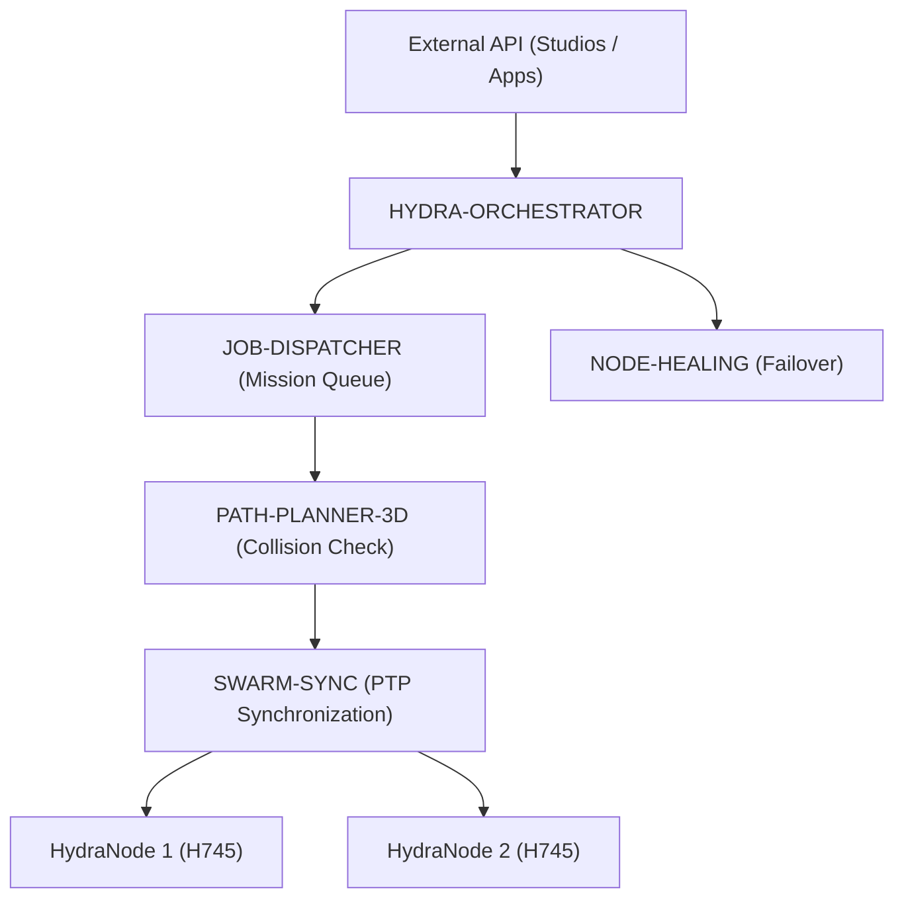

<p align="center">
  
</p>

# 🕸️ HYDRA-UMC-ORCHESTRATOR

<p align="center">🇺🇸 <b>English</b> | <a href="README_spa.md">🇪🇸 Español</a> | <a href="README_fra.md">🇫🇷 Français</a> | <a href="README_ita.md">🇮🇹 Italiano</a> | <a href="README_deu.md">🇩🇪 Deutsch</a> | <a href="README_zho.md">🇨🇳 简体中文</a> | <a href="README_jpn.md">🇯🇵 日本語</a></p>

### 🤖 Distributed Swarm Manager & Multi-Node Coordinator

<p align="left">
  
  
  
  
</p>

---

## 1. 🛠️ TECHNICAL OVERVIEW

**HYDRA-UMC-ORCHESTRATOR** is the high-level coordination layer of the HYDRA-UMC ecosystem. It manages multiple HydraNodes (Kinematic Brains, Vision Nodes, and Cognitive Nodes) as a single, unified swarm.

It handles global mission planning, load balancing across the fleet, and real-time synchronization between robots to prevent physical collisions and ensure millimetric precision in multi-robot collaborative tasks.

### Key Features:
* 🕸️ **Swarm Coordination:** Orchestrates up to 32+ independent robot arms across multiple controllers.
* ⚖️ **Load Balancing:** Automatically assigns missions to the most available or best-equipped robot.
* 🛡️ **Centralized Safety:** Global E-STOP management and fleet-wide health monitoring.
* 📡 **Unified API:** Provides a single entry point for APPs and Studios to interact with the entire factory.

---

## 2. 🔄 ORCHESTRATION ARCHITECTURE



---

## 3. 🧠 ARCHITECTURE & DESIGN DECISIONS

> The internal layers below are the planned design for the logic that will
> sit behind this entry point - see "🔧 BUILD & RUN" further down for what
> actually runs today (a minimal skeleton).

**Planned internal layers**, to be built out incrementally on top of the
current skeleton:
* **API layer** — receives high-level mission requests from Studios/Apps
  and translates them into fleet-level actions.
* **Mission queue integration** — hands accepted missions off to
  JOB-DISPATCHER and tracks their lifecycle across the fleet.
* **PTP-synced dispatch** — coordinates timing with SWARM-SYNC so multiple
  robots executing the same mission stay collision-free per
  PATH-PLANNER-3D's checks.
* **Fleet health aggregation** — consumes NODE-HEALING's per-node signals
  into a single fleet-wide view; this is also the path a global E-STOP
  would travel through to reach every node at once.

### Why Rust for this specific service
This process is the one with the most authority over the fleet: it is what
would issue a global E-STOP and arbitrate which robot gets which mission.
That role needs deterministic, low-latency coordination — no garbage
collector pauses that could delay a safety-critical stop — and
compile-time memory/type safety, since a crash or a data race here does
not stay local: it can leave the whole swarm without its coordinator
mid-mission. Two of this orchestrator's own children (JOB-DISPATCHER,
NODE-HEALING) use Go instead, a good fit for their simpler, more isolated
jobs; it is not the trade-off this particular "brain" process needs.

### Design decisions
* **Only process with a family-wide `docker-compose.yml`.** As the
  integration parent of SWARM-SYNC, PATH-PLANNER-3D, JOB-DISPATCHER and
  NODE-HEALING, this repository is the natural place to describe how the
  whole family runs together — each child's own repo stays focused on
  itself.
* **Exposes a "Unified API" for Apps/Studios.** Rather than every client
  (mobile apps, desktop Studios) talking to 4 separate child services
  directly, they talk to one stable entry point here, which stays free to
  route to whichever child implementation changes underneath it.

---

## 📂 DIRECTORY STRUCTURE

```text
HYDRA-UMC-ORCHESTRATOR/
├── src/              # Source code (Core, Network, API)
├── proto/            # Shared gRPC contract for node-to-node traffic
│                     # across the ecosystem (see proto/README.md) -
│                     # not just this repo's own API
├── docs/             # Documentation and architecture guides
├── build/            # Compiled binaries (build.sh/build.bat output)
├── images/           # Media and diagrams
├── scripts/          # Utility scripts
├── Cargo.toml        # Rust package manifest (name, version, deps)
├── bump_version.py   # Odometer-style version bump, run by build.sh/.bat
├── build.sh/.bat     # Bumps version, then `cargo build --release`
├── run.sh/.bat       # Runs the compiled binary
├── docker-compose.yml # Integrates this repo with its 4 real children
└── README.md
```

Pruned from the original template: `hardware/`, `firmware/` and `os/` — this
is a pure software service (Rust binary) with no dedicated hardware or
firmware of its own, and no operating system image to maintain.

---

## 🔧 BUILD & RUN

Real, minimal Rust skeleton - it compiles and runs today.

```bash
# Windows
build.bat
run.bat

# Linux / macOS
./build.sh
./run.sh
```

`build.sh`/`build.bat` bump the version in `Cargo.toml` (ecosystem-wide
odometer rule, see `bump_version.py`) and then run `cargo build --release`.
`run.sh`/`run.bat` execute the resulting binary directly.

As the ecosystem's integration parent, this repo also ships a real
`docker-compose.yml` that builds and runs itself together with its 4
children (SWARM-SYNC, PATH-PLANNER-3D, JOB-DISPATCHER, NODE-HEALING),
checked out as sibling folders:

```bash
docker compose up --build
```

---

## 🚀 ROADMAP
* **Phase 1:** Deterministic swarm synchronization over TSN and sub-ms jitter reduction.
* **Phase 2:** 3D Path planning with dynamic obstacle avoidance in multi-robot cells.
* **Phase 3:** Multi-robot job dispatching optimization using real-time resource availability.
* **Phase 4:** High-availability failover cluster implementation and heterogeneous robot support.

---

## 🔗 Related Projects

This project is part of a larger robotics ecosystem by the same author (JuanenRac / Electro Hobby 3D), spanning firmware, control software, AI nodes, and fleet tooling. Worth knowing about, since a request might actually be about one of these rather than this repository.

### Family

**Parent:** none — this project is itself the integration parent of the Orchestration & Swarm family.

**Children:**
- **[HYDRA-UMC-SWARM-SYNC](https://github.com/JuanenRac/HYDRA-UMC-SWARM-SYNC)** — CRDT-based state reconciliation across the cells this orchestrator coordinates.
- **[HYDRA-UMC-PATH-PLANNER-3D](https://github.com/JuanenRac/HYDRA-UMC-PATH-PLANNER-3D)** — collision-free path planning this orchestrator dispatches jobs against.
- **[HYDRA-UMC-JOB-DISPATCHER](https://github.com/JuanenRac/HYDRA-UMC-JOB-DISPATCHER)** — the job queue/scheduler this orchestrator feeds.
- **[HYDRA-UMC-NODE-HEALING](https://github.com/JuanenRac/HYDRA-UMC-NODE-HEALING)** — detects and routes around an unresponsive node this orchestrator manages.

### Directly Related (outside the family)

- **[HYDRA-UMC-SERVER](https://github.com/JuanenRac/HYDRA-UMC-SERVER)** — coordinates multiple instances of this backend.
- **[HYDRA-UMC-COGNITIVE-NODE](https://github.com/JuanenRac/HYDRA-UMC-COGNITIVE-NODE)** — receives mission-level orders from here.
- **[HYDRA-UMC-SUITE](https://github.com/JuanenRac/HYDRA-UMC-SUITE)** — the swarm command center this orchestrator backs.

### Rest of the Ecosystem

**HYDRA-UMC platform** — the multi-robot micro-factory cell
- **[HYDRA-UMC](https://github.com/JuanenRac/HYDRA-UMC)** — the CM5 + STM32H745 motherboard orchestrating up to 8 robot arms.
- **[HYDRA-UMC-SERVER](https://github.com/JuanenRac/HYDRA-UMC-SERVER)** — the Express/WebSocket backend every control client talks to.
- **[HYDRA-UMC-STUDIO](https://github.com/JuanenRac/HYDRA-UMC-STUDIO)** — web-based control dashboard, multi-robot 3D visualization.
- **[HYDRA-UMC-ANDROID-CONTROL](https://github.com/JuanenRac/HYDRA-UMC-ANDROID-CONTROL)** — Android control app over Wi-Fi/Bluetooth.
- **[HYDRA-UMC-IOS-CONTROL](https://github.com/JuanenRac/HYDRA-UMC-IOS-CONTROL)** — iOS/iPadOS control app built in Flutter.
- **[HYDRA-UMC-SUITE](https://github.com/JuanenRac/HYDRA-UMC-SUITE)** — desktop swarm command center (Python/PySide6).
- **[HYDRA-UMC-EDITOR-URDF](https://github.com/JuanenRac/HYDRA-UMC-EDITOR-URDF)** — desktop URDF model editor for the robot catalog.
- **[HYDRA-UMC-DSI](https://github.com/JuanenRac/HYDRA-UMC-DSI)** — native touch UI for the onboard DSI touchscreen.

**URTC platform** — the tool head controller every HYDRA-UMC robot arm carries
- **[URTC](https://github.com/JuanenRac/URTC)** — CAN bus tool head controller, 25 tool profiles.
- **[URTC-FLASHER](https://github.com/JuanenRac/URTC-FLASHER)** — desktop CAN-OTA + SWD/JTAG flashing tool.
- **[URTC-TESTER](https://github.com/JuanenRac/URTC-TESTER)** — desktop live CAN-bus diagnostic tool.
- **[URTC-WEB-STUDIO](https://github.com/JuanenRac/URTC-WEB-STUDIO)** — browser-based alternative via Web Serial API.

**🎥 Vision AI Node (Hailo-8)**
- [HYDRA-UMC-VISION-NODE](https://github.com/JuanenRac/HYDRA-UMC-VISION-NODE)
- [HYDRA-UMC-VISION-STREAMER](https://github.com/JuanenRac/HYDRA-UMC-VISION-STREAMER)
- [HYDRA-UMC-DETECTION-HEF](https://github.com/JuanenRac/HYDRA-UMC-DETECTION-HEF)
- [HYDRA-UMC-SAFETY-ZONES](https://github.com/JuanenRac/HYDRA-UMC-SAFETY-ZONES)
- [HYDRA-UMC-VISUAL-SERVOING-API](https://github.com/JuanenRac/HYDRA-UMC-VISUAL-SERVOING-API)

**🧠 Cognitive AI Node (Hailo-10)**
- [HYDRA-UMC-COGNITIVE-NODE](https://github.com/JuanenRac/HYDRA-UMC-COGNITIVE-NODE)
- [HYDRA-UMC-VLA-ENGINE](https://github.com/JuanenRac/HYDRA-UMC-VLA-ENGINE)
- [HYDRA-UMC-VOICE-UI](https://github.com/JuanenRac/HYDRA-UMC-VOICE-UI)
- [HYDRA-UMC-SEMANTIC-PLANNER](https://github.com/JuanenRac/HYDRA-UMC-SEMANTIC-PLANNER)
- [HYDRA-UMC-DOCS-QA](https://github.com/JuanenRac/HYDRA-UMC-DOCS-QA)

**🎮 Digital Twin & Simulation**
- [HYDRA-UMC-TWIN](https://github.com/JuanenRac/HYDRA-UMC-TWIN)
- [HYDRA-UMC-PHYSICS-REPLICA](https://github.com/JuanenRac/HYDRA-UMC-PHYSICS-REPLICA)
- [HYDRA-UMC-HIL-BRIDGE](https://github.com/JuanenRac/HYDRA-UMC-HIL-BRIDGE)
- [HYDRA-UMC-SYNTHETIC-DATA-GEN](https://github.com/JuanenRac/HYDRA-UMC-SYNTHETIC-DATA-GEN)

**📊 Data & Analytics**
- [HYDRA-UMC-DATALAKE](https://github.com/JuanenRac/HYDRA-UMC-DATALAKE)
- [HYDRA-UMC-TELEMETRY-COLLECTOR](https://github.com/JuanenRac/HYDRA-UMC-TELEMETRY-COLLECTOR)
- [HYDRA-UMC-ANOMALY-DETECTOR](https://github.com/JuanenRac/HYDRA-UMC-ANOMALY-DETECTOR)
- [HYDRA-UMC-PRODUCTION-REPORTS](https://github.com/JuanenRac/HYDRA-UMC-PRODUCTION-REPORTS)

**🏭 Industrial Gateway**
- [HYDRA-UMC-GATEWAY-INDUSTRIAL](https://github.com/JuanenRac/HYDRA-UMC-GATEWAY-INDUSTRIAL)
- [HYDRA-UMC-OPCUA-SERVER](https://github.com/JuanenRac/HYDRA-UMC-OPCUA-SERVER)
- [HYDRA-UMC-MQTT-BROKER](https://github.com/JuanenRac/HYDRA-UMC-MQTT-BROKER)
- [HYDRA-UMC-MTCONNECT-ADAPTER](https://github.com/JuanenRac/HYDRA-UMC-MTCONNECT-ADAPTER)

**🛠️ Complementary Tools**
- [URTC-SMART-RACK](https://github.com/JuanenRac/URTC-SMART-RACK)
- [URTC-VISION-TOOL](https://github.com/JuanenRac/URTC-VISION-TOOL)
- [HYDRA-UMC-WATCH](https://github.com/JuanenRac/HYDRA-UMC-WATCH)
- [HYDRA-UMC-TOOL-CLI](https://github.com/JuanenRac/HYDRA-UMC-TOOL-CLI)
- [HYDRA-UMC-DASHBOARD-AI](https://github.com/JuanenRac/HYDRA-UMC-DASHBOARD-AI)


## 👤 AUTHOR
**JuanenRac** (Electro Hobby 3D)
📧 electrohobby3d@gmail.com

## 📜 LICENSE
GPL-3.0 - See LICENSE for details.

## Related Projects

> Canonical public ecosystem relationship map.

**Direct integrations:**
[HYDRA-UMC-OS](https://github.com/JuanenRac/HYDRA-UMC-OS) · [HYDRA-UMC-SDK](https://github.com/JuanenRac/HYDRA-UMC-SDK) · [HYDRA-UMC-SERVER](https://github.com/JuanenRac/HYDRA-UMC-SERVER) · [URTC](https://github.com/JuanenRac/URTC) · [HYDRA-UMC-JOB-DISPATCHER](https://github.com/JuanenRac/HYDRA-UMC-JOB-DISPATCHER) · [HYDRA-UMC-SWARM-SYNC](https://github.com/JuanenRac/HYDRA-UMC-SWARM-SYNC) · [HYDRA-UMC-NODE-HEALING](https://github.com/JuanenRac/HYDRA-UMC-NODE-HEALING) · [HYDRA-UMC-UPDATER](https://github.com/JuanenRac/HYDRA-UMC-UPDATER)

**Platform and contracts:**
[HYDRA-UMC-OS](https://github.com/JuanenRac/HYDRA-UMC-OS) · [HYDRA-UMC-SDK](https://github.com/JuanenRac/HYDRA-UMC-SDK)

**Rest of the ecosystem:**
All remaining public repositories are grouped by the seven ecosystem layers in the [JuanenRac ecosystem dashboard](https://juanenrac.github.io/JuanenRac/).
