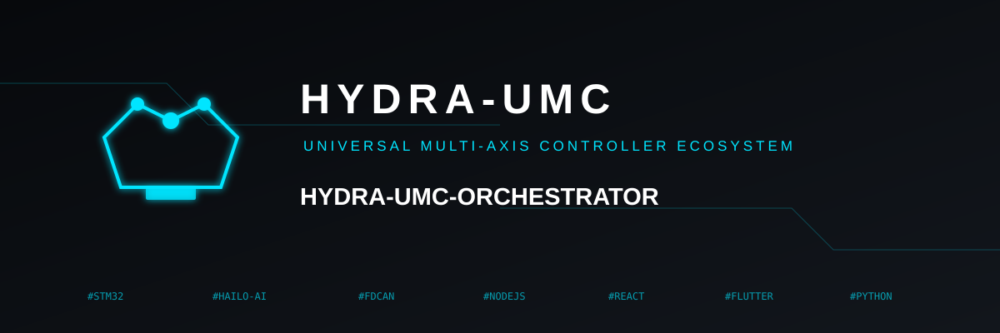
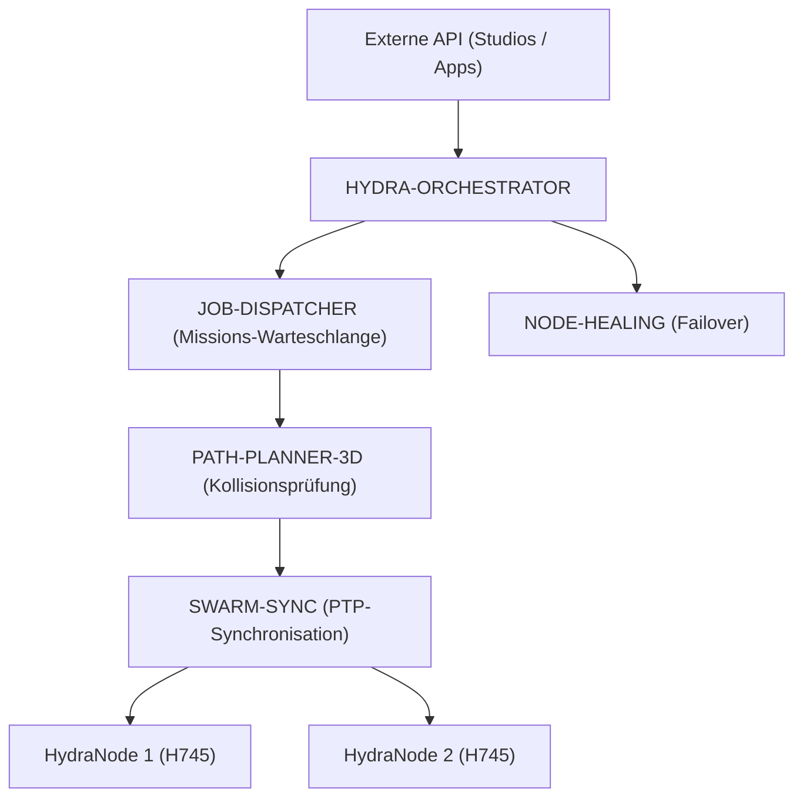

<p align="center">
  
</p>

# 🕸️ HYDRA-UMC-ORCHESTRATOR

<p align="center"><a href="README.md">🇺🇸 English</a> | <a href="README_spa.md">🇪🇸 Español</a> | <a href="README_fra.md">🇫🇷 Français</a> | <a href="README_ita.md">🇮🇹 Italiano</a> | 🇩🇪 <b>Deutsch</b> | <a href="README_zho.md">🇨🇳 简体中文</a> | <a href="README_jpn.md">🇯🇵 日本語</a></p>

### 🤖 Verteilter Schwarm-Manager & Multi-Knoten-Koordinator

<p align="left">
  
  
  
  
</p>

---

## 1. 🛠️ TECHNISCHER ÜBERBLICK

**HYDRA-UMC-ORCHESTRATOR** ist die übergeordnete Koordinationsschicht des HYDRA-UMC-Ökosystems. Er verwaltet mehrere HydraNodes (Kinematik-Brains, Vision-Knoten und kognitive Knoten) als einen einzigen, einheitlichen Schwarm.

Er übernimmt die globale Missionsplanung, den Lastausgleich innerhalb der Flotte und die Echtzeit-Synchronisation zwischen Robotern, um physische Kollisionen zu vermeiden und millimentergenaue Präzision bei kollaborativen Multi-Roboter-Aufgaben zu gewährleisten.

### Hauptmerkmale:
* 🕸️ **Schwarm-Koordination:** Orchestriert bis zu 32+ unabhängige Roboterarme über mehrere Controller.
* ⚖️ **Lastausgleich:** Weist Missionen automatisch dem am besten verfügbaren oder am besten ausgestatteten Roboter zu.
* 🛡️ **Zentralisierte Sicherheit:** Globales E-STOP-Management und flottenweite Zustandsüberwachung.
* 📡 **Einheitliche API:** Bietet einen einzigen Einstiegspunkt für Apps und Studios, um mit der gesamten Fabrik zu interagieren.

---

## 2. 🔄 ORCHESTRIERUNGSARCHITEKTUR



---

## 3. 🧠 ARCHITEKTUR UND ENTSCHEIDUNGEN

> Die folgenden internen Schichten sind das geplante Design für die Logik
> hinter diesem Einstiegspunkt. Unter „🔧 BUILD & RUN“ steht, was heute
> tatsächlich läuft: ein minimales Grundgerüst.

**Geplante interne Schichten**, die schrittweise auf dem aktuellen Gerüst
aufgebaut werden:
* **API-Schicht** — empfängt Missionsanfragen von Studios/Apps und übersetzt
  sie in Aktionen auf Flottenebene.
* **Missionswarteschlange** — übergibt angenommene Missionen an
  JOB-DISPATCHER und verfolgt ihren Lebenszyklus in der Flotte.
* **PTP-synchronisierte Verteilung** — koordiniert die Zeitsteuerung mit
  SWARM-SYNC, damit mehrere Roboter derselben Mission gemäß den Prüfungen von
  PATH-PLANNER-3D kollisionsfrei bleiben.
* **Aggregierte Flottengesundheit** — fasst NODE-HEALING-Signale je Knoten in
  einer Gesamtansicht zusammen; über diesen Weg würde auch ein globales E-STOP
  alle Knoten zugleich erreichen.

### Warum Rust für diesen speziellen Dienst

Dieser Prozess besitzt die größte Autorität über die Flotte: Er würde einen
globalen E-STOP auslösen und Missionen den Robotern zuordnen. Dafür sind
deterministische Koordination mit niedriger Latenz ohne GC-Pausen sowie
Speicher- und Typsicherheit zur Compile-Zeit nötig. Ein Absturz oder Data Race
bliebe nicht lokal, sondern könnte den gesamten Schwarm während einer Mission
ohne Koordinator lassen. JOB-DISPATCHER und NODE-HEALING verwenden Go, was für
ihre einfacheren, isolierten Aufgaben passt, nicht jedoch für diesen Kernprozess.

### Designentscheidungen

* **Einziger Prozess mit familienweitem `docker-compose.yml`.** Als
  Integrationsvater von SWARM-SYNC, PATH-PLANNER-3D, JOB-DISPATCHER und
  NODE-HEALING beschreibt dieses Repository die gemeinsame Ausführung;
  jedes Kind bleibt auf seine eigene Aufgabe fokussiert.
* **Stellt eine „Unified API“ für Apps/Studios bereit.** Clients sprechen
  diesen stabilen Einstiegspunkt an statt direkt vier Kinddienste; intern kann
  er auf die jeweilige Implementierung weiterleiten.

---

## 📂 VERZEICHNISSTRUKTUR

```text
HYDRA-UMC-ORCHESTRATOR/
├── src/              # Quellcode (Kern, Netzwerk, API)
├── proto/            # Gemeinsamer gRPC-Vertrag für Knoten-zu-Knoten-
│                     # Verkehr im gesamten Ökosystem (siehe
│                     # proto/README.md) - nicht nur die API dieses Repos
├── docs/             # Dokumentation und Architekturleitfäden
├── build/            # Kompilierte Binärdateien (Ausgabe von build.sh/.bat)
├── images/           # Medien und Diagramme
├── scripts/          # Utility-Skripte
├── Cargo.toml        # Rust-Paketmanifest (Name, Version, Abhängigkeiten)
├── bump_version.py   # Versions-Bump nach Kilometerzähler-Prinzip
├── build.sh/.bat     # Erhöht die Version, dann `cargo build --release`
├── run.sh/.bat       # Führt die kompilierte Binärdatei aus
├── docker-compose.yml # Integriert dieses Repo mit seinen 4 echten Kindern
└── README.md
```

Aus der ursprünglichen Vorlage entfernt: `hardware/`, `firmware/` und `os/`
— dies ist ein reiner Softwaredienst (Rust-Binärdatei) ohne eigene Hardware
oder Firmware und ohne zu pflegendes Betriebssystem-Image.

---

## 🔧 BUILD & RUN

Echtes, minimales Rust-Skelett - kompiliert und läuft schon heute.

```bash
# Windows
build.bat
run.bat

# Linux / macOS
./build.sh
./run.sh
```

`build.sh`/`build.bat` erhöhen die Version in `Cargo.toml` (ökosystemweite
Kilometerzähler-Regel, siehe `bump_version.py`) und führen anschließend
`cargo build --release` aus. `run.sh`/`run.bat` führen die resultierende
Binärdatei direkt aus.

Als übergeordnetes Integrations-Repo des Ökosystems liefert dieses Repo auch
eine echte `docker-compose.yml`, die diesen Dienst zusammen mit seinen 4
Kindern (SWARM-SYNC, PATH-PLANNER-3D, JOB-DISPATCHER, NODE-HEALING) startet,
die als Geschwisterordner erwartet werden:

```bash
docker compose up --build
```

---

## 🚀 ROADMAP
* **Phase 1:** Deterministische Schwarm-Synchronisation über TSN und Sub-ms-Jitter-Reduzierung.
* **Phase 2:** 3D-Pfadplanung mit dynamischer Hindernisvermeidung in Multi-Roboter-Zellen.
* **Phase 3:** Multi-Roboter-Job-Dispatching-Optimierung unter Berücksichtigung der Ressourcenverfügbarkeit in Echtzeit.
* **Phase 4:** Implementierung eines Hochverfügbarkeits-Failover-Clusters und Unterstützung heterogener Roboter.

---

## 🔗 Verwandte Projekte

Dieses Projekt ist Teil eines größeren Robotik-Ökosystems desselben Autors (JuanenRac / Electro Hobby 3D), das Firmware, Steuerungssoftware, KI-Knoten und Flotten-Tools umfasst. Gut zu wissen, denn eine Anfrage könnte tatsächlich eines dieser Projekte betreffen statt dieses Repository.

### Familie

**Elternteil:** keiner — dieses Projekt ist selbst der Integrations-Elternteil der Orchestration & Swarm-Familie.

**Kinder:**
- **[HYDRA-UMC-SWARM-SYNC](https://github.com/JuanenRac/HYDRA-UMC-SWARM-SYNC)** — CRDT-basierte Zustandsabgleichung über die von diesem Orchestrator koordinierten Zellen.
- **[HYDRA-UMC-PATH-PLANNER-3D](https://github.com/JuanenRac/HYDRA-UMC-PATH-PLANNER-3D)** — kollisionsfreie Bahnplanung, gegen die dieser Orchestrator Aufträge verteilt.
- **[HYDRA-UMC-JOB-DISPATCHER](https://github.com/JuanenRac/HYDRA-UMC-JOB-DISPATCHER)** — die Auftragswarteschlange/der Scheduler, den dieser Orchestrator speist.
- **[HYDRA-UMC-NODE-HEALING](https://github.com/JuanenRac/HYDRA-UMC-NODE-HEALING)** — erkennt und umgeht einen nicht reagierenden, von diesem Orchestrator verwalteten Knoten.

### Direkte Beziehung (außerhalb der Familie)

- **[HYDRA-UMC-SERVER](https://github.com/JuanenRac/HYDRA-UMC-SERVER)** — koordiniert mehrere Instanzen dieses Backends.
- **[HYDRA-UMC-COGNITIVE-NODE](https://github.com/JuanenRac/HYDRA-UMC-COGNITIVE-NODE)** — erhält Missionsaufträge von hier.
- **[HYDRA-UMC-SUITE](https://github.com/JuanenRac/HYDRA-UMC-SUITE)** — die Schwarm-Kommandozentrale, die dieser Orchestrator unterstützt.

### Restliches Ökosystem

**HYDRA-UMC-Plattform** — die Multi-Roboter-Mikrofabrikzelle
- **[HYDRA-UMC](https://github.com/JuanenRac/HYDRA-UMC)** — das CM5 + STM32H745-Motherboard, das bis zu 8 Roboterarme orchestriert.
- **[HYDRA-UMC-SERVER](https://github.com/JuanenRac/HYDRA-UMC-SERVER)** — das Express/WebSocket-Backend, mit dem jeder Steuerungsclient spricht.
- **[HYDRA-UMC-STUDIO](https://github.com/JuanenRac/HYDRA-UMC-STUDIO)** — webbasiertes Steuerungs-Dashboard, Multi-Roboter-3D-Visualisierung.
- **[HYDRA-UMC-ANDROID-CONTROL](https://github.com/JuanenRac/HYDRA-UMC-ANDROID-CONTROL)** — Android-Steuerungs-App über Wi-Fi/Bluetooth.
- **[HYDRA-UMC-IOS-CONTROL](https://github.com/JuanenRac/HYDRA-UMC-IOS-CONTROL)** — iOS/iPadOS-Steuerungs-App, gebaut in Flutter.
- **[HYDRA-UMC-SUITE](https://github.com/JuanenRac/HYDRA-UMC-SUITE)** — Desktop-Schwarm-Kommandozentrale (Python/PySide6).
- **[HYDRA-UMC-EDITOR-URDF](https://github.com/JuanenRac/HYDRA-UMC-EDITOR-URDF)** — Desktop-URDF-Modelleditor für den Roboterkatalog.
- **[HYDRA-UMC-DSI](https://github.com/JuanenRac/HYDRA-UMC-DSI)** — native Touch-UI für den eingebauten DSI-Touchscreen.

**URTC-Plattform** — der Werkzeugkopf-Controller, den jeder HYDRA-UMC-Roboterarm trägt
- **[URTC](https://github.com/JuanenRac/URTC)** — CAN-Bus-Werkzeugkopf-Controller, 25 Werkzeugprofile.
- **[URTC-FLASHER](https://github.com/JuanenRac/URTC-FLASHER)** — Desktop-Tool für CAN-OTA + SWD/JTAG-Flashing.
- **[URTC-TESTER](https://github.com/JuanenRac/URTC-TESTER)** — Desktop-Tool für Live-CAN-Bus-Diagnose.
- **[URTC-WEB-STUDIO](https://github.com/JuanenRac/URTC-WEB-STUDIO)** — browserbasierte Alternative über die Web-Serial-API.

**🎥 Vision AI Node (Hailo-8)**
- [HYDRA-UMC-VISION-NODE](https://github.com/JuanenRac/HYDRA-UMC-VISION-NODE)
- [HYDRA-UMC-VISION-STREAMER](https://github.com/JuanenRac/HYDRA-UMC-VISION-STREAMER)
- [HYDRA-UMC-DETECTION-HEF](https://github.com/JuanenRac/HYDRA-UMC-DETECTION-HEF)
- [HYDRA-UMC-SAFETY-ZONES](https://github.com/JuanenRac/HYDRA-UMC-SAFETY-ZONES)
- [HYDRA-UMC-VISUAL-SERVOING-API](https://github.com/JuanenRac/HYDRA-UMC-VISUAL-SERVOING-API)

**🧠 Cognitive AI Node (Hailo-10)**
- [HYDRA-UMC-COGNITIVE-NODE](https://github.com/JuanenRac/HYDRA-UMC-COGNITIVE-NODE)
- [HYDRA-UMC-VLA-ENGINE](https://github.com/JuanenRac/HYDRA-UMC-VLA-ENGINE)
- [HYDRA-UMC-VOICE-UI](https://github.com/JuanenRac/HYDRA-UMC-VOICE-UI)
- [HYDRA-UMC-SEMANTIC-PLANNER](https://github.com/JuanenRac/HYDRA-UMC-SEMANTIC-PLANNER)
- [HYDRA-UMC-DOCS-QA](https://github.com/JuanenRac/HYDRA-UMC-DOCS-QA)

**🎮 Digital Twin & Simulation**
- [HYDRA-UMC-TWIN](https://github.com/JuanenRac/HYDRA-UMC-TWIN)
- [HYDRA-UMC-PHYSICS-REPLICA](https://github.com/JuanenRac/HYDRA-UMC-PHYSICS-REPLICA)
- [HYDRA-UMC-HIL-BRIDGE](https://github.com/JuanenRac/HYDRA-UMC-HIL-BRIDGE)
- [HYDRA-UMC-SYNTHETIC-DATA-GEN](https://github.com/JuanenRac/HYDRA-UMC-SYNTHETIC-DATA-GEN)

**📊 Data & Analytics**
- [HYDRA-UMC-DATALAKE](https://github.com/JuanenRac/HYDRA-UMC-DATALAKE)
- [HYDRA-UMC-TELEMETRY-COLLECTOR](https://github.com/JuanenRac/HYDRA-UMC-TELEMETRY-COLLECTOR)
- [HYDRA-UMC-ANOMALY-DETECTOR](https://github.com/JuanenRac/HYDRA-UMC-ANOMALY-DETECTOR)
- [HYDRA-UMC-PRODUCTION-REPORTS](https://github.com/JuanenRac/HYDRA-UMC-PRODUCTION-REPORTS)

**🏭 Industrial Gateway**
- [HYDRA-UMC-GATEWAY-INDUSTRIAL](https://github.com/JuanenRac/HYDRA-UMC-GATEWAY-INDUSTRIAL)
- [HYDRA-UMC-OPCUA-SERVER](https://github.com/JuanenRac/HYDRA-UMC-OPCUA-SERVER)
- [HYDRA-UMC-MQTT-BROKER](https://github.com/JuanenRac/HYDRA-UMC-MQTT-BROKER)
- [HYDRA-UMC-MTCONNECT-ADAPTER](https://github.com/JuanenRac/HYDRA-UMC-MTCONNECT-ADAPTER)

**🛠️ Complementary Tools**
- [URTC-SMART-RACK](https://github.com/JuanenRac/URTC-SMART-RACK)
- [URTC-VISION-TOOL](https://github.com/JuanenRac/URTC-VISION-TOOL)
- [HYDRA-UMC-WATCH](https://github.com/JuanenRac/HYDRA-UMC-WATCH)
- [HYDRA-UMC-TOOL-CLI](https://github.com/JuanenRac/HYDRA-UMC-TOOL-CLI)
- [HYDRA-UMC-DASHBOARD-AI](https://github.com/JuanenRac/HYDRA-UMC-DASHBOARD-AI)


## 👤 AUTOR
**JuanenRac** (Electro Hobby 3D)
📧 electrohobby3d@gmail.com

## 📜 LIZENZ
GPL-3.0 - Siehe LICENSE für Details.
