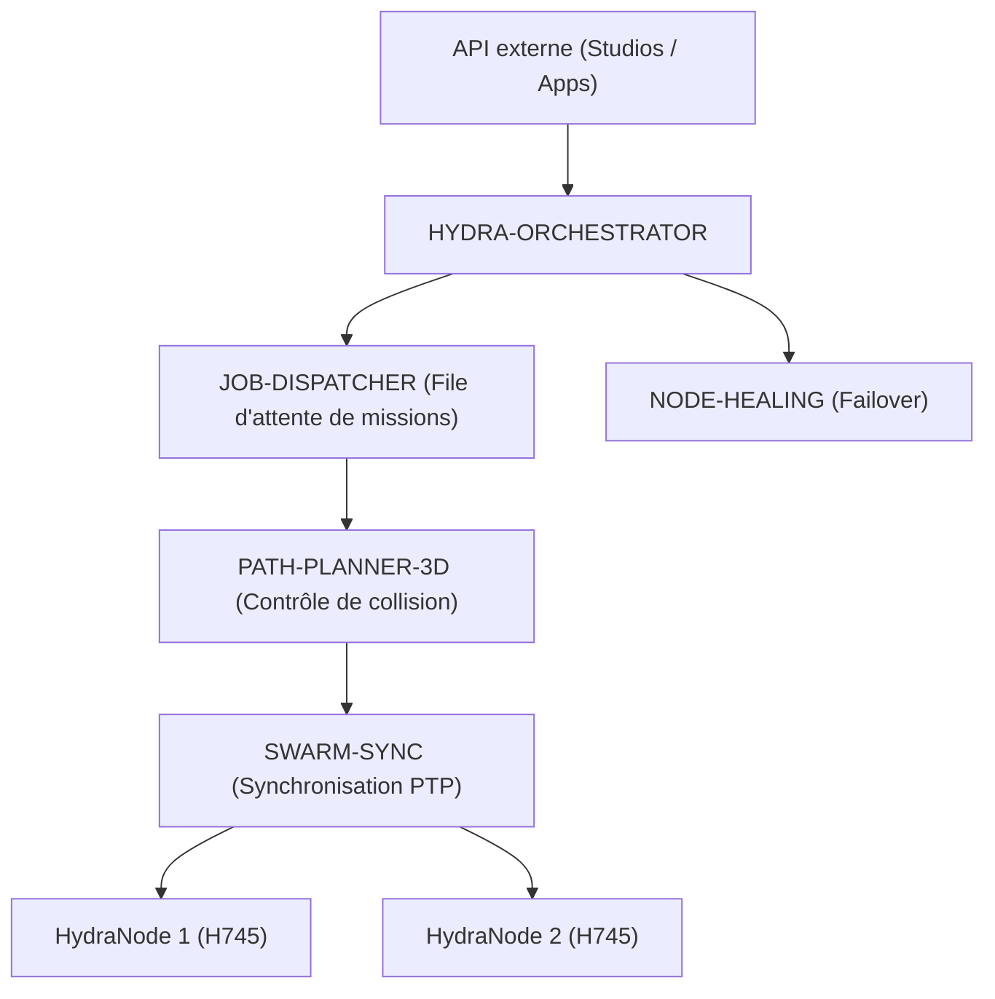

<p align="center">
  
</p>

# 🕸️ HYDRA-UMC-ORCHESTRATOR

<p align="center"><a href="README.md">🇺🇸 English</a> | <a href="README_spa.md">🇪🇸 Español</a> | 🇫🇷 <b>Français</b> | <a href="README_ita.md">🇮🇹 Italiano</a> | <a href="README_deu.md">🇩🇪 Deutsch</a> | <a href="README_zho.md">🇨🇳 简体中文</a> | <a href="README_jpn.md">🇯🇵 日本語</a></p>

### 🤖 Gestionnaire d'essaim distribué et coordinateur multi-nœuds

<p align="left">
  
  
  
  
</p>

---

## 1. 🛠️ APERÇU TECHNIQUE

**HYDRA-UMC-ORCHESTRATOR** est la couche de coordination de haut niveau de l'écosystème HYDRA-UMC. Il gère plusieurs nœuds HydraNodes (cerveaux cinématiques, nœuds de vision et nœuds cognitifs) comme un essaim unique et unifié.

Il gère la planification globale des missions, l'équilibrage de la charge sur l'ensemble de la flotte et la synchronisation en temps réel entre les robots afin d'éviter les collisions physiques et de garantir une précision millimétrique dans les tâches collaboratives multi-robots.

### Caractéristiques principales :
* 🕸️ **Coordination d'essaim :** Orchestre jusqu'à plus de 32 bras robotisés indépendants via plusieurs contrôleurs.
* ⚖️ **Équilibrage de charge :** Assigne automatiquement des missions au robot le plus disponible ou le mieux équipé.
* 🛡️ **Sécurité centralisée :** Gestion globale de l'E-STOP et surveillance de l'état de l'ensemble de la flotte.
* 📡 **API unifiée :** Fournit un point d'entrée unique pour les applications et les studios afin d'interagir avec l'ensemble de l'usine.

---

## 2. 🔄 ARCHITECTURE D'ORCHESTRATION



---

## 3. 🧠 ARCHITECTURE ET DÉCISIONS DE CONCEPTION

> Les couches internes ci-dessous constituent la conception prévue pour la
> logique derrière ce point d'entrée. Consultez « 🔧 BUILD & RUN » plus bas
> pour ce qui fonctionne aujourd'hui : un squelette minimal.

**Couches internes prévues**, à développer progressivement sur le squelette
actuel :
* **Couche API** — reçoit les requêtes de mission de haut niveau des Studios
  et applications, puis les traduit en actions au niveau de la flotte.
* **Intégration de file de missions** — transmet les missions acceptées à
  JOB-DISPATCHER et suit leur cycle de vie dans toute la flotte.
* **Distribution synchronisée par PTP** — coordonne le temps avec SWARM-SYNC
  afin que plusieurs robots exécutant la même mission restent sans collision
  selon les contrôles de PATH-PLANNER-3D.
* **Agrégation de santé de flotte** — regroupe les signaux par nœud de
  NODE-HEALING dans une vue unique ; c'est aussi le chemin qu'emprunterait un
  E-STOP global pour atteindre tous les nœuds simultanément.

### Pourquoi Rust pour ce service précis

Ce processus a la plus grande autorité sur la flotte : il émettrait un E-STOP
global et arbitre l'attribution des missions. Ce rôle exige une coordination
déterministe à faible latence sans pauses de ramasse-miettes, ainsi que la
sûreté mémoire et de types à la compilation. Un plantage ou une course de
données pourrait laisser tout l'essaim sans coordinateur pendant une mission.
JOB-DISPATCHER et NODE-HEALING utilisent Go, adapté à leurs tâches plus simples
et isolées, mais pas à ce processus central.

### Décisions de conception

* **Seul processus avec un `docker-compose.yml` à l'échelle de la famille.**
  Parent d'intégration de SWARM-SYNC, PATH-PLANNER-3D, JOB-DISPATCHER et
  NODE-HEALING, ce dépôt décrit l'exécution de toute la famille ; chaque enfant
  reste centré sur lui-même.
* **Expose une « API unifiée » aux applications et Studios.** Les clients
  parlent à ce point d'entrée stable plutôt qu'à quatre services enfants ; il
  peut router en interne vers chaque implémentation.

---

## 📂 STRUCTURE DES RÉPERTOIRES

```text
HYDRA-UMC-ORCHESTRATOR/
├── src/              # Code source (Cœur, Réseau, API)
├── proto/            # Contrat gRPC partagé pour le trafic nœud-à-nœud
│                     # à travers l'écosystème (voir proto/README.md) -
│                     # pas seulement l'API de ce dépôt
├── docs/             # Documentation et guides d'architecture
├── build/            # Binaires compilés (sortie de build.sh/build.bat)
├── images/           # Médias et diagrammes
├── scripts/          # Scripts utilitaires
├── Cargo.toml        # Manifeste du paquet Rust (nom, version, dépendances)
├── bump_version.py   # Incrément de version type compteur kilométrique
├── build.sh/.bat     # Incrémente la version puis `cargo build --release`
├── run.sh/.bat       # Exécute le binaire compilé
├── docker-compose.yml # Intègre ce dépôt avec ses 4 enfants réels
└── README.md
```

Élagué du modèle original : `hardware/`, `firmware/` et `os/` — il s'agit
d'un service purement logiciel (binaire Rust) sans matériel ni firmware
propres, et sans image de système d'exploitation à maintenir.

---

## 🔧 BUILD & RUN

Squelette Rust réel et minimal - il compile et s'exécute dès aujourd'hui.

```bash
# Windows
build.bat
run.bat

# Linux / macOS
./build.sh
./run.sh
```

`build.sh`/`build.bat` incrémentent la version dans `Cargo.toml` (règle du
compteur kilométrique de l'écosystème, voir `bump_version.py`) puis exécutent
`cargo build --release`. `run.sh`/`run.bat` exécutent directement le binaire
résultant.

En tant que dépôt d'intégration parent de l'écosystème, ce dépôt fournit
également un `docker-compose.yml` réel qui démarre ce service avec ses 4
enfants (SWARM-SYNC, PATH-PLANNER-3D, JOB-DISPATCHER, NODE-HEALING), attendus
comme dossiers frères :

```bash
docker compose up --build
```

---

## 🚀 ROADMAP
* **Phase 1 :** Synchronisation déterministe d'essaim sur TSN et réduction de la gigue sub-ms.
* **Phase 2 :** Planification de trajectoires 3D avec évitement dynamique d'obstacles dans les cellules multi-robots.
* **Phase 3 :** Optimisation de la répartition des tâches multi-robots à l'aide de la disponibilité des ressources en temps réel.
* **Phase 4 :** Mise en œuvre d'un cluster de basculement à haute disponibilité et prise en charge de robots hétérogènes.

---

## 🔗 Projets Liés

Ce projet fait partie d'un écosystème robotique plus large du même auteur (JuanenRac / Electro Hobby 3D), couvrant firmware, logiciel de contrôle, nœuds IA et outillage de flotte. Bon à savoir, car une demande pourrait en réalité concerner l'un de ces projets plutôt que ce dépôt.

### Famille

**Parent :** aucun — ce projet est lui-même le parent d'intégration de la famille Orchestration & Swarm.

**Enfants :**
- **[HYDRA-UMC-SWARM-SYNC](https://github.com/JuanenRac/HYDRA-UMC-SWARM-SYNC)** — réconciliation d'état basée CRDT entre les cellules coordonnées par cet orchestrateur.
- **[HYDRA-UMC-PATH-PLANNER-3D](https://github.com/JuanenRac/HYDRA-UMC-PATH-PLANNER-3D)** — planification de trajectoires sans collision contre laquelle cet orchestrateur distribue les tâches.
- **[HYDRA-UMC-JOB-DISPATCHER](https://github.com/JuanenRac/HYDRA-UMC-JOB-DISPATCHER)** — la file/planificateur de tâches qu'alimente cet orchestrateur.
- **[HYDRA-UMC-NODE-HEALING](https://github.com/JuanenRac/HYDRA-UMC-NODE-HEALING)** — détecte et contourne un nœud sans réponse géré par cet orchestrateur.

### Relation Directe (hors de la famille)

- **[HYDRA-UMC-SERVER](https://github.com/JuanenRac/HYDRA-UMC-SERVER)** — coordonne plusieurs instances de ce backend.
- **[HYDRA-UMC-COGNITIVE-NODE](https://github.com/JuanenRac/HYDRA-UMC-COGNITIVE-NODE)** — reçoit des ordres de mission d'ici.
- **[HYDRA-UMC-SUITE](https://github.com/JuanenRac/HYDRA-UMC-SUITE)** — le centre de commande d'essaim que soutient cet orchestrateur.

### Reste de l'Écosystème

**Plateforme HYDRA-UMC** — la cellule de micro-usine multi-robot
- **[HYDRA-UMC](https://github.com/JuanenRac/HYDRA-UMC)** — la carte mère CM5 + STM32H745 orchestrant jusqu'à 8 bras robotiques.
- **[HYDRA-UMC-SERVER](https://github.com/JuanenRac/HYDRA-UMC-SERVER)** — le backend Express/WebSocket auquel parle chaque client de contrôle.
- **[HYDRA-UMC-STUDIO](https://github.com/JuanenRac/HYDRA-UMC-STUDIO)** — tableau de bord de contrôle web, visualisation 3D multi-robot.
- **[HYDRA-UMC-ANDROID-CONTROL](https://github.com/JuanenRac/HYDRA-UMC-ANDROID-CONTROL)** — application de contrôle Android via Wi-Fi/Bluetooth.
- **[HYDRA-UMC-IOS-CONTROL](https://github.com/JuanenRac/HYDRA-UMC-IOS-CONTROL)** — application de contrôle iOS/iPadOS construite en Flutter.
- **[HYDRA-UMC-SUITE](https://github.com/JuanenRac/HYDRA-UMC-SUITE)** — centre de commande d'essaim de bureau (Python/PySide6).
- **[HYDRA-UMC-EDITOR-URDF](https://github.com/JuanenRac/HYDRA-UMC-EDITOR-URDF)** — éditeur de modèles URDF de bureau pour le catalogue de robots.
- **[HYDRA-UMC-DSI](https://github.com/JuanenRac/HYDRA-UMC-DSI)** — interface tactile native pour l'écran DSI embarqué.

**Plateforme URTC** — le contrôleur de tête d'outil que porte chaque bras HYDRA-UMC
- **[URTC](https://github.com/JuanenRac/URTC)** — contrôleur de tête d'outil sur bus CAN, 25 profils d'outil.
- **[URTC-FLASHER](https://github.com/JuanenRac/URTC-FLASHER)** — outil de bureau de flashage CAN-OTA + SWD/JTAG.
- **[URTC-TESTER](https://github.com/JuanenRac/URTC-TESTER)** — outil de bureau de diagnostic CAN en direct.
- **[URTC-WEB-STUDIO](https://github.com/JuanenRac/URTC-WEB-STUDIO)** — alternative basée navigateur via l'API Web Serial.

**🎥 Vision AI Node (Hailo-8)**
- [HYDRA-UMC-VISION-NODE](https://github.com/JuanenRac/HYDRA-UMC-VISION-NODE)
- [HYDRA-UMC-VISION-STREAMER](https://github.com/JuanenRac/HYDRA-UMC-VISION-STREAMER)
- [HYDRA-UMC-DETECTION-HEF](https://github.com/JuanenRac/HYDRA-UMC-DETECTION-HEF)
- [HYDRA-UMC-SAFETY-ZONES](https://github.com/JuanenRac/HYDRA-UMC-SAFETY-ZONES)
- [HYDRA-UMC-VISUAL-SERVOING-API](https://github.com/JuanenRac/HYDRA-UMC-VISUAL-SERVOING-API)

**🧠 Cognitive AI Node (Hailo-10)**
- [HYDRA-UMC-COGNITIVE-NODE](https://github.com/JuanenRac/HYDRA-UMC-COGNITIVE-NODE)
- [HYDRA-UMC-VLA-ENGINE](https://github.com/JuanenRac/HYDRA-UMC-VLA-ENGINE)
- [HYDRA-UMC-VOICE-UI](https://github.com/JuanenRac/HYDRA-UMC-VOICE-UI)
- [HYDRA-UMC-SEMANTIC-PLANNER](https://github.com/JuanenRac/HYDRA-UMC-SEMANTIC-PLANNER)
- [HYDRA-UMC-DOCS-QA](https://github.com/JuanenRac/HYDRA-UMC-DOCS-QA)

**🎮 Digital Twin & Simulation**
- [HYDRA-UMC-TWIN](https://github.com/JuanenRac/HYDRA-UMC-TWIN)
- [HYDRA-UMC-PHYSICS-REPLICA](https://github.com/JuanenRac/HYDRA-UMC-PHYSICS-REPLICA)
- [HYDRA-UMC-HIL-BRIDGE](https://github.com/JuanenRac/HYDRA-UMC-HIL-BRIDGE)
- [HYDRA-UMC-SYNTHETIC-DATA-GEN](https://github.com/JuanenRac/HYDRA-UMC-SYNTHETIC-DATA-GEN)

**📊 Data & Analytics**
- [HYDRA-UMC-DATALAKE](https://github.com/JuanenRac/HYDRA-UMC-DATALAKE)
- [HYDRA-UMC-TELEMETRY-COLLECTOR](https://github.com/JuanenRac/HYDRA-UMC-TELEMETRY-COLLECTOR)
- [HYDRA-UMC-ANOMALY-DETECTOR](https://github.com/JuanenRac/HYDRA-UMC-ANOMALY-DETECTOR)
- [HYDRA-UMC-PRODUCTION-REPORTS](https://github.com/JuanenRac/HYDRA-UMC-PRODUCTION-REPORTS)

**🏭 Industrial Gateway**
- [HYDRA-UMC-GATEWAY-INDUSTRIAL](https://github.com/JuanenRac/HYDRA-UMC-GATEWAY-INDUSTRIAL)
- [HYDRA-UMC-OPCUA-SERVER](https://github.com/JuanenRac/HYDRA-UMC-OPCUA-SERVER)
- [HYDRA-UMC-MQTT-BROKER](https://github.com/JuanenRac/HYDRA-UMC-MQTT-BROKER)
- [HYDRA-UMC-MTCONNECT-ADAPTER](https://github.com/JuanenRac/HYDRA-UMC-MTCONNECT-ADAPTER)

**🛠️ Complementary Tools**
- [URTC-SMART-RACK](https://github.com/JuanenRac/URTC-SMART-RACK)
- [URTC-VISION-TOOL](https://github.com/JuanenRac/URTC-VISION-TOOL)
- [HYDRA-UMC-WATCH](https://github.com/JuanenRac/HYDRA-UMC-WATCH)
- [HYDRA-UMC-TOOL-CLI](https://github.com/JuanenRac/HYDRA-UMC-TOOL-CLI)
- [HYDRA-UMC-DASHBOARD-AI](https://github.com/JuanenRac/HYDRA-UMC-DASHBOARD-AI)


## 👤 AUTEUR
**JuanenRac** (Electro Hobby 3D)
📧 electrohobby3d@gmail.com

## 📜 LICENCE
GPL-3.0 - Voir le fichier LICENSE pour plus de détails.

## 🛠️ BUILD & RUN

Utilisez la vérification de compilation sans versionnement avant une compilation de publication :

| Action | Windows | Linux / macOS |
|---|---|---|
| Vérification de compilation (sans modifier la version ni le CHANGELOG) | `build-test.bat` | `./build-test.sh` |
| Exécution / développement (si disponible) | `run*.bat` ou `dev*.bat` | `./run*.sh` ou `./dev*.sh` |

`build-test.bat` et `build-test.sh` compilent ou valident la pile du projet sans incrémenter `hydra-umc.project.json` ni modifier `CHANGELOG.md`. Ils peuvent uniquement créer les sorties normales du compilateur. Les scripts existants `build*.bat`, `build*.sh`, `run*` et `dev*` conservent leur comportement spécifique de versionnement ou d'exécution ; utilisez-les lorsque ce comportement est requis.