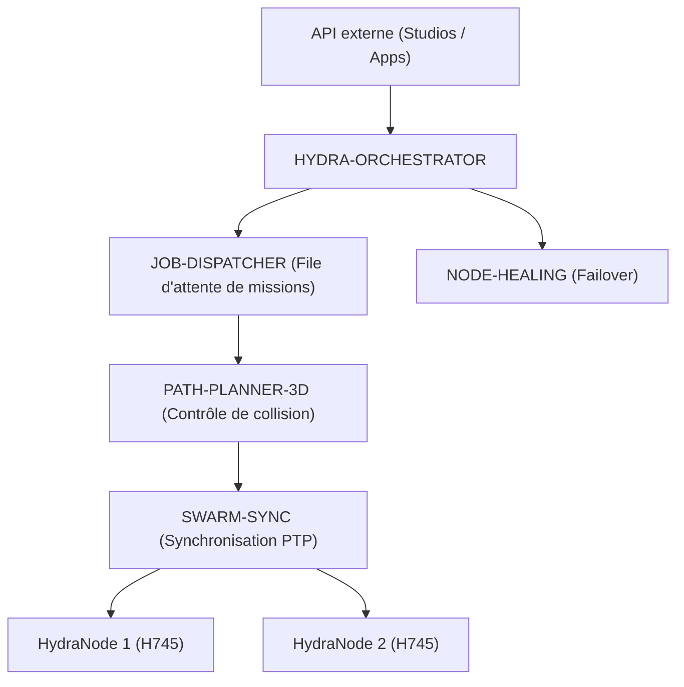

<p align="center">
  
</p>

# 🕸️ HYDRA-UMC-ORCHESTRATOR

<p align="center"><a href="README.md">🇺🇸 English</a> | <a href="README_spa.md">🇪🇸 Español</a> | 🇫🇷 <b>Français</b> | <a href="README_ita.md">🇮🇹 Italiano</a> | <a href="README_deu.md">🇩🇪 Deutsch</a> | <a href="README_zho.md">🇨🇳 简体中文</a> | <a href="README_jpn.md">🇯🇵 日本語</a></p>

### 🤖 Gestionnaire d'essaim distribué et coordinateur multi-nœuds

<p align="left">
  
  
  
  
</p>

---

## 1. 🛠️ APERÇU TECHNIQUE

**HYDRA-UMC-ORCHESTRATOR** est la couche de coordination de haut niveau de l'écosystème HYDRA-UMC. Il gère plusieurs nœuds HydraNodes (cerveaux cinématiques, nœuds de vision et nœuds cognitifs) comme un essaim unique et unifié.

Il gère la planification globale des missions, l'équilibrage de la charge sur l'ensemble de la flotte et la synchronisation en temps réel entre les robots afin d'éviter les collisions physiques et de garantir une précision millimétrique dans les tâches collaboratives multi-robots.

### Caractéristiques principales :
* 🕸️ **Coordination d'essaim :** Orchestre jusqu'à plus de 32 bras robotisés indépendants via plusieurs contrôleurs.
* ⚖️ **Équilibrage de charge :** Assigne automatiquement des missions au robot le plus disponible ou le mieux équipé.
* 🛡️ **Sécurité centralisée :** Gestion globale de l'E-STOP et surveillance de l'état de l'ensemble de la flotte.
* 📡 **API unifiée :** Fournit un point d'entrée unique pour les applications et les studios afin d'interagir avec l'ensemble de l'usine.
* 🧩 **Réel v0 - Machine à états de mission :** `mission.rs` suit chaque mission via `Pending -> Dispatched -> InProgress -> Completed` (plus les états terminaux `Cancelled`/`Failed`), avec une annulation idempotente et une vraie récupération quand un nœud est signalé injoignable/invalide - voir `mission-demo` ci-dessous. Logique pure en mémoire - aucun pair gRPC en direct avec JOB-DISPATCHER/NODE-HEALING nécessaire pour l'exécuter ou la tester.

---

## 2. 🔄 ARCHITECTURE D'ORCHESTRATION



---

## 3. 🧠 ARCHITECTURE ET DÉCISIONS DE CONCEPTION

> Les couches internes ci-dessous constituent la conception prévue pour la
> logique derrière ce point d'entrée. Consultez « 🔧 BUILD ET EXÉCUTION » plus bas
> pour ce qui fonctionne aujourd'hui : une machine à états de mission réelle
> et purement en mémoire (`mission.rs`), encore sans aucun pair réseau en
> direct à qui parler.

**Couches internes prévues**, à développer progressivement sur la machine à
états réelle qui existe déjà :
* **Couche API** — reçoit les requêtes de mission de haut niveau des Studios
  et applications, puis les traduit en actions au niveau de la flotte.
* **Intégration de file de missions** — transmet les missions acceptées à
  JOB-DISPATCHER et suit leur cycle de vie dans toute la flotte en utilisant
  la machine à états réelle `Mission`/`MissionRegistry` qui existe déjà dans
  `mission.rs` - ce qui manque encore est le câblage gRPC vers un vrai
  JOB-DISPATCHER à qui transmettre les missions.
* **Distribution synchronisée par PTP** — coordonne le temps avec SWARM-SYNC
  afin que plusieurs robots exécutant la même mission restent sans collision
  selon les contrôles de PATH-PLANNER-3D.
* **Agrégation de santé de flotte** — regroupe les signaux par nœud de
  NODE-HEALING dans une vue unique et appelle
  `MissionRegistry::recover_node_unavailable()` (déjà réel) dès qu'un signal
  arrive ; c'est aussi le chemin qu'emprunterait un E-STOP global pour
  atteindre tous les nœuds simultanément.

### Pourquoi Rust pour ce service précis

Ce processus a la plus grande autorité sur la flotte : il émettrait un E-STOP
global et arbitre l'attribution des missions. Ce rôle exige une coordination
déterministe à faible latence sans pauses de ramasse-miettes, ainsi que la
sûreté mémoire et de types à la compilation. Un plantage ou une course de
données pourrait laisser tout l'essaim sans coordinateur pendant une mission.
JOB-DISPATCHER et NODE-HEALING utilisent Go, adapté à leurs tâches plus simples
et isolées, mais pas à ce processus central.

### Décisions de conception

* **Seul processus avec un `docker-compose.yml` à l'échelle de la famille.**
  Parent d'intégration de SWARM-SYNC, PATH-PLANNER-3D, JOB-DISPATCHER et
  NODE-HEALING, ce dépôt décrit l'exécution de toute la famille ; chaque enfant
  reste centré sur lui-même.
* **Expose une « API unifiée » aux applications et Studios.** Les clients
  parlent à ce point d'entrée stable plutôt qu'à quatre services enfants ; il
  peut router en interne vers chaque implémentation.
* **Pourquoi `cancel()` est idempotent plutôt que d'échouer sur une mission déjà annulée.** Une demande d'annulation peut légitimement arriver deux fois - un client qui réessaie après une réponse perdue, un opérateur qui reclique sur annuler avant de voir la confirmation. Traiter le second appel comme un succès (`AlreadyCancelled`, pas une erreur) signifie que l'appelant n'a jamais à distinguer « mon annulation a fonctionné » de « l'annulation de quelqu'un d'autre a déjà fonctionné » - les deux sont le même bon résultat. Annuler une mission `Completed`/`Failed` reste refusé : c'est une situation véritablement différente, non idempotente (défaire un travail terminé), pas une nouvelle tentative.
* **Pourquoi la récupération après défaillance de nœud remet la mission en `Pending` plutôt que de la faire échouer directement.** Un nœud signalant `UNREACHABLE` pourrait être en cours de redémarrage plutôt que définitivement perdu (voir la propre logique de réessais bornés de `HYDRA-UMC-NODE-HEALING`, qui absorbe déjà les incidents transitoires avant même de signaler un nœud en panne) - donc une mission bloquée sur ce nœud obtient une nouvelle chance sur un autre nœud via `Pending`, plutôt que d'être marquée `Failed` au premier signe de problème. `fail()` existe toujours pour quand la redistribution épuise véritablement les options.

---

## 📂 STRUCTURE DES RÉPERTOIRES

```text
HYDRA-UMC-ORCHESTRATOR/
├── src/
│   ├── mission.rs         # Machine à états de mission réelle (Mission, MissionRegistry)
│   ├── job_dispatcher.rs  # Vrai client pour l'API HTTP propre de HYDRA-UMC-JOB-DISPATCHER
│   ├── server.rs          # Surface JSON/HTTP simple (tiny_http, bloquant, sans runtime async)
│   └── main.rs            # Point d'entrée + sous-commande réelle `mission-demo`
├── proto/            # Contrat gRPC partagé pour le trafic nœud-à-nœud
│                     # à travers l'écosystème (voir proto/README.md) -
│                     # pas seulement l'API de ce dépôt
├── docs/             # Documentation et guides d'architecture
├── build/            # Binaires compilés (sortie de build.sh/build.bat)
├── images/           # Médias et diagrammes
├── systemd/
│   └── hydra-umc-orchestrator.service # Unité systemd de l'API locale mission/dispatch sur la CM5
├── tools/
│   ├── build_test.py # Vérification de build sans versionnage
│   └── ci_validate.py # Validation manifeste/CHANGELOG/docs utilisée par CI
├── Cargo.toml        # Manifeste du paquet Rust (nom, version, dépendances)
├── bump_version.py   # Incrément de version native type compteur kilométrique
├── bump_manifest_version.py # Synchronise la version de hydra-umc.project.json avec la version native (--sync)
├── build.sh/.bat     # Incrémente la version puis `cargo build --release`
├── build-test.sh/.bat # Vérification de build sans versionnage
├── run.sh/.bat       # Exécute le binaire compilé
├── docker-compose.yml # Intègre ce dépôt avec ses 4 enfants réels
└── README.md
```

Élagué du modèle original : `hardware/`, `firmware/` et `os/` — il s'agit
d'un service purement logiciel (binaire Rust) sans matériel ni firmware
propres, et sans image de système d'exploitation à maintenir.

---

## 🔧 BUILD ET EXÉCUTION

L'invocation nue reste un squelette minimal (affiche l'identité, quitte
avec 0) ; la vraie machine à états de mission est exerçable dès
aujourd'hui via `mission-demo`.

```bash
# Windows
build.bat
run.bat
run.bat mission-demo

# Linux / macOS
./build.sh
./run.sh
./run.sh mission-demo
```

`build.sh`/`build.bat` incrémentent la version dans `Cargo.toml` (règle du
compteur kilométrique de l'écosystème, voir `bump_version.py`) puis exécutent
`cargo build --release`. `run.sh`/`run.bat` exécutent directement le binaire
résultant.

`mission-demo` exécute un scénario réel de bout en bout contre le
`MissionRegistry` de `mission.rs` et affiche chaque transition réelle :

```text
[orchestrator] mission-1: dispatched -> InProgress(node=node-a)
[orchestrator] mission-2: dispatched -> Dispatched(node=node-a)
[orchestrator] mission-3: dispatched -> InProgress(node=node-b)
[orchestrator] node-a reported UNREACHABLE by NODE-HEALING - recovering its missions
[orchestrator] mission-1: requeued -> Pending
[orchestrator] mission-2: requeued -> Pending
[orchestrator] mission-3: unaffected (different node) -> InProgress(node=node-b)
[orchestrator] mission-2: cancel() -> Cancelled -> Cancelled
[orchestrator] mission-2: cancel() again (idempotent) -> AlreadyCancelled -> Cancelled
[orchestrator] mission-3: complete() -> Completed(node=node-b)
[orchestrator] mission-4: fail() -> Failed(no healthy node accepted redispatch after 3 attempts)
[orchestrator] final registry state:
  mission-1: Pending (terminal=false)
  mission-2: Cancelled (terminal=true)
  mission-3: Completed(node=node-b) (terminal=true)
  mission-4: Failed(no healthy node accepted redispatch after 3 attempts) (terminal=true)
```

```bash
cargo test   # 42 tests : chaque transition, chaque rejet de transition
             # invalide, annulation idempotente et récupération après
             # défaillance de nœud
```

En tant que dépôt d'intégration parent de l'écosystème, ce dépôt fournit
également un `docker-compose.yml` réel qui démarre ce service avec ses 4
enfants (SWARM-SYNC, PATH-PLANNER-3D, JOB-DISPATCHER, NODE-HEALING), attendus
comme dossiers frères :

```bash
docker compose up --build
```

---

## 🚀 FEUILLE DE ROUTE
* **Phase 1 :** Synchronisation déterministe d'essaim sur TSN et réduction de la gigue sub-ms.
* **Phase 2 :** Planification de trajectoires 3D avec évitement dynamique d'obstacles dans les cellules multi-robots.
* **Phase 3 :** Optimisation de la répartition des tâches multi-robots à l'aide de la disponibilité des ressources en temps réel.
* **Phase 4 :** Mise en œuvre d'un cluster de basculement à haute disponibilité et prise en charge de robots hétérogènes.

---

## 🔗 Projets Liés

Ce projet fait partie de l'écosystème robotique HYDRA-UMC du même auteur (JuanenRac / Electro Hobby 3D). Bon à savoir, car une demande pourrait en réalité concerner l'un de ceux-ci plutôt que ce dépôt.

**Projets Enfants** — chacun est un service que cet orchestrateur coordonne ou alimente directement
- **[HYDRA-UMC-SWARM-SYNC](https://github.com/JuanenRac/HYDRA-UMC-SWARM-SYNC)** — vraie synchronisation d'état CRDT LWW-Element-Map, testée par propriétés pour la convergence multi-cellule.
- **[HYDRA-UMC-PATH-PLANNER-3D](https://github.com/JuanenRac/HYDRA-UMC-PATH-PLANNER-3D)** — vrai planificateur de trajectoire 3D basé sur RRT, avec vraie validation des collisions obstacle/espace de travail.
- **[HYDRA-UMC-JOB-DISPATCHER](https://github.com/JuanenRac/HYDRA-UMC-JOB-DISPATCHER)** — vraie file de tâches basée sur la priorité avec déduplication, via une vraie API HTTP.
- **[HYDRA-UMC-NODE-HEALING](https://github.com/JuanenRac/HYDRA-UMC-NODE-HEALING)** — vrai chien de garde de santé de flotte basé sur gRPC, avec retry/backoff et détection d'incohérence d'identité.

**Directement Liés**
- **[HYDRA-UMC-SERVER](https://github.com/JuanenRac/HYDRA-UMC-SERVER)** — le vrai backend headless (REST/WebSocket) auquel parle réellement chaque client de contrôle ; cet orchestrateur coordonne plusieurs instances de celui-ci.
- **[HYDRA-UMC-COGNITIVE-NODE](https://github.com/JuanenRac/HYDRA-UMC-COGNITIVE-NODE)** — hub d'intégration pour le pipeline cognitif Hailo-10 (orchestration LLM/VLA/voix) ; il reçoit d'ici ses ordres de mission.
- **[HYDRA-UMC-SUITE](https://github.com/JuanenRac/HYDRA-UMC-SUITE)** — centre de commande d'essaim de bureau (PySide6) pour plusieurs serveurs à la fois, empaqueté en exécutable autonome ; le centre de commande d'essaim que cet orchestrateur soutient.

**Fait Également Partie de l'Écosystème**

*Matériel & Plateforme de Base*
- **[HYDRA-UMC](https://github.com/JuanenRac/HYDRA-UMC)** — la carte mère physique du bras robotique : hôte CM5 + coprocesseur STM32H745 double cœur, coordonnant jusqu'à 8 bras-outils via CAN-OTA/SPI-OTA.
- **[HYDRA-UMC-OS](https://github.com/JuanenRac/HYDRA-UMC-OS)** — couche produit reproductible sur Raspberry Pi OS pour le CM5 : agent en lecture seule, config/profils validés, provisionnement WiFi de premier contact.
- **[HYDRA-UMC-SDK](https://github.com/JuanenRac/HYDRA-UMC-SDK)** — le contrat JSON-Schema partagé et la barrière de sécurité contre laquelle chaque bridge valide ses commandes.

*Backend Central & Clients*
- **[HYDRA-UMC-STUDIO](https://github.com/JuanenRac/HYDRA-UMC-STUDIO)** — tableau de bord de contrôle web avec visualisation 3D multi-robot en temps réel.
- **[HYDRA-UMC-ANDROID-CONTROL](https://github.com/JuanenRac/HYDRA-UMC-ANDROID-CONTROL)** — application de contrôle Android native avec connexion biométrique et un compagnon Wear OS jumelé.
- **[HYDRA-UMC-IOS-CONTROL](https://github.com/JuanenRac/HYDRA-UMC-IOS-CONTROL)** — application de contrôle iOS/iPadOS (Flutter) avec synchronisation WebSocket en temps réel.
- **[HYDRA-UMC-DSI](https://github.com/JuanenRac/HYDRA-UMC-DSI)** — interface tactile native pour l'écran tactile DSI 7" embarqué, intégrée directement sur le CM5.
- **[HYDRA-UMC-EDITOR-URDF](https://github.com/JuanenRac/HYDRA-UMC-EDITOR-URDF)** — créateur/éditeur graphique de bureau pour URDF qui envoie les modèles terminés vers le propre catalogue de STUDIO.
- **[HYDRA-UMC-BRIDGE-AMR](https://github.com/JuanenRac/HYDRA-UMC-BRIDGE-AMR)** — frontière de coordination pour les flottes AGV/AMR via un éditeur MQTT VDA 5050 réel.
- **[HYDRA-UMC-BRIDGE-CNC](https://github.com/JuanenRac/HYDRA-UMC-BRIDGE-CNC)** — coordinateur haut niveau pour cellules CNC avec accès réel au statut/octets de contrôle GRBL.
- **[HYDRA-UMC-BRIDGE-DROIDS](https://github.com/JuanenRac/HYDRA-UMC-BRIDGE-DROIDS)** — frontière de coordination pour droïdes à pattes/humanoïdes, avec un véritable émetteur de commandes Boston Dynamics Spot.
- **[HYDRA-UMC-BRIDGE-LASER](https://github.com/JuanenRac/HYDRA-UMC-BRIDGE-LASER)** — coordinateur de sécurité pour cellules laser lisant 3 vraies sécurités GPIO de clé/enceinte/verrouillage.
- **[HYDRA-UMC-BRIDGE-OPENPNP](https://github.com/JuanenRac/HYDRA-UMC-BRIDGE-OPENPNP)** — coordinateur haut niveau sûr pour le flux de cartes du pick-and-place OpenPnP.
- **[HYDRA-UMC-BRIDGE-PRINTER3D](https://github.com/JuanenRac/HYDRA-UMC-BRIDGE-PRINTER3D)** — frontière de coordination sûre pour imprimantes 3D Moonraker/Klipper, avec de vraies commandes de tâche contrôlées.
- **[HYDRA-UMC-BRIDGE-ROS2](https://github.com/JuanenRac/HYDRA-UMC-BRIDGE-ROS2)** — coordinateur de sécurité avec un vrai transport ROS 2 rclpy à importation paresseuse.
- **[HYDRA-UMC-BRIDGE-UAV](https://github.com/JuanenRac/HYDRA-UMC-BRIDGE-UAV)** — frontière de coordination pour UAV équipés de caméra, avec un véritable émetteur de commandes MAVLink.

*Plateforme d'Outils URTC*
- **[URTC](https://github.com/JuanenRac/URTC)** — firmware pour la carte physique Universal Robot Tool Controller, plus de 25 profils d'outil sur bus CAN.
- **[URTC-FLASHER](https://github.com/JuanenRac/URTC-FLASHER)** — outil de bureau à interface graphique pour flasher les cartes URTC, CAN-OTA plus SWD/JTAG puce complète.
- **[URTC-TESTER](https://github.com/JuanenRac/URTC-TESTER)** — outil de bureau de diagnostic CAN-bus en direct pour cartes URTC, un panneau par profil d'outil.
- **[URTC-WEB-STUDIO](https://github.com/JuanenRac/URTC-WEB-STUDIO)** — alternative basée navigateur à URTC-TESTER via la Web Serial API, sans installation locale.

*Nœud IA de Vision (Hailo-8)*
- **[HYDRA-UMC-VISION-NODE](https://github.com/JuanenRac/HYDRA-UMC-VISION-NODE)** — hub d'intégration pour le pipeline de vision Hailo-8, avec une vraie vérification de disponibilité matérielle par étape.
- **[HYDRA-UMC-DETECTION-HEF](https://github.com/JuanenRac/HYDRA-UMC-DETECTION-HEF)** — registre réel de modèles compilés avec vérification de chargement sécurisé par architecture Hailo/checksum.
- **[HYDRA-UMC-VISION-STREAMER](https://github.com/JuanenRac/HYDRA-UMC-VISION-STREAMER)** — générateur réel de pipeline GStreamer + config MediaMTX, avec une vraie frontière d'intégration HailoRT.
- **[HYDRA-UMC-VISUAL-SERVOING-API](https://github.com/JuanenRac/HYDRA-UMC-VISUAL-SERVOING-API)** — vraie loi de correction Position-Based Visual Servoing, verrouillée sur l'état de zone en amont.
- **[HYDRA-UMC-SAFETY-ZONES](https://github.com/JuanenRac/HYDRA-UMC-SAFETY-ZONES)** — vraie vérification de violation de zone et demande d'E-STOP, avec application de la fraîcheur de calibration.

*Nœud IA Cognitif (Hailo-10)*
- **[HYDRA-UMC-VLA-ENGINE](https://github.com/JuanenRac/HYDRA-UMC-VLA-ENGINE)** — vrai encodage/décodage de jetons d'action et génération de trajectoire pour un modèle Vision-Language-Action.
- **[HYDRA-UMC-VOICE-UI](https://github.com/JuanenRac/HYDRA-UMC-VOICE-UI)** — vrai front-end vocal (VAD + analyseur d'intention) avec un relais Watch borné et soumis à confirmation.
- **[HYDRA-UMC-SEMANTIC-PLANNER](https://github.com/JuanenRac/HYDRA-UMC-SEMANTIC-PLANNER)** — vraie décomposition de tâches basée sur des règles et récupération sémantique d'erreurs sur les codes d'erreur MCU.
- **[HYDRA-UMC-DOCS-QA](https://github.com/JuanenRac/HYDRA-UMC-DOCS-QA)** — vraie recherche documentaire TF-IDF (bibliothèque standard uniquement) sur les propres documents Markdown de cet écosystème.

*Jumeau Numérique & Simulation*
- **[HYDRA-UMC-TWIN](https://github.com/JuanenRac/HYDRA-UMC-TWIN)** — hub d'intégration pour le moteur de jumeau numérique, avec un vrai contrat de synchronisation par compatibilité de version.
- **[HYDRA-UMC-HIL-BRIDGE](https://github.com/JuanenRac/HYDRA-UMC-HIL-BRIDGE)** — vrai verrouillage de sécurité hardware-in-the-loop routant les commandes entre simulation et matériel réel.
- **[HYDRA-UMC-PHYSICS-REPLICA](https://github.com/JuanenRac/HYDRA-UMC-PHYSICS-REPLICA)** — vraie cinématique directe et validation des limites articulaires sur un vrai sous-ensemble URDF.
- **[HYDRA-UMC-SYNTHETIC-DATA-GEN](https://github.com/JuanenRac/HYDRA-UMC-SYNTHETIC-DATA-GEN)** — vrai générateur procédural de scènes 2D avec export d'annotations YOLO/COCO.

*Données & Analytique*
- **[HYDRA-UMC-DATALAKE](https://github.com/JuanenRac/HYDRA-UMC-DATALAKE)** — vrai magasin de séries temporelles basé sur sqlite3, avec une vraie API HTTP d'ingestion/requête.
- **[HYDRA-UMC-ANOMALY-DETECTOR](https://github.com/JuanenRac/HYDRA-UMC-ANOMALY-DETECTOR)** — vrai détecteur d'anomalies FFT + ligne de base statistique, avec surveillance de dérive.
- **[HYDRA-UMC-PRODUCTION-REPORTS](https://github.com/JuanenRac/HYDRA-UMC-PRODUCTION-REPORTS)** — vrai calcul OEE/disponibilité sur l'historique de DATALAKE, avec export CSV reproductible.
- **[HYDRA-UMC-TELEMETRY-COLLECTOR](https://github.com/JuanenRac/HYDRA-UMC-TELEMETRY-COLLECTOR)** — vrai pipeline d'ingestion CAN/WebSocket vers DATALAKE, avec déduplication par séquence.

*Passerelle Industrielle*
- **[HYDRA-UMC-GATEWAY-INDUSTRIAL](https://github.com/JuanenRac/HYDRA-UMC-GATEWAY-INDUSTRIAL)** — hub d'intégration relayant vers les protocoles industriels, avec une vraie couche de liste blanche de commandes/contre-pression.
- **[HYDRA-UMC-OPCUA-SERVER](https://github.com/JuanenRac/HYDRA-UMC-OPCUA-SERVER)** — vrai espace d'adressage OPC-UA, vérifié avec une vraie session client du protocole binaire.
- **[HYDRA-UMC-MQTT-BROKER](https://github.com/JuanenRac/HYDRA-UMC-MQTT-BROKER)** — vrai broker MQTT avec authentification par client optionnelle et ACL de sujets.
- **[HYDRA-UMC-MTCONNECT-ADAPTER](https://github.com/JuanenRac/HYDRA-UMC-MTCONNECT-ADAPTER)** — vrais points de terminaison XML MTConnect `/probe` et `/current`, avec sortie en mode dégradé.

*Outils Complémentaires & Opérations de l'Écosystème*
- **[HYDRA-UMC-DASHBOARD-AI](https://github.com/JuanenRac/HYDRA-UMC-DASHBOARD-AI)** — panneaux Smart Summaries et Anomaly Highlighting sur DATALAKE/ANOMALY-DETECTOR, avec un repli statistique honnête.
- **[HYDRA-UMC-TOOL-CLI](https://github.com/JuanenRac/HYDRA-UMC-TOOL-CLI)** — CLI de flotte avec un vrai contrat de codes de sortie stable, un vrai client en direct de la propre API de HYDRA-UMC-SERVER.
- **[HYDRA-UMC-WATCH](https://github.com/JuanenRac/HYDRA-UMC-WATCH)** — application compagnon WearOS avec de vraies alertes haptiques et un relais vocal vers le téléphone jumelé.
- **[URTC-SMART-RACK](https://github.com/JuanenRac/URTC-SMART-RACK)** — firmware pour un rack de montage de cartes avec décodage réel d'ID d'outil et logique de préchauffage Smart Idle.
- **[URTC-VISION-TOOL](https://github.com/JuanenRac/URTC-VISION-TOOL)** — firmware plus un vrai compagnon de vision Python pour une tête d'outil d'inspection thermique/RGB.
- **[HYDRA-UMC-UPDATER](https://github.com/JuanenRac/HYDRA-UMC-UPDATER)** — outil administratif de bureau qui découvre, clone et met à jour chaque dépôt de cet écosystème.


---

## 📚 Documentation & Communauté

- **[CONTRIBUTING.md](CONTRIBUTING.md)** — pile technologique et lignes directrices de codage pour une pull request.
- **[CODE_OF_CONDUCT.md](CODE_OF_CONDUCT.md)** — les normes de comportement attendues dans cette communauté.
- **[SECURITY.md](SECURITY.md)** — comment signaler une vulnérabilité, et les véritables axes de sécurité de ce projet.
- **[SUPPORT.md](SUPPORT.md)** — où poser des questions et signaler des bugs.
- **[LICENSE.md](LICENSE.md)** — la licence propre de ce projet.

## 👤 AUTEUR
**JuanenRac** (Electro Hobby 3D)
📧 electrohobby3d@gmail.com
📺 [youtube.com/@electrohobby3d](https://youtube.com/@electrohobby3d)

## 📜 LICENCE
GPL-3.0 - Voir le fichier LICENSE pour plus de détails.
