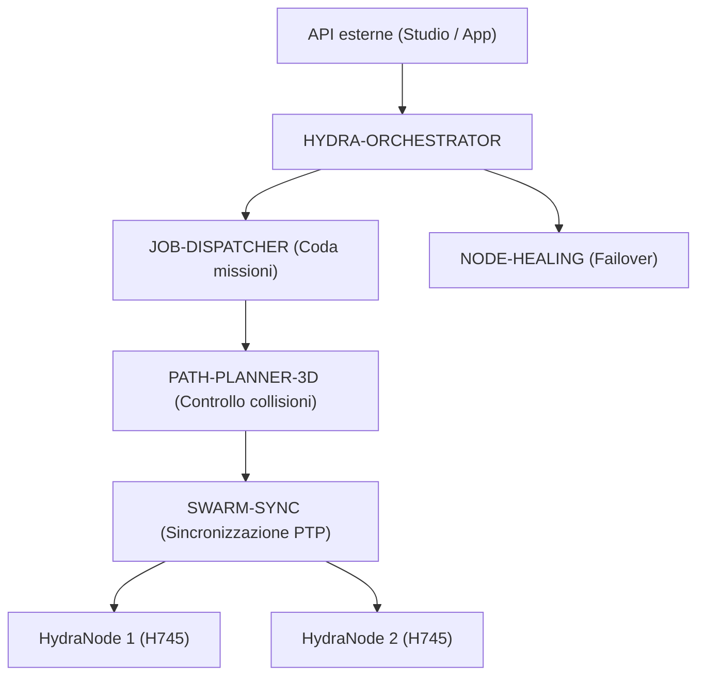

<p align="center">
  
</p>

# 🕸️ HYDRA-UMC-ORCHESTRATOR

<p align="center"><a href="README.md">🇺🇸 English</a> | <a href="README_spa.md">🇪🇸 Español</a> | <a href="README_fra.md">🇫🇷 Français</a> | 🇮🇹 <b>Italiano</b> | <a href="README_deu.md">🇩🇪 Deutsch</a> | <a href="README_zho.md">🇨🇳 简体中文</a> | <a href="README_jpn.md">🇯🇵 日本語</a></p>

### 🤖 Gestore dello sciame distribuito e coordinatore multi-nodo

<p align="left">
  
  
  
  
</p>

---

## 1. 🛠️ PANORAMICA TECNICA

**HYDRA-UMC-ORCHESTRATOR** è lo strato di coordinamento di alto livello dell'ecosistema HYDRA-UMC. Gestisce più HydraNode (Kinematic Brain, Vision Node e Cognitive Node) come un unico sciame unificato.

Gestisce la pianificazione globale della missione, il bilanciamento del carico tra la flotta e la sincronizzazione in tempo reale tra i robot per prevenire collisioni fisiche e garantire una precisione millimetrica nelle attività collaborative multi-robot.

### Caratteristiche principali:
* 🕸️ **Coordinamento dello sciame:** Orchestrano oltre 32 bracci robotici indipendenti attraverso più controller.
* ⚖️ **Bilanciamento del carico:** Assegna automaticamente le missioni al robot più disponibile o meglio equipaggiato.
* 🛡️ **Sicurezza centralizzata:** Gestione globale dell'E-STOP e monitoraggio dello stato di salute dell'intera flotta.
* 📡 **API unificata:** Fornisce un unico punto di ingresso per APP e Studio per interagire con l'intera fabbrica.

---

## 2. 🔄 ARCHITETTURA DI ORCHESTRAZIONE



---

## 3. 🧠 ARCHITETTURA E DECISIONI DI PROGETTAZIONE

> I livelli interni seguenti sono il progetto previsto per la logica dietro
> questo punto di ingresso. Per ciò che funziona oggi (uno scheletro minimo),
> vedere «🔧 BUILD & RUN» più sotto.

**Livelli interni pianificati**, da sviluppare progressivamente sullo
scheletro attuale:
* **Livello API** — riceve richieste di missione di alto livello da Studios e
  app e le traduce in azioni a livello di flotta.
* **Integrazione della coda missioni** — consegna le missioni accettate a
  JOB-DISPATCHER e ne traccia il ciclo di vita nell'intera flotta.
* **Dispatch sincronizzato PTP** — coordina la temporizzazione con
  SWARM-SYNC affinché più robot nella stessa missione restino senza collisioni
  secondo i controlli di PATH-PLANNER-3D.
* **Aggregazione della salute della flotta** — raccoglie i segnali per nodo di
  NODE-HEALING in un'unica vista; è anche il percorso di un E-STOP globale
  diretto a tutti i nodi contemporaneamente.

### Perché Rust per questo servizio specifico

Questo processo ha la maggiore autorità sulla flotta: emetterebbe un E-STOP
globale e decide quale robot riceve ciascuna missione. Richiede coordinamento
deterministico a bassa latenza senza pause del garbage collector, oltre a
sicurezza di memoria e tipi in compilazione. Un crash o una data race potrebbe
lasciare l'intero sciame senza coordinatore durante una missione.
JOB-DISPATCHER e NODE-HEALING usano Go, adatto ai loro compiti più semplici e
isolati, ma non a questo processo centrale.

### Decisioni di progettazione

* **Unico processo con `docker-compose.yml` per l'intera famiglia.** Come
  padre d'integrazione di SWARM-SYNC, PATH-PLANNER-3D, JOB-DISPATCHER e
  NODE-HEALING, questo repository descrive l'esecuzione dell'intera famiglia;
  ogni repository figlio resta concentrato sul proprio compito.
* **Espone una «API unificata» per app e Studios.** I client parlano con questo
  punto d'ingresso stabile anziché con quattro servizi figli; internamente può
  instradare verso la relativa implementazione.

---

## 📂 STRUTTURA DELLE CARTELLE

```text
HYDRA-UMC-ORCHESTRATOR/
├── src/              # Codice sorgente (Core, Rete, API)
├── proto/            # Contratto gRPC condiviso per il traffico nodo-a-nodo
│                     # in tutto l'ecosistema (vedi proto/README.md) - non
│                     # solo l'API di questo repo
├── docs/             # Documentazione e guide all'architettura
├── build/            # Binari compilati (output di build.sh/build.bat)
├── images/           # Media e diagrammi
├── scripts/          # Script di utilità
├── Cargo.toml        # Manifesto del pacchetto Rust (nome, versione, dep)
├── bump_version.py   # Bump di versione stile contachilometri
├── build.sh/.bat     # Aggiorna la versione, poi `cargo build --release`
├── run.sh/.bat       # Esegue il binario compilato
├── docker-compose.yml # Integra questo repo con i suoi 4 figli reali
└── README.md
```

Rimossi dal template originale: `hardware/`, `firmware/` e `os/` — è un
servizio puramente software (binario Rust) senza hardware o firmware propri,
e senza un'immagine del sistema operativo da mantenere.

---

## 🔧 BUILD & RUN

Scheletro Rust reale e minimo - compila ed esegue già oggi.

```bash
# Windows
build.bat
run.bat

# Linux / macOS
./build.sh
./run.sh
```

`build.sh`/`build.bat` aggiornano la versione in `Cargo.toml` (regola
contachilometri dell'ecosistema, vedi `bump_version.py`) e poi eseguono
`cargo build --release`. `run.sh`/`run.bat` eseguono direttamente il binario
risultante.

Come repo padre di integrazione dell'ecosistema, include anche un vero
`docker-compose.yml` che avvia questo servizio insieme ai suoi 4 figli
(SWARM-SYNC, PATH-PLANNER-3D, JOB-DISPATCHER, NODE-HEALING), attesi come
cartelle gemelle:

```bash
docker compose up --build
```

---

## 🚀 ROADMAP
* **Fase 1:** Sincronizzazione deterministica dello sciame su TSN e riduzione del jitter sub-ms.
* **Fase 2:** Pianificazione dei percorsi 3D con evitamento dinamico degli ostacoli in celle multi-robot.
* **Fase 3:** Ottimizzazione del dispacciamento dei lavori multi-robot utilizzando la disponibilità delle risorse in tempo reale.
* **Fase 4:** Implementazione di cluster failover ad alta disponibilità e supporto per robot eterogenei.

---

## 🔗 Progetti Correlati

Questo progetto fa parte di un ecosistema robotico più ampio dello stesso autore (JuanenRac / Electro Hobby 3D), che copre firmware, software di controllo, nodi IA e strumenti di flotta. Utile saperlo, perché una richiesta potrebbe in realtà riguardare uno di questi progetti anziché questo repository.

### Famiglia

**Genitore:** nessuno — questo progetto è esso stesso il genitore di integrazione della famiglia Orchestration & Swarm.

**Figli:**
- **[HYDRA-UMC-SWARM-SYNC](https://github.com/JuanenRac/HYDRA-UMC-SWARM-SYNC)** — riconciliazione dello stato basata su CRDT tra le celle coordinate da questo orchestratore.
- **[HYDRA-UMC-PATH-PLANNER-3D](https://github.com/JuanenRac/HYDRA-UMC-PATH-PLANNER-3D)** — pianificazione di percorsi senza collisioni contro cui questo orchestratore assegna i lavori.
- **[HYDRA-UMC-JOB-DISPATCHER](https://github.com/JuanenRac/HYDRA-UMC-JOB-DISPATCHER)** — la coda/pianificatore di lavori che alimenta questo orchestratore.
- **[HYDRA-UMC-NODE-HEALING](https://github.com/JuanenRac/HYDRA-UMC-NODE-HEALING)** — rileva ed evita un nodo non risponente gestito da questo orchestratore.

### Relazione Diretta (fuori dalla famiglia)

- **[HYDRA-UMC-SERVER](https://github.com/JuanenRac/HYDRA-UMC-SERVER)** — coordina più istanze di questo backend.
- **[HYDRA-UMC-COGNITIVE-NODE](https://github.com/JuanenRac/HYDRA-UMC-COGNITIVE-NODE)** — riceve ordini di missione da qui.
- **[HYDRA-UMC-SUITE](https://github.com/JuanenRac/HYDRA-UMC-SUITE)** — il centro di comando sciame che sostiene questo orchestratore.

### Resto dell'Ecosistema

**Piattaforma HYDRA-UMC** — la cella di micro-fabbrica multi-robot
- **[HYDRA-UMC](https://github.com/JuanenRac/HYDRA-UMC)** — la scheda madre CM5 + STM32H745 che orchestra fino a 8 bracci robotici.
- **[HYDRA-UMC-SERVER](https://github.com/JuanenRac/HYDRA-UMC-SERVER)** — il backend Express/WebSocket con cui parla ogni client di controllo.
- **[HYDRA-UMC-STUDIO](https://github.com/JuanenRac/HYDRA-UMC-STUDIO)** — dashboard di controllo web, visualizzazione 3D multi-robot.
- **[HYDRA-UMC-ANDROID-CONTROL](https://github.com/JuanenRac/HYDRA-UMC-ANDROID-CONTROL)** — app di controllo Android via Wi-Fi/Bluetooth.
- **[HYDRA-UMC-IOS-CONTROL](https://github.com/JuanenRac/HYDRA-UMC-IOS-CONTROL)** — app di controllo iOS/iPadOS costruita in Flutter.
- **[HYDRA-UMC-SUITE](https://github.com/JuanenRac/HYDRA-UMC-SUITE)** — centro di comando sciame desktop (Python/PySide6).
- **[HYDRA-UMC-EDITOR-URDF](https://github.com/JuanenRac/HYDRA-UMC-EDITOR-URDF)** — editor desktop di modelli URDF per il catalogo robot.
- **[HYDRA-UMC-DSI](https://github.com/JuanenRac/HYDRA-UMC-DSI)** — interfaccia touch nativa per lo schermo DSI a bordo.

**Piattaforma URTC** — il controller della testa utensile che ogni braccio HYDRA-UMC porta con sé
- **[URTC](https://github.com/JuanenRac/URTC)** — controller testa utensile su bus CAN, 25 profili utensile.
- **[URTC-FLASHER](https://github.com/JuanenRac/URTC-FLASHER)** — strumento desktop di flashing CAN-OTA + SWD/JTAG.
- **[URTC-TESTER](https://github.com/JuanenRac/URTC-TESTER)** — strumento desktop di diagnostica CAN live.
- **[URTC-WEB-STUDIO](https://github.com/JuanenRac/URTC-WEB-STUDIO)** — alternativa basata su browser via Web Serial API.

**🎥 Vision AI Node (Hailo-8)**
- [HYDRA-UMC-VISION-NODE](https://github.com/JuanenRac/HYDRA-UMC-VISION-NODE)
- [HYDRA-UMC-VISION-STREAMER](https://github.com/JuanenRac/HYDRA-UMC-VISION-STREAMER)
- [HYDRA-UMC-DETECTION-HEF](https://github.com/JuanenRac/HYDRA-UMC-DETECTION-HEF)
- [HYDRA-UMC-SAFETY-ZONES](https://github.com/JuanenRac/HYDRA-UMC-SAFETY-ZONES)
- [HYDRA-UMC-VISUAL-SERVOING-API](https://github.com/JuanenRac/HYDRA-UMC-VISUAL-SERVOING-API)

**🧠 Cognitive AI Node (Hailo-10)**
- [HYDRA-UMC-COGNITIVE-NODE](https://github.com/JuanenRac/HYDRA-UMC-COGNITIVE-NODE)
- [HYDRA-UMC-VLA-ENGINE](https://github.com/JuanenRac/HYDRA-UMC-VLA-ENGINE)
- [HYDRA-UMC-VOICE-UI](https://github.com/JuanenRac/HYDRA-UMC-VOICE-UI)
- [HYDRA-UMC-SEMANTIC-PLANNER](https://github.com/JuanenRac/HYDRA-UMC-SEMANTIC-PLANNER)
- [HYDRA-UMC-DOCS-QA](https://github.com/JuanenRac/HYDRA-UMC-DOCS-QA)

**🎮 Digital Twin & Simulation**
- [HYDRA-UMC-TWIN](https://github.com/JuanenRac/HYDRA-UMC-TWIN)
- [HYDRA-UMC-PHYSICS-REPLICA](https://github.com/JuanenRac/HYDRA-UMC-PHYSICS-REPLICA)
- [HYDRA-UMC-HIL-BRIDGE](https://github.com/JuanenRac/HYDRA-UMC-HIL-BRIDGE)
- [HYDRA-UMC-SYNTHETIC-DATA-GEN](https://github.com/JuanenRac/HYDRA-UMC-SYNTHETIC-DATA-GEN)

**📊 Data & Analytics**
- [HYDRA-UMC-DATALAKE](https://github.com/JuanenRac/HYDRA-UMC-DATALAKE)
- [HYDRA-UMC-TELEMETRY-COLLECTOR](https://github.com/JuanenRac/HYDRA-UMC-TELEMETRY-COLLECTOR)
- [HYDRA-UMC-ANOMALY-DETECTOR](https://github.com/JuanenRac/HYDRA-UMC-ANOMALY-DETECTOR)
- [HYDRA-UMC-PRODUCTION-REPORTS](https://github.com/JuanenRac/HYDRA-UMC-PRODUCTION-REPORTS)

**🏭 Industrial Gateway**
- [HYDRA-UMC-GATEWAY-INDUSTRIAL](https://github.com/JuanenRac/HYDRA-UMC-GATEWAY-INDUSTRIAL)
- [HYDRA-UMC-OPCUA-SERVER](https://github.com/JuanenRac/HYDRA-UMC-OPCUA-SERVER)
- [HYDRA-UMC-MQTT-BROKER](https://github.com/JuanenRac/HYDRA-UMC-MQTT-BROKER)
- [HYDRA-UMC-MTCONNECT-ADAPTER](https://github.com/JuanenRac/HYDRA-UMC-MTCONNECT-ADAPTER)

**🛠️ Complementary Tools**
- [URTC-SMART-RACK](https://github.com/JuanenRac/URTC-SMART-RACK)
- [URTC-VISION-TOOL](https://github.com/JuanenRac/URTC-VISION-TOOL)
- [HYDRA-UMC-WATCH](https://github.com/JuanenRac/HYDRA-UMC-WATCH)
- [HYDRA-UMC-TOOL-CLI](https://github.com/JuanenRac/HYDRA-UMC-TOOL-CLI)
- [HYDRA-UMC-DASHBOARD-AI](https://github.com/JuanenRac/HYDRA-UMC-DASHBOARD-AI)


## 👤 AUTORE
**JuanenRac** (Electro Hobby 3D)
📧 electrohobby3d@gmail.com

## 📜 LICENZA
GPL-3.0 - Vedere LICENSE per i dettagli.
