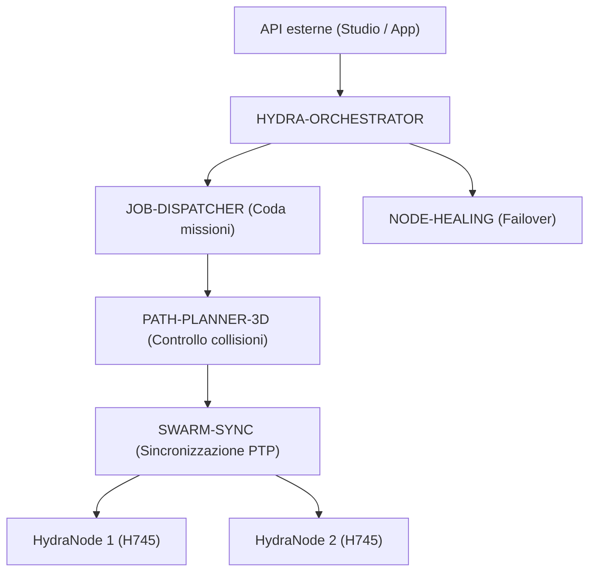

<p align="center">
  
</p>

# 🕸️ HYDRA-UMC-ORCHESTRATOR

<p align="center"><a href="README.md">🇺🇸 English</a> | <a href="README_spa.md">🇪🇸 Español</a> | <a href="README_fra.md">🇫🇷 Français</a> | 🇮🇹 <b>Italiano</b> | <a href="README_deu.md">🇩🇪 Deutsch</a> | <a href="README_zho.md">🇨🇳 简体中文</a> | <a href="README_jpn.md">🇯🇵 日本語</a></p>

### 🤖 Gestore dello sciame distribuito e coordinatore multi-nodo

<p align="left">
  
  
  
  
</p>

---

## 1. 🛠️ PANORAMICA TECNICA

**HYDRA-UMC-ORCHESTRATOR** è lo strato di coordinamento di alto livello dell'ecosistema HYDRA-UMC. Gestisce più HydraNode (Kinematic Brain, Vision Node e Cognitive Node) come un unico sciame unificato.

Gestisce la pianificazione globale della missione, il bilanciamento del carico tra la flotta e la sincronizzazione in tempo reale tra i robot per prevenire collisioni fisiche e garantire una precisione millimetrica nelle attività collaborative multi-robot.

### Caratteristiche principali:
* 🕸️ **Coordinamento dello sciame:** Orchestrano oltre 32 bracci robotici indipendenti attraverso più controller.
* ⚖️ **Bilanciamento del carico:** Assegna automaticamente le missioni al robot più disponibile o meglio equipaggiato.
* 🛡️ **Sicurezza centralizzata:** Gestione globale dell'E-STOP e monitoraggio dello stato di salute dell'intera flotta.
* 📡 **API unificata:** Fornisce un unico punto di ingresso per APP e Studio per interagire con l'intera fabbrica.
* 🧩 **Reale v0 - Macchina a stati della missione:** `mission.rs` segue ogni missione attraverso `Pending -> Dispatched -> InProgress -> Completed` (più gli stati terminali `Cancelled`/`Failed`), con cancellazione idempotente e vero recupero quando un nodo viene segnalato irraggiungibile/non valido - vedi `mission-demo` più sotto. Logica pura in memoria - non serve nessun peer gRPC live con JOB-DISPATCHER/NODE-HEALING per eseguirla o testarla.

---

## 2. 🔄 ARCHITETTURA DI ORCHESTRAZIONE



---

## 3. 🧠 ARCHITETTURA E DECISIONI DI PROGETTAZIONE

> I livelli interni seguenti sono il progetto previsto per la logica dietro
> questo punto di ingresso. Per ciò che funziona oggi, vedere «🔧 BUILD ED ESECUZIONE»
> più sotto: una macchina a stati della missione reale e puramente in memoria
> (`mission.rs`), ancora senza alcun peer di rete live con cui parlare.

**Livelli interni pianificati**, da sviluppare progressivamente sulla
macchina a stati reale che già esiste:
* **Livello API** — riceve richieste di missione di alto livello da Studios e
  app e le traduce in azioni a livello di flotta.
* **Integrazione della coda missioni** — consegna le missioni accettate a
  JOB-DISPATCHER e ne traccia il ciclo di vita nell'intera flotta usando la
  macchina a stati reale `Mission`/`MissionRegistry` che già esiste in
  `mission.rs` - ciò che manca ancora è il collegamento gRPC verso un vero
  JOB-DISPATCHER a cui consegnare le missioni.
* **Dispatch sincronizzato PTP** — coordina la temporizzazione con
  SWARM-SYNC affinché più robot nella stessa missione restino senza collisioni
  secondo i controlli di PATH-PLANNER-3D.
* **Aggregazione della salute della flotta** — raccoglie i segnali per nodo di
  NODE-HEALING in un'unica vista e chiama
  `MissionRegistry::recover_node_unavailable()` (già reale) non appena arriva
  ogni segnale; è anche il percorso di un E-STOP globale diretto a tutti i
  nodi contemporaneamente.

### Perché Rust per questo servizio specifico

Questo processo ha la maggiore autorità sulla flotta: emetterebbe un E-STOP
globale e decide quale robot riceve ciascuna missione. Richiede coordinamento
deterministico a bassa latenza senza pause del garbage collector, oltre a
sicurezza di memoria e tipi in compilazione. Un crash o una data race potrebbe
lasciare l'intero sciame senza coordinatore durante una missione.
JOB-DISPATCHER e NODE-HEALING usano Go, adatto ai loro compiti più semplici e
isolati, ma non a questo processo centrale.

### Decisioni di progettazione

* **Unico processo con `docker-compose.yml` per l'intera famiglia.** Come
  padre d'integrazione di SWARM-SYNC, PATH-PLANNER-3D, JOB-DISPATCHER e
  NODE-HEALING, questo repository descrive l'esecuzione dell'intera famiglia;
  ogni repository figlio resta concentrato sul proprio compito.
* **Espone una «API unificata» per app e Studios.** I client parlano con questo
  punto d'ingresso stabile anziché con quattro servizi figli; internamente può
  instradare verso la relativa implementazione.
* **Perché `cancel()` è idempotente invece di fallire su una missione già cancellata.** Una richiesta di cancellazione può legittimamente arrivare due volte - un client che riprova dopo una risposta persa, un operatore che clicca di nuovo cancella prima di vedere la conferma. Trattare la seconda chiamata come un successo (`AlreadyCancelled`, non un errore) significa che chi chiama non deve mai distinguere "la mia cancellazione ha funzionato" da "la cancellazione di qualcun altro ha già funzionato" - entrambi sono lo stesso buon risultato. Cancellare una missione `Completed`/`Failed` resta rifiutato: questa è una situazione genuinamente diversa, non idempotente (annullare lavoro finito), non un nuovo tentativo.
* **Perché il recupero da guasto nodo rimette in coda a `Pending` invece di far fallire subito la missione.** Un nodo che segnala `UNREACHABLE` potrebbe essere in fase di riavvio piuttosto che scomparso definitivamente (vedi la stessa logica di retry limitati di `HYDRA-UMC-NODE-HEALING`, che assorbe già i disturbi transitori prima ancora di segnalare un nodo come caduto) - quindi una missione bloccata su quel nodo ottiene una nuova possibilità su un altro nodo tramite `Pending`, invece di essere segnata `Failed` al primo segnale di problema. `fail()` esiste comunque per quando il redispatch esaurisce davvero le opzioni.

Per ogni esempio reale di mission-demo/CLI (catturato da un binario realmente compilato), vedere [`docs/CLI_REFERENCE.md`](docs/CLI_REFERENCE.md). Per il contratto gRPC condiviso `hydra.common.v1` stesso - cosa definisce, perché vive in questo repo e come ogni linguaggio genera i propri binding - vedere [`proto/README.md`](proto/README.md).

---

## 📂 STRUTTURA DELLE CARTELLE

```text
HYDRA-UMC-ORCHESTRATOR/
├── src/
│   ├── mission.rs         # Macchina a stati della missione reale (Mission, MissionRegistry)
│   ├── job_dispatcher.rs  # Client reale per la API HTTP propria di HYDRA-UMC-JOB-DISPATCHER
│   ├── server.rs          # Superficie JSON/HTTP semplice (tiny_http, bloccante, senza runtime async)
│   └── main.rs            # Entry point + sottocomando reale `mission-demo`
├── proto/            # Contratto gRPC condiviso per il traffico nodo-a-nodo
│                     # in tutto l'ecosistema (vedi proto/README.md) - non
│                     # solo l'API di questo repo
├── docs/             # Documentazione e guide all'architettura
├── build/            # Binari compilati (output di build.sh/build.bat)
├── images/           # Media e diagrammi
├── systemd/
│   └── hydra-umc-orchestrator.service # Unità systemd della API locale mission/dispatch sulla CM5
├── tools/
│   ├── build_test.py # Controllo build senza versionamento
│   └── ci_validate.py # Validazione manifest/CHANGELOG/docs usata dalla CI
├── Cargo.toml        # Manifesto del pacchetto Rust (nome, versione, dep)
├── bump_version.py   # Bump di versione nativa stile contachilometri
├── bump_manifest_version.py # Sincronizza la versione di hydra-umc.project.json con quella nativa (--sync)
├── build.sh/.bat     # Aggiorna la versione, poi `cargo build --release`
├── build-test.sh/.bat # Controllo build senza versionamento
├── run.sh/.bat       # Esegue il binario compilato
├── docker-compose.yml # Integra questo repo con i suoi 4 figli reali
└── README.md
```

Rimossi dal template originale: `hardware/`, `firmware/` e `os/` — è un
servizio puramente software (binario Rust) senza hardware o firmware propri,
e senza un'immagine del sistema operativo da mantenere.

---

## 🔧 BUILD ED ESECUZIONE

L'invocazione nuda resta uno scheletro minimo (stampa l'identità, esce con
0); la vera macchina a stati della missione è esercitabile oggi tramite
`mission-demo`.

```bash
# Windows
build.bat
run.bat
run.bat mission-demo

# Linux / macOS
./build.sh
./run.sh
./run.sh mission-demo
```

`build.sh`/`build.bat` aggiornano la versione in `Cargo.toml` (regola
contachilometri dell'ecosistema, vedi `bump_version.py`) e poi eseguono
`cargo build --release`. `run.sh`/`run.bat` eseguono direttamente il binario
risultante.

`mission-demo` esegue uno scenario reale end-to-end contro il
`MissionRegistry` di `mission.rs` e stampa ogni transizione reale:

```text
[orchestrator] mission-1: dispatched -> InProgress(node=node-a)
[orchestrator] mission-2: dispatched -> Dispatched(node=node-a)
[orchestrator] mission-3: dispatched -> InProgress(node=node-b)
[orchestrator] node-a reported UNREACHABLE by NODE-HEALING - recovering its missions
[orchestrator] mission-1: requeued -> Pending
[orchestrator] mission-2: requeued -> Pending
[orchestrator] mission-3: unaffected (different node) -> InProgress(node=node-b)
[orchestrator] mission-2: cancel() -> Cancelled -> Cancelled
[orchestrator] mission-2: cancel() again (idempotent) -> AlreadyCancelled -> Cancelled
[orchestrator] mission-3: complete() -> Completed(node=node-b)
[orchestrator] mission-4: fail() -> Failed(no healthy node accepted redispatch after 3 attempts)
[orchestrator] final registry state:
  mission-1: Pending (terminal=false)
  mission-2: Cancelled (terminal=true)
  mission-3: Completed(node=node-b) (terminal=true)
  mission-4: Failed(no healthy node accepted redispatch after 3 attempts) (terminal=true)
```

```bash
cargo test   # 42 test: ogni transizione, ogni rifiuto di transizione
             # non valida, cancellazione idempotente e recupero dopo
             # guasto nodo
```

Come repo padre di integrazione dell'ecosistema, include anche un vero
`docker-compose.yml` che avvia questo servizio insieme ai suoi 4 figli
(SWARM-SYNC, PATH-PLANNER-3D, JOB-DISPATCHER, NODE-HEALING), attesi come
cartelle gemelle:

```bash
docker compose up --build
```

---

## 🚀 TABELLA DI MARCIA
* **Fase 1:** Sincronizzazione deterministica dello sciame su TSN e riduzione del jitter sub-ms.
* **Fase 2:** Pianificazione dei percorsi 3D con evitamento dinamico degli ostacoli in celle multi-robot.
* **Fase 3:** Ottimizzazione del dispacciamento dei lavori multi-robot utilizzando la disponibilità delle risorse in tempo reale.
* **Fase 4:** Implementazione di cluster failover ad alta disponibilità e supporto per robot eterogenei.

---

## 🔗 Progetti Correlati

Questo progetto fa parte dell'ecosistema robotico HYDRA-UMC dello stesso autore (JuanenRac / Electro Hobby 3D). Vale la pena conoscerlo, poiché una richiesta potrebbe in realtà riguardare uno di questi invece di questo repository.

**Progetti Figli** — ciascuno è un servizio che questo orchestratore coordina o alimenta direttamente
- **[HYDRA-UMC-SWARM-SYNC](https://github.com/JuanenRac/HYDRA-UMC-SWARM-SYNC)** — vera sincronizzazione di stato CRDT LWW-Element-Map, con property test per la convergenza multi-cella.
- **[HYDRA-UMC-PATH-PLANNER-3D](https://github.com/JuanenRac/HYDRA-UMC-PATH-PLANNER-3D)** — vero pianificatore di percorsi 3D basato su RRT, con vera validazione delle collisioni ostacolo/spazio di lavoro.
- **[HYDRA-UMC-JOB-DISPATCHER](https://github.com/JuanenRac/HYDRA-UMC-JOB-DISPATCHER)** — vera coda di lavori basata su priorità con deduplicazione, su una vera API HTTP.
- **[HYDRA-UMC-NODE-HEALING](https://github.com/JuanenRac/HYDRA-UMC-NODE-HEALING)** — vero watchdog di salute della flotta basato su gRPC, con retry/backoff e rilevamento di discrepanza d'identità.

**Direttamente Correlati**
- **[HYDRA-UMC-SERVER](https://github.com/JuanenRac/HYDRA-UMC-SERVER)** — il vero backend headless (REST/WebSocket) con cui parla davvero ogni client di controllo; questo orchestratore coordina più istanze di esso.
- **[HYDRA-UMC-COGNITIVE-NODE](https://github.com/JuanenRac/HYDRA-UMC-COGNITIVE-NODE)** — hub di integrazione per la pipeline cognitiva Hailo-10 (orchestrazione LLM/VLA/voce); riceve ordini a livello di missione da qui.
- **[HYDRA-UMC-SUITE](https://github.com/JuanenRac/HYDRA-UMC-SUITE)** — centro di comando sciame desktop (PySide6) per più server contemporaneamente, pacchettizzato come eseguibile standalone; il centro di comando sciame supportato da questo orchestratore.

**Fa Anche Parte dell'Ecosistema**

*Hardware e Piattaforma di Base*
- **[HYDRA-UMC](https://github.com/JuanenRac/HYDRA-UMC)** — la scheda madre fisica del braccio robotico: host CM5 + coprocessore STM32H745 dual-core, che coordina fino a 8 bracci utensile via CAN-OTA/SPI-OTA.
- **[HYDRA-UMC-OS](https://github.com/JuanenRac/HYDRA-UMC-OS)** — livello prodotto riproducibile su Raspberry Pi OS per il CM5: agente in sola lettura, config/profili validati, provisioning WiFi al primo contatto.
- **[HYDRA-UMC-SDK](https://github.com/JuanenRac/HYDRA-UMC-SDK)** — il contratto JSON-Schema condiviso e la barriera di sicurezza contro cui ogni bridge valida i propri comandi.

*Backend Centrale e Client*
- **[HYDRA-UMC-STUDIO](https://github.com/JuanenRac/HYDRA-UMC-STUDIO)** — dashboard di controllo web con visualizzazione 3D multi-robot in tempo reale.
- **[HYDRA-UMC-ANDROID-CONTROL](https://github.com/JuanenRac/HYDRA-UMC-ANDROID-CONTROL)** — app di controllo nativa per Android con login biometrico e un companion Wear OS abbinato.
- **[HYDRA-UMC-IOS-CONTROL](https://github.com/JuanenRac/HYDRA-UMC-IOS-CONTROL)** — app di controllo per iOS/iPadOS (Flutter) con sincronizzazione WebSocket in tempo reale.
- **[HYDRA-UMC-DSI](https://github.com/JuanenRac/HYDRA-UMC-DSI)** — interfaccia touch nativa per il touchscreen DSI da 7" a bordo, incorporata direttamente nel CM5.
- **[HYDRA-UMC-EDITOR-URDF](https://github.com/JuanenRac/HYDRA-UMC-EDITOR-URDF)** — creatore/editor grafico desktop di URDF che invia i modelli finiti al catalogo di STUDIO.
- **[HYDRA-UMC-BRIDGE-AMR](https://github.com/JuanenRac/HYDRA-UMC-BRIDGE-AMR)** — barriera di coordinamento per flotte AGV/AMR tramite un publisher MQTT VDA 5050 reale.
- **[HYDRA-UMC-BRIDGE-CNC](https://github.com/JuanenRac/HYDRA-UMC-BRIDGE-CNC)** — coordinatore ad alto livello per celle CNC con accesso reale a stato/byte di controllo GRBL.
- **[HYDRA-UMC-BRIDGE-DROIDS](https://github.com/JuanenRac/HYDRA-UMC-BRIDGE-DROIDS)** — barriera di coordinamento per droidi con zampe/umanoidi, con un vero mittente di comandi per Boston Dynamics Spot.
- **[HYDRA-UMC-BRIDGE-LASER](https://github.com/JuanenRac/HYDRA-UMC-BRIDGE-LASER)** — coordinatore di sicurezza per celle laser che legge 3 salvaguardie GPIO reali di chiave/involucro/interblocco.
- **[HYDRA-UMC-BRIDGE-OPENPNP](https://github.com/JuanenRac/HYDRA-UMC-BRIDGE-OPENPNP)** — coordinatore ad alto livello sicuro per il flusso schede del pick-and-place OpenPnP.
- **[HYDRA-UMC-BRIDGE-PRINTER3D](https://github.com/JuanenRac/HYDRA-UMC-BRIDGE-PRINTER3D)** — barriera di coordinamento sicura per stampanti 3D Moonraker/Klipper, con comandi di lavoro reali e controllati.
- **[HYDRA-UMC-BRIDGE-ROS2](https://github.com/JuanenRac/HYDRA-UMC-BRIDGE-ROS2)** — coordinatore di sicurezza con un vero trasporto ROS 2 rclpy, importato in modo lazy.
- **[HYDRA-UMC-BRIDGE-UAV](https://github.com/JuanenRac/HYDRA-UMC-BRIDGE-UAV)** — barriera di coordinamento per UAV dotati di fotocamera, con un vero mittente di comandi MAVLink.

*Piattaforma Strumenti URTC*
- **[URTC](https://github.com/JuanenRac/URTC)** — firmware per la scheda fisica dell'Universal Robot Tool Controller, oltre 25 profili utensile su bus CAN.
- **[URTC-FLASHER](https://github.com/JuanenRac/URTC-FLASHER)** — strumento desktop con GUI per il flashing delle schede URTC, CAN-OTA più SWD/JTAG a chip intero.
- **[URTC-TESTER](https://github.com/JuanenRac/URTC-TESTER)** — strumento desktop di diagnostica CAN-bus dal vivo per schede URTC, un pannello per profilo utensile.
- **[URTC-WEB-STUDIO](https://github.com/JuanenRac/URTC-WEB-STUDIO)** — alternativa basata su browser a URTC-TESTER tramite la Web Serial API, senza installazione locale.

*Nodo IA Visione (Hailo-8)*
- **[HYDRA-UMC-VISION-NODE](https://github.com/JuanenRac/HYDRA-UMC-VISION-NODE)** — hub di integrazione per la pipeline di visione Hailo-8, con un vero controllo di prontezza hardware per fase.
- **[HYDRA-UMC-DETECTION-HEF](https://github.com/JuanenRac/HYDRA-UMC-DETECTION-HEF)** — registro reale di modelli compilati con verifica di caricamento sicuro per architettura Hailo/checksum.
- **[HYDRA-UMC-VISION-STREAMER](https://github.com/JuanenRac/HYDRA-UMC-VISION-STREAMER)** — generatore reale di pipeline GStreamer + config MediaMTX, con una vera barriera di integrazione HailoRT.
- **[HYDRA-UMC-VISUAL-SERVOING-API](https://github.com/JuanenRac/HYDRA-UMC-VISUAL-SERVOING-API)** — vera legge di correzione Position-Based Visual Servoing, con cancello di sicurezza sullo stato di zona a monte.
- **[HYDRA-UMC-SAFETY-ZONES](https://github.com/JuanenRac/HYDRA-UMC-SAFETY-ZONES)** — vero controllo di violazione zona e richiesta E-STOP, con imposizione della freschezza di calibrazione.

*Nodo IA Cognitivo (Hailo-10)*
- **[HYDRA-UMC-VLA-ENGINE](https://github.com/JuanenRac/HYDRA-UMC-VLA-ENGINE)** — vera codifica/decodifica di token d'azione e generazione di traiettoria per un modello Vision-Language-Action.
- **[HYDRA-UMC-VOICE-UI](https://github.com/JuanenRac/HYDRA-UMC-VOICE-UI)** — vero front-end vocale (VAD + parser di intenti) con un relay verso Watch limitato e soggetto a conferma.
- **[HYDRA-UMC-SEMANTIC-PLANNER](https://github.com/JuanenRac/HYDRA-UMC-SEMANTIC-PLANNER)** — vera scomposizione dei task basata su regole e recupero semantico degli errori sui codici errore MCU.
- **[HYDRA-UMC-DOCS-QA](https://github.com/JuanenRac/HYDRA-UMC-DOCS-QA)** — vera ricerca documentale TF-IDF (solo libreria standard) sui documenti Markdown di questo ecosistema.

*Gemello Digitale e Simulazione*
- **[HYDRA-UMC-TWIN](https://github.com/JuanenRac/HYDRA-UMC-TWIN)** — hub di integrazione per il motore di gemello digitale, con un vero contratto di sincronizzazione per compatibilità di versione.
- **[HYDRA-UMC-HIL-BRIDGE](https://github.com/JuanenRac/HYDRA-UMC-HIL-BRIDGE)** — vero interblocco di sicurezza hardware-in-the-loop che instrada i comandi tra simulazione e hardware reale.
- **[HYDRA-UMC-PHYSICS-REPLICA](https://github.com/JuanenRac/HYDRA-UMC-PHYSICS-REPLICA)** — vera cinematica diretta e validazione dei limiti articolari su un vero sottoinsieme URDF.
- **[HYDRA-UMC-SYNTHETIC-DATA-GEN](https://github.com/JuanenRac/HYDRA-UMC-SYNTHETIC-DATA-GEN)** — vero generatore procedurale di scene 2D con esportazione di annotazioni YOLO/COCO.

*Dati e Analisi*
- **[HYDRA-UMC-DATALAKE](https://github.com/JuanenRac/HYDRA-UMC-DATALAKE)** — vero archivio di serie temporali basato su sqlite3, con una vera API HTTP di ingestione/query.
- **[HYDRA-UMC-ANOMALY-DETECTOR](https://github.com/JuanenRac/HYDRA-UMC-ANOMALY-DETECTOR)** — vero rilevatore di anomalie FFT + baseline statistica, con monitoraggio della deriva.
- **[HYDRA-UMC-PRODUCTION-REPORTS](https://github.com/JuanenRac/HYDRA-UMC-PRODUCTION-REPORTS)** — vero calcolo OEE/disponibilità sullo storico di DATALAKE, con esportazione CSV riproducibile.
- **[HYDRA-UMC-TELEMETRY-COLLECTOR](https://github.com/JuanenRac/HYDRA-UMC-TELEMETRY-COLLECTOR)** — vera pipeline di ingestione CAN/WebSocket verso DATALAKE, con deduplicazione per sequenza.

*Gateway Industriale*
- **[HYDRA-UMC-GATEWAY-INDUSTRIAL](https://github.com/JuanenRac/HYDRA-UMC-GATEWAY-INDUSTRIAL)** — hub di integrazione che inoltra ai protocolli industriali, con un vero livello di allowlist dei comandi/backpressure.
- **[HYDRA-UMC-OPCUA-SERVER](https://github.com/JuanenRac/HYDRA-UMC-OPCUA-SERVER)** — vero spazio di indirizzi OPC-UA, verificato con una vera sessione client del protocollo binario.
- **[HYDRA-UMC-MQTT-BROKER](https://github.com/JuanenRac/HYDRA-UMC-MQTT-BROKER)** — vero broker MQTT con autenticazione opzionale per client e ACL sui topic.
- **[HYDRA-UMC-MTCONNECT-ADAPTER](https://github.com/JuanenRac/HYDRA-UMC-MTCONNECT-ADAPTER)** — veri endpoint XML `/probe` e `/current` di MTConnect, con output in modalità degradata.

*Strumenti Complementari e Operazioni dell'Ecosistema*
- **[HYDRA-UMC-DASHBOARD-AI](https://github.com/JuanenRac/HYDRA-UMC-DASHBOARD-AI)** — pannelli Smart Summaries e Anomaly Highlighting su DATALAKE/ANOMALY-DETECTOR, con un fallback statistico onesto.
- **[HYDRA-UMC-TOOL-CLI](https://github.com/JuanenRac/HYDRA-UMC-TOOL-CLI)** — CLI di flotta con un vero e stabile contratto di exit-code, un client live reale della stessa API di HYDRA-UMC-SERVER.
- **[HYDRA-UMC-WATCH](https://github.com/JuanenRac/HYDRA-UMC-WATCH)** — app companion WearOS con avvisi aptici reali e un relay vocale verso il telefono abbinato.
- **[URTC-SMART-RACK](https://github.com/JuanenRac/URTC-SMART-RACK)** — firmware per un rack di montaggio schede con decodifica reale dell'ID utensile e logica di preriscaldamento Smart Idle.
- **[URTC-VISION-TOOL](https://github.com/JuanenRac/URTC-VISION-TOOL)** — firmware più un vero companion di visione Python per una testa utensile di ispezione termica/RGB.
- **[HYDRA-UMC-UPDATER](https://github.com/JuanenRac/HYDRA-UMC-UPDATER)** — strumento amministrativo desktop che scopre, clona e aggiorna ogni repository di questo ecosistema.


---

## 📚 Documentazione e Comunità

- **[CONTRIBUTING.md](CONTRIBUTING.md)** — stack tecnologico e linee guida di codifica per una pull request.
- **[CODE_OF_CONDUCT.md](CODE_OF_CONDUCT.md)** — gli standard di comportamento attesi in questa comunità.
- **[SECURITY.md](SECURITY.md)** — come segnalare una vulnerabilità, e le reali aree di attenzione sulla sicurezza di questo progetto.
- **[SUPPORT.md](SUPPORT.md)** — dove porre domande e segnalare bug.
- **[LICENSE.md](LICENSE.md)** — la licenza propria di questo progetto.

## 👤 AUTORE
**JuanenRac** (Electro Hobby 3D)
📧 electrohobby3d@gmail.com
📺 [youtube.com/@electrohobby3d](https://youtube.com/@electrohobby3d)

## 📜 LICENZA
GPL-3.0 - Vedere LICENSE per i dettagli.
