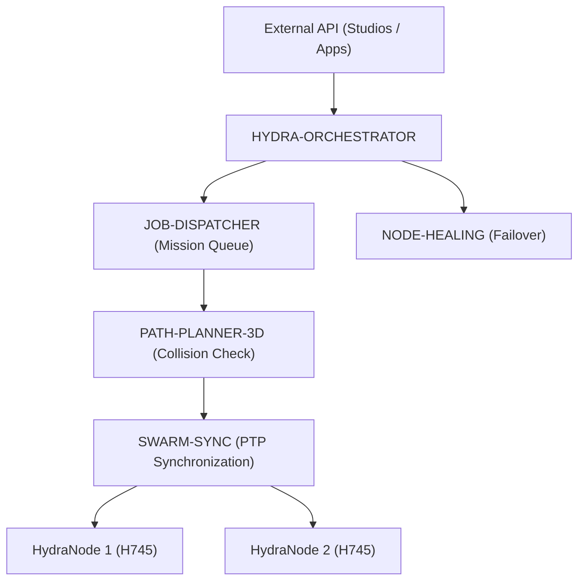

<p align="center">
  
</p>

# 🕸️ HYDRA-UMC-ORCHESTRATOR

<p align="center"><a href="README.md">🇺🇸 English</a> | <a href="README_spa.md">🇪🇸 Español</a> | <a href="README_fra.md">🇫🇷 Français</a> | <a href="README_ita.md">🇮🇹 Italiano</a> | <a href="README_deu.md">🇩🇪 Deutsch</a> | <a href="README_zho.md">🇨🇳 简体中文</a> | 🇯🇵 <b>日本語</b></p>

### 🤖 分散型スウォームマネージャー & マルチノードコーディネーター

<p align="left">
  
  
  
  
</p>

---

## 1. 🛠️ 技術概要

**HYDRA-UMC-ORCHESTRATOR** は、HYDRA-UMC エコシステムの高レベル調整層
です。複数の HydraNode（運動学ブレイン、ビジョンノード、認知ノード）を
単一の統合されたスウォームとして管理します。

グローバルなミッション計画、フリート全体での負荷分散、そして物理的な
衝突を防ぎマルチロボット協調タスクにおけるミリメートル単位の精度を確保
するためのロボット間のリアルタイム同期を処理します。

### 主な機能：
* 🕸️ **スウォーム調整：** 複数のコントローラーにまたがる最大 32 台以上の独立したロボットアームをオーケストレートします。
* ⚖️ **負荷分散：** 最も空いている、または最適な装備を持つロボットに自動的にミッションを割り当てます。
* 🛡️ **集中安全管理：** グローバル E-STOP 管理とフリート全体の健全性監視。
* 📡 **統一 API：** アプリと Studio が工場全体とやり取りするための単一のエントリポイントを提供します。
* 🧩 **実装済み v0 —— ミッション状態機械：** `mission.rs` が各ミッションを `Pending -> Dispatched -> InProgress -> Completed`（および終端状態の `Cancelled`/`Failed`）を通じて追跡し、冪等なキャンセルと、ノードが到達不能/無効と報告された場合の実際のリカバリーを備えています——下記の `mission-demo` を参照してください。純粋なインメモリロジックであり、実行やテストに JOB-DISPATCHER/NODE-HEALING とのライブ gRPC ピアは不要です。

---

## 2. 🔄 オーケストレーションアーキテクチャ



---

## 3. 🧠 アーキテクチャと設計上の決定

> 以下の内部レイヤーは、このエントリポイントの背後に置かれる予定のロジック
> の計画設計です——今日実際に動くものについては、さらに下の「🔧 ビルドと
> 実行」を参照してください：実際の、純粋にインメモリで動作するミッション
> 状態機械（`mission.rs`）であり、まだ話し相手となるライブのネットワーク
> ピアはありません。

すでに存在する実際の状態機械の上に段階的に構築される**計画中の内部
レイヤー**：
* **API 層** — Studio/アプリから高レベルのミッションリクエストを受け取り、フリートレベルのアクションに変換します。
* **ミッションキュー統合** — 受理されたミッションを、`mission.rs` にすでに存在する実際の `Mission`/`MissionRegistry` 状態機械を使って JOB-DISPATCHER に引き渡し、フリート全体にわたってそのライフサイクルを追跡します——まだ欠けているのは、ミッションを引き渡す先となる実際の JOB-DISPATCHER への gRPC 配線です。
* **PTP 同期ディスパッチ** — SWARM-SYNC とタイミングを協調させ、同一ミッションを実行する複数のロボットが PATH-PLANNER-3D のチェックに従って衝突のない状態を維持します。
* **フリート健全性の集約** — NODE-HEALING の各ノードからの信号を単一のフリート全体のビューに統合し、各信号が到着するたびに（すでに実際に動作する）`MissionRegistry::recover_node_unavailable()` を呼び出します。これはまた、グローバル E-STOP がすべてのノードに一度に到達するために通る経路でもあります。

### このサービスに特に Rust を採用した理由
このプロセスはフリートに対して最も大きな権限を持つものです：グローバル
E-STOP を発行し、どのロボットがどのミッションを担当するかを裁定します。
その役割には決定論的で低遅延な調整が必要です——安全に関わる停止を遅らせ
かねないガベージコレクションの一時停止は許容できません——また、コンパイル
時のメモリ/型安全性も必要です。なぜなら、ここでのクラッシュやデータ競合は
局所的に留まらず、ミッション実行中にスウォーム全体をコーディネーター不在
の状態に陥れる可能性があるからです。本オーケストレーター自身の 2 つの
子プロジェクト（JOB-DISPATCHER、NODE-HEALING）は代わりに Go を使用して
おり、それらのよりシンプルで独立したタスクにはよく適合しています。それは
この特定の「ブレイン」プロセスが必要とするトレードオフではありません。

### 設計上の決定
* **ファミリー全体の `docker-compose.yml` を持つ唯一のプロセス。** SWARM-SYNC、PATH-PLANNER-3D、JOB-DISPATCHER、NODE-HEALING の統合親プロジェクトとして、本リポジトリはファミリー全体がどのように連携して動作するかを記述する自然な場所です——各子プロジェクト自身のリポジトリは自分自身に集中したままにできます。
* **アプリ/Studio 向けに「統一 API」を公開。** すべてのクライアント（モバイルアプリ、デスクトップ版 Studio）が 4 つの独立した子サービスと直接やり取りするのではなく、ここにある 1 つの安定したエントリポイントとやり取りします。このエントリポイントは、その下層で変化する子実装のいずれにも自由にルーティングできます。
* **`cancel()` が、すでにキャンセル済みのミッションでエラーにするのではなく冪等である理由。** キャンセルリクエストは正当に二度届くことがあります——応答が失われた後にクライアントが再試行する場合や、確認を見る前にオペレーターが再度キャンセルをクリックする場合です。2 回目の呼び出しを成功（`AlreadyCancelled`、エラーではない）として扱うことで、呼び出し元は「自分のキャンセルが効いた」のか「誰か他の人のキャンセルがすでに効いていた」のかを決して区別する必要がなくなります——どちらも同じ良い結果だからです。`Completed`/`Failed` からのキャンセルは引き続き拒否されます：これは本当に異なる、非冪等な状況(完了した作業を取り消すこと)であり、再試行ではありません。
* **ノード障害からのリカバリーがミッションを即座に失敗させるのではなく `Pending` に再キューする理由。** `UNREACHABLE` を報告するノードは、永久に失われたのではなく、再起動中である可能性があります(`HYDRA-UMC-NODE-HEALING` 自身の上限付きリトライロジックを参照してください。そもそもノードがダウンしていると報告される前に、一時的な不調をすでに吸収しています)——そのため、そのノードで止まっていたミッションは、最初のトラブルの兆候で `Failed` にマークされるのではなく、`Pending` を通じて別のノードで新たなチャンスを得ます。再ディスパッチが本当に選択肢を使い果たした場合のために、`fail()` は引き続き存在します。

---

## 📂 リポジトリ構成

```text
HYDRA-UMC-ORCHESTRATOR/
├── src/
│   ├── mission.rs    # 実際のミッション状態機械（Mission、MissionRegistry）
│   ├── job_dispatcher.rs  # HYDRA-UMC-JOB-DISPATCHER自身のHTTP APIに対する実際のクライアント
│   ├── server.rs          # シンプルなJSON/HTTPサーフェス(tiny_http、ブロッキング、非同期ランタイムなし)
│   └── main.rs       # エントリポイント + 実際の `mission-demo` サブコマンド
├── proto/            # エコシステム全体のノード間通信のための共有 gRPC
│                     # コントラクト（proto/README.md を参照）——本リポ
│                     # ジトリ自身の API だけではありません
├── docs/             # ドキュメントとアーキテクチャガイド
├── build/            # コンパイル済みバイナリ（build.sh/build.bat の出力）
├── images/           # メディアと図表
├── systemd/
│   └── hydra-umc-orchestrator.service # ローカルCM5 mission/dispatch APIのsystemdユニット
├── tools/
│   ├── build_test.py # バージョンを増やさないビルドチェック
│   └── ci_validate.py # CI が使用するマニフェスト/CHANGELOG/ドキュメント検証
├── Cargo.toml        # Rust パッケージマニフェスト（名前、バージョン、依存関係）
├── bump_version.py   # ネイティブバージョンのオドメーター式インクリメント、build.sh/.bat が実行
├── bump_manifest_version.py # hydra-umc.project.json のバージョンをネイティブ版と同期(--sync)
├── build.sh/.bat     # バージョンを増加させ、その後 `cargo build --release` を実行
├── build-test.sh/.bat # バージョンを増やさないビルドチェック
├── run.sh/.bat       # コンパイル済みバイナリを実行
├── docker-compose.yml # 本リポジトリを実際の 4 つの子プロジェクトと統合
└── README.md
```

元のテンプレートから省略：`hardware/`、`firmware/`、`os/` —— これは純粋
なソフトウェアサービス（Rust バイナリ）であり、専用のハードウェアや
ファームウェアを持たず、維持すべきオペレーティングシステムイメージも
ありません。

---

## 🔧 ビルドと実行

素の呼び出しは引き続き最小限のスケルトンのままです(識別情報を表示し、
終了コード 0 で終了)。実際のミッション状態機械は、今日 `mission-demo`
経由ですでに試すことができます。

```bash
# Windows
build.bat
run.bat
run.bat mission-demo

# Linux / macOS
./build.sh
./run.sh
./run.sh mission-demo
```

`build.sh`/`build.bat` は `Cargo.toml` のバージョンを増加させ（エコ
システム全体で統一されたオドメーター規則、`bump_version.py` を参照）、
その後 `cargo build --release` を実行します。`run.sh`/`run.bat` は
生成されたバイナリを直接実行します。

`mission-demo` は `mission.rs` の `MissionRegistry` に対して実際の
シナリオをエンドツーエンドで実行し、実際の状態遷移をすべて表示します：

```text
[orchestrator] mission-1: dispatched -> InProgress(node=node-a)
[orchestrator] mission-2: dispatched -> Dispatched(node=node-a)
[orchestrator] mission-3: dispatched -> InProgress(node=node-b)
[orchestrator] node-a reported UNREACHABLE by NODE-HEALING - recovering its missions
[orchestrator] mission-1: requeued -> Pending
[orchestrator] mission-2: requeued -> Pending
[orchestrator] mission-3: unaffected (different node) -> InProgress(node=node-b)
[orchestrator] mission-2: cancel() -> Cancelled -> Cancelled
[orchestrator] mission-2: cancel() again (idempotent) -> AlreadyCancelled -> Cancelled
[orchestrator] mission-3: complete() -> Completed(node=node-b)
[orchestrator] mission-4: fail() -> Failed(no healthy node accepted redispatch after 3 attempts)
[orchestrator] final registry state:
  mission-1: Pending (terminal=false)
  mission-2: Cancelled (terminal=true)
  mission-3: Completed(node=node-b) (terminal=true)
  mission-4: Failed(no healthy node accepted redispatch after 3 attempts) (terminal=true)
```

```bash
cargo test   # 42 件のテスト：すべての状態遷移、すべての不正な遷移の
             # 拒否、冪等なキャンセル、ノード障害後のリカバリー
```

エコシステムの統合親プロジェクトとして、本リポジトリは実際の
`docker-compose.yml` も提供しており、これにより本プロジェクトをその
4 つの子プロジェクト（SWARM-SYNC、PATH-PLANNER-3D、JOB-DISPATCHER、
NODE-HEALING、兄弟フォルダとしてチェックアウト）とともにビルド・実行
できます：

```bash
docker compose up --build
```

---

## 🚀 ロードマップ
* **フェーズ 1：** TSN による決定論的スウォーム同期とサブミリ秒ジッタの低減。
* **フェーズ 2：** マルチロボットセルにおける動的障害物回避を伴う 3D パスプランニング。
* **フェーズ 3：** リアルタイムのリソース可用性を用いたマルチロボットジョブディスパッチの最適化。
* **フェーズ 4：** 高可用性フェイルオーバークラスターの実装と異種ロボットのサポート。

---

## 🔗 関連プロジェクト

本プロジェクトは、同じ作者(JuanenRac / Electro Hobby 3D)による HYDRA-UMC ロボティクスエコシステムの一部です。リクエストが実はこの中のどれかについてのものである可能性があるため、知っておく価値があります。

**子プロジェクト** —— いずれも、本オーケストレーターが調整または直接供給するサービスです
- **[HYDRA-UMC-SWARM-SYNC](https://github.com/JuanenRac/HYDRA-UMC-SWARM-SYNC)** — 複数セルの収束についてプロパティテストされた、実際の CRDT LWW-Element-Map 状態同期。
- **[HYDRA-UMC-PATH-PLANNER-3D](https://github.com/JuanenRac/HYDRA-UMC-PATH-PLANNER-3D)** — 実際の障害物/ワークスペース衝突検証を備えた、実際の RRT ベースの 3D 経路プランナー。
- **[HYDRA-UMC-JOB-DISPATCHER](https://github.com/JuanenRac/HYDRA-UMC-JOB-DISPATCHER)** — 実際の HTTP API 上に構築された、優先度ベースの実際のジョブキュー(重複排除付き)。
- **[HYDRA-UMC-NODE-HEALING](https://github.com/JuanenRac/HYDRA-UMC-NODE-HEALING)** — リトライ/バックオフとアイデンティティ不一致検出を備えた、実際の gRPC ベースのフリートヘルスウォッチドッグ。

**直接関連**
- **[HYDRA-UMC-SERVER](https://github.com/JuanenRac/HYDRA-UMC-SERVER)** — すべての制御クライアントが実際に通信する、本物のヘッドレスバックエンド(REST/WebSocket)。本オーケストレーターはその複数インスタンスを調整する。
- **[HYDRA-UMC-COGNITIVE-NODE](https://github.com/JuanenRac/HYDRA-UMC-COGNITIVE-NODE)** — Hailo-10 コグニティブパイプライン(LLM/VLA/音声オーケストレーション)の統合ハブ。ここからミッションレベルの指令を受け取る。
- **[HYDRA-UMC-SUITE](https://github.com/JuanenRac/HYDRA-UMC-SUITE)** — 複数のサーバーを同時に扱えるデスクトップ(PySide6)スウォームコマンドセンター、スタンドアロン実行ファイルとしてパッケージ化。本オーケストレーターが支えるスウォームコマンドセンター。

**エコシステムの他のプロジェクト**

*コアハードウェア&プラットフォーム*
- **[HYDRA-UMC](https://github.com/JuanenRac/HYDRA-UMC)** — 実際のロボットアームのマザーボード——CM5 ホスト + デュアルコア STM32H745、CAN-OTA/SPI-OTA 経由で最大 8 本のツールアームを統括。
- **[HYDRA-UMC-OS](https://github.com/JuanenRac/HYDRA-UMC-OS)** — CM5 向けの再現可能な Raspberry Pi OS プロダクト層——読み取り専用エージェント、検証済み設定/プロファイル、WiFi 初回接続プロビジョニング。
- **[HYDRA-UMC-SDK](https://github.com/JuanenRac/HYDRA-UMC-SDK)** — すべてのブリッジが自身のコマンドを検証する共有 JSON-Schema 契約と安全ゲートの境界。

*コアバックエンド&クライアント*
- **[HYDRA-UMC-STUDIO](https://github.com/JuanenRac/HYDRA-UMC-STUDIO)** — リアルタイムのマルチロボット 3D 可視化を備えたウェブ制御ダッシュボード。
- **[HYDRA-UMC-ANDROID-CONTROL](https://github.com/JuanenRac/HYDRA-UMC-ANDROID-CONTROL)** — 生体認証ログインとペアリングされた Wear OS コンパニオンを備えたネイティブ Android 制御アプリ。
- **[HYDRA-UMC-IOS-CONTROL](https://github.com/JuanenRac/HYDRA-UMC-IOS-CONTROL)** — リアルタイム WebSocket 同期を備えた iOS/iPadOS 制御アプリ(Flutter)。
- **[HYDRA-UMC-DSI](https://github.com/JuanenRac/HYDRA-UMC-DSI)** — 本体搭載の 7 インチ DSI タッチスクリーン向けネイティブタッチ UI、CM5 自体に組み込み。
- **[HYDRA-UMC-EDITOR-URDF](https://github.com/JuanenRac/HYDRA-UMC-EDITOR-URDF)** — 完成したモデルを STUDIO 自身のカタログへ送信するデスクトップ用グラフィカル URDF 作成/編集ツール。
- **[HYDRA-UMC-BRIDGE-AMR](https://github.com/JuanenRac/HYDRA-UMC-BRIDGE-AMR)** — 実際の VDA 5050 MQTT パブリッシャーによる AGV/AMR フリートの調整境界。
- **[HYDRA-UMC-BRIDGE-CNC](https://github.com/JuanenRac/HYDRA-UMC-BRIDGE-CNC)** — 実際の GRBL ステータス/制御バイトへのアクセスを持つ、CNC セルの高レベルコーディネーター。
- **[HYDRA-UMC-BRIDGE-DROIDS](https://github.com/JuanenRac/HYDRA-UMC-BRIDGE-DROIDS)** — 実際の Boston Dynamics Spot コマンド送信機能を持つ、脚型/ヒューマノイドドロイドの調整境界。
- **[HYDRA-UMC-BRIDGE-LASER](https://github.com/JuanenRac/HYDRA-UMC-BRIDGE-LASER)** — 実際のキー/筐体/インターロック GPIO セーフガード 3 系統を読み取る、レーザーセルの安全コーディネーター。
- **[HYDRA-UMC-BRIDGE-OPENPNP](https://github.com/JuanenRac/HYDRA-UMC-BRIDGE-OPENPNP)** — OpenPnP ピックアンドプレースの基板フローを安全に統括する高レベルコーディネーター。
- **[HYDRA-UMC-BRIDGE-PRINTER3D](https://github.com/JuanenRac/HYDRA-UMC-BRIDGE-PRINTER3D)** — 実際にゲート制御されたジョブコマンドを持つ、Moonraker/Klipper 3D プリンター向けの安全な調整境界。
- **[HYDRA-UMC-BRIDGE-ROS2](https://github.com/JuanenRac/HYDRA-UMC-BRIDGE-ROS2)** — 実際の遅延インポート rclpy ROS 2 トランスポートを持つ安全コーディネーター。
- **[HYDRA-UMC-BRIDGE-UAV](https://github.com/JuanenRac/HYDRA-UMC-BRIDGE-UAV)** — 実際の MAVLink コマンド送信機能を持つ、カメラ搭載 UAV の調整境界。

*URTC ツールプラットフォーム*
- **[URTC](https://github.com/JuanenRac/URTC)** — 物理的な Universal Robot Tool Controller 基板向けファームウェア、CAN バス経由の 25 以上のツールプロファイル。
- **[URTC-FLASHER](https://github.com/JuanenRac/URTC-FLASHER)** — URTC 基板用のデスクトップ GUI 書き込みツール、CAN-OTA およびフルチップ SWD/JTAG。
- **[URTC-TESTER](https://github.com/JuanenRac/URTC-TESTER)** — URTC 基板向けのデスクトップ CAN バスライブ診断ツール、ツールプロファイルごとに 1 パネル。
- **[URTC-WEB-STUDIO](https://github.com/JuanenRac/URTC-WEB-STUDIO)** — Web Serial API を使ったブラウザベースの URTC-TESTER の代替、ローカルインストール不要。

*ビジョン AI ノード(Hailo-8)*
- **[HYDRA-UMC-VISION-NODE](https://github.com/JuanenRac/HYDRA-UMC-VISION-NODE)** — Hailo-8 ビジョンパイプラインの統合ハブ、段階ごとの実際のハードウェア準備状況チェック付き。
- **[HYDRA-UMC-DETECTION-HEF](https://github.com/JuanenRac/HYDRA-UMC-DETECTION-HEF)** — Hailo アーキテクチャ/チェックサムによる安全読み込み検証を備えた、実際のコンパイル済みモデルレジストリ。
- **[HYDRA-UMC-VISION-STREAMER](https://github.com/JuanenRac/HYDRA-UMC-VISION-STREAMER)** — 実際の HailoRT 統合境界を持つ、実際の GStreamer パイプライン + MediaMTX 設定生成器。
- **[HYDRA-UMC-VISUAL-SERVOING-API](https://github.com/JuanenRac/HYDRA-UMC-VISUAL-SERVOING-API)** — 上流のゾーン状態に応じて安全ゲート制御される、実際の Position-Based Visual Servoing 補正則。
- **[HYDRA-UMC-SAFETY-ZONES](https://github.com/JuanenRac/HYDRA-UMC-SAFETY-ZONES)** — キャリブレーションの鮮度を強制する、実際のゾーン侵入チェックと E-STOP 要求。

*コグニティブ AI ノード(Hailo-10)*
- **[HYDRA-UMC-VLA-ENGINE](https://github.com/JuanenRac/HYDRA-UMC-VLA-ENGINE)** — Vision-Language-Action モデル向けの、実際のアクショントークンのエンコード/デコードと軌道生成。
- **[HYDRA-UMC-VOICE-UI](https://github.com/JuanenRac/HYDRA-UMC-VOICE-UI)** — 確認ゲート付きの限定的な Watch リレーを備えた、実際の音声フロントエンド(VAD + 意図解析)。
- **[HYDRA-UMC-SEMANTIC-PLANNER](https://github.com/JuanenRac/HYDRA-UMC-SEMANTIC-PLANNER)** — MCU エラーコードに対する、実際のルールベースのタスク分解と意味的エラー復旧。
- **[HYDRA-UMC-DOCS-QA](https://github.com/JuanenRac/HYDRA-UMC-DOCS-QA)** — このエコシステム自身の Markdown ドキュメントに対する、標準ライブラリのみの実際の TF-IDF 文書検索。

*デジタルツイン&シミュレーション*
- **[HYDRA-UMC-TWIN](https://github.com/JuanenRac/HYDRA-UMC-TWIN)** — 実際のバージョン互換性同期契約を持つ、デジタルツインエンジンの統合ハブ。
- **[HYDRA-UMC-HIL-BRIDGE](https://github.com/JuanenRac/HYDRA-UMC-HIL-BRIDGE)** — シミュレーションと実際のハードウェアの間でコマンドをルーティングする、実際のハードウェア・イン・ザ・ループ安全インターロック。
- **[HYDRA-UMC-PHYSICS-REPLICA](https://github.com/JuanenRac/HYDRA-UMC-PHYSICS-REPLICA)** — 実際の URDF サブセットに対する、実際の順運動学と関節限界検証。
- **[HYDRA-UMC-SYNTHETIC-DATA-GEN](https://github.com/JuanenRac/HYDRA-UMC-SYNTHETIC-DATA-GEN)** — YOLO/COCO アノテーションのエクスポート機能を持つ、実際のプロシージャル 2D シーンジェネレーター。

*データ&分析*
- **[HYDRA-UMC-DATALAKE](https://github.com/JuanenRac/HYDRA-UMC-DATALAKE)** — 実際の取り込み/クエリ HTTP API を備えた、実際の sqlite3 ベースの時系列ストア。
- **[HYDRA-UMC-ANOMALY-DETECTOR](https://github.com/JuanenRac/HYDRA-UMC-ANOMALY-DETECTOR)** — ドリフト監視を備えた、実際の FFT + 統計ベースラインによる異常検知器。
- **[HYDRA-UMC-PRODUCTION-REPORTS](https://github.com/JuanenRac/HYDRA-UMC-PRODUCTION-REPORTS)** — DATALAKE の履歴に対する実際の OEE/稼働率計算、再現可能な CSV エクスポート付き。
- **[HYDRA-UMC-TELEMETRY-COLLECTOR](https://github.com/JuanenRac/HYDRA-UMC-TELEMETRY-COLLECTOR)** — シーケンス重複排除機能を備えた、DATALAKE への実際の CAN/WebSocket 取り込みパイプライン。

*産業用ゲートウェイ*
- **[HYDRA-UMC-GATEWAY-INDUSTRIAL](https://github.com/JuanenRac/HYDRA-UMC-GATEWAY-INDUSTRIAL)** — 実際のコマンド許可リスト/バックプレッシャー層を持つ、産業用プロトコルへ中継する統合ハブ。
- **[HYDRA-UMC-OPCUA-SERVER](https://github.com/JuanenRac/HYDRA-UMC-OPCUA-SERVER)** — 実際のバイナリプロトコルクライアントセッションで検証された、実際の OPC-UA アドレス空間。
- **[HYDRA-UMC-MQTT-BROKER](https://github.com/JuanenRac/HYDRA-UMC-MQTT-BROKER)** — クライアント単位のオプション認証とトピック ACL を備えた、実際の MQTT ブローカー。
- **[HYDRA-UMC-MTCONNECT-ADAPTER](https://github.com/JuanenRac/HYDRA-UMC-MTCONNECT-ADAPTER)** — 縮退モード出力を備えた、実際の MTConnect `/probe` および `/current` XML エンドポイント。

*補完ツール&エコシステム運用*
- **[HYDRA-UMC-DASHBOARD-AI](https://github.com/JuanenRac/HYDRA-UMC-DASHBOARD-AI)** — 誠実な統計フォールバックを備えた、DATALAKE/ANOMALY-DETECTOR 上のスマートサマリーと異常ハイライトパネル。
- **[HYDRA-UMC-TOOL-CLI](https://github.com/JuanenRac/HYDRA-UMC-TOOL-CLI)** — 実際の安定した終了コード契約を持つフリート CLI、HYDRA-UMC-SERVER 自身の API の本物のライブクライアント。
- **[HYDRA-UMC-WATCH](https://github.com/JuanenRac/HYDRA-UMC-WATCH)** — 実際の触覚アラートとペアリングされたスマートフォンへの音声リレーを備えた WearOS コンパニオンアプリ。
- **[URTC-SMART-RACK](https://github.com/JuanenRac/URTC-SMART-RACK)** — 実際の工具 ID デコードと Smart Idle 予熱ロジックを備えた、基板搭載ラック用ファームウェア。
- **[URTC-VISION-TOOL](https://github.com/JuanenRac/URTC-VISION-TOOL)** — サーマル/RGB 検査ツールヘッド向けの、ファームウェアと実際の Python ビジョンコンパニオン。
- **[HYDRA-UMC-UPDATER](https://github.com/JuanenRac/HYDRA-UMC-UPDATER)** — このエコシステム内のすべてのリポジトリを検出・クローン・更新する、管理用デスクトップツール。


## 👤 作者
**JuanenRac** (Electro Hobby 3D)
📧 electrohobby3d@gmail.com
📺 [youtube.com/@electrohobby3d](https://youtube.com/@electrohobby3d)

## 📜 ライセンス
GPL-3.0 —— 詳細は LICENSE を参照してください。
