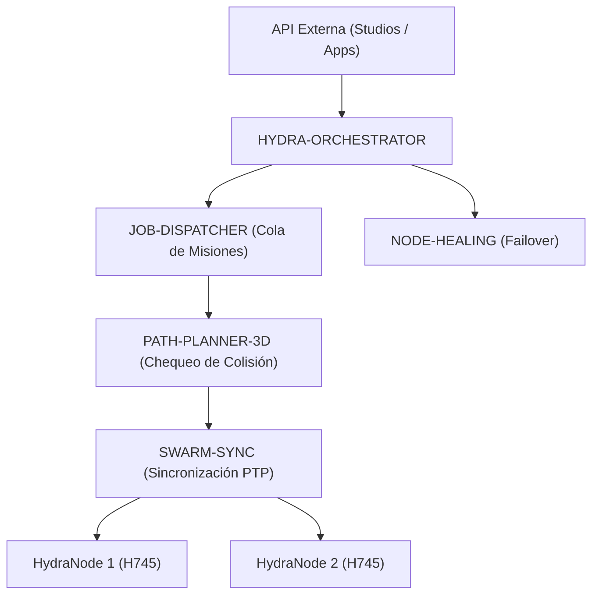

<p align="center">
  
</p>

# 🕸️ HYDRA-UMC-ORCHESTRATOR

<p align="center"><a href="README.md">🇺🇸 English</a> | 🇪🇸 <b>Español</b> | <a href="README_fra.md">🇫🇷 Français</a> | <a href="README_ita.md">🇮🇹 Italiano</a> | <a href="README_deu.md">🇩🇪 Deutsch</a> | <a href="README_zho.md">🇨🇳 简体中文</a> | <a href="README_jpn.md">🇯🇵 日本語</a></p>

### 🤖 Gestor de Enjambres Distribuido y Orquestador Multi-Nodo

<p align="left">
  
  
  
  
</p>

---

## 1. 🛠️ VISIÓN GENERAL TÉCNICA

**HYDRA-UMC-ORCHESTRATOR** es la capa de coordinación de alto nivel del ecosistema HYDRA-UMC. Gestiona múltiples HydraNodes (Kinematic Brains, Vision Nodes y Cognitive Nodes) como un enjambre único y unificado.

Se encarga de la planificación global de misiones, el balanceo de carga en toda la flota y la sincronización en tiempo real entre robots para evitar colisiones físicas y garantizar una precisión milimétrica en tareas colaborativas multi-robot.

### Características Clave:
* 🕸️ **Coordinación de Enjambres:** Orquesta hasta 32+ brazos robóticos independientes a través de múltiples controladores.
* ⚖️ **Balanceo de Carga:** Asigna misiones automáticamente al robot más disponible o mejor equipado.
* 🛡️ **Seguridad Centralizada:** Gestión global de E-STOP y monitorización de salud de toda la flota.
* 📡 **API Unificada:** Proporciona un único punto de entrada para que las Apps y Studios interactúen con toda la fábrica.
* 🧩 **Real v0 - Máquina de Estados de Misión:** `mission.rs` sigue cada misión a través de `Pending -> Dispatched -> InProgress -> Completed` (más los estados terminales `Cancelled`/`Failed`), con cancelación idempotente y recuperación real cuando un nodo se reporta inalcanzable/inválido - ver `mission-demo` más abajo. Lógica pura en memoria - no necesita un par gRPC en vivo con JOB-DISPATCHER/NODE-HEALING para ejecutarse ni testearse.

---

## 2. 🔄 ARQUITECTURA DE ORQUESTACIÓN



---

## 3. 🧠 ARQUITECTURA Y DECISIONES DE DISEÑO

> Las capas internas siguientes son el diseño previsto para la lógica que se
> situará detrás de este punto de entrada. Consulta «🔧 BUILD Y EJECUCIÓN» más abajo
> para conocer lo que funciona hoy: una máquina de estados de misión real y
> pura en memoria (`mission.rs`), todavía sin ningún par de red en vivo con
> quien hablar.

**Capas internas planificadas**, que se desarrollarán de forma incremental
sobre la máquina de estados real que ya existe:
* **Capa API** — recibe solicitudes de misión de alto nivel desde Studios y
  aplicaciones, y las traduce a acciones de flota.
* **Integración con la cola de misiones** — entrega las misiones aceptadas a
  JOB-DISPATCHER y sigue su ciclo de vida en toda la flota usando la máquina
  de estados real `Mission`/`MissionRegistry` que ya existe en `mission.rs` -
  lo que falta es el cableado gRPC hacia un JOB-DISPATCHER real al que
  entregar las misiones.
* **Despacho sincronizado por PTP** — coordina la temporización con
  SWARM-SYNC para que varios robots que ejecuten la misma misión permanezcan
  libres de colisiones según las comprobaciones de PATH-PLANNER-3D.
* **Agregación de salud de la flota** — integra las señales por nodo de
  NODE-HEALING en una única vista global y llama a
  `MissionRegistry::recover_node_unavailable()` (ya real) en cuanto llega
  cada señal; este es también el camino que recorrería un E-STOP global
  para llegar a todos los nodos a la vez.

### Por qué Rust para este servicio concreto

Este proceso es el que tiene mayor autoridad sobre la flota: emitiría un
E-STOP global y decidiría qué robot recibe cada misión. Esa función necesita
coordinación determinista y de baja latencia —sin pausas de recolector de
basura que puedan retrasar una parada crítica— y seguridad de memoria y tipos
en compilación. Un fallo o una condición de carrera no quedaría aislado: puede
dejar a todo el enjambre sin coordinador durante una misión. Dos hijos de este
orquestador (JOB-DISPATCHER y NODE-HEALING) usan Go, adecuado para sus trabajos
más simples y aislados; no es el compromiso que necesita este proceso central.

### Decisiones de diseño

* **Único proceso con un `docker-compose.yml` para toda la familia.** Como
  padre de integración de SWARM-SYNC, PATH-PLANNER-3D, JOB-DISPATCHER y
  NODE-HEALING, este repositorio describe cómo se ejecuta la familia completa;
  cada repositorio hijo conserva su propio enfoque.
* **Expone una «API unificada» para aplicaciones y Studios.** En vez de que
  cada cliente se comunique directamente con cuatro servicios hijos, usa este
  punto de entrada estable, libre para enrutar internamente a cada hijo.
* **Por qué `cancel()` es idempotente en vez de fallar sobre una misión ya cancelada.** Una solicitud de cancelación puede llegar dos veces legítimamente - un cliente reintentando tras una respuesta perdida, un operador pulsando cancelar de nuevo antes de ver la confirmación. Tratar la segunda llamada como un éxito (`AlreadyCancelled`, no un error) significa que quien llama nunca tiene que distinguir "mi cancelación funcionó" de "la cancelación de otro ya funcionó" - ambos son el mismo buen resultado. Cancelar una misión `Completed`/`Failed` sigue rechazándose: eso sí es una situación genuinamente distinta, no idempotente (deshacer trabajo terminado), no un reintento.
* **Por qué la recuperación tras fallo de nodo reencola a `Pending` en vez de fallar la misión directamente.** Un nodo que reporta `UNREACHABLE` podría estar reiniciándose en vez de haber desaparecido permanentemente (ver la propia lógica de reintentos acotados de `HYDRA-UMC-NODE-HEALING`, que ya absorbe baches transitorios antes de reportar siquiera un nodo caído) - así que una misión atrapada en ese nodo recibe una nueva oportunidad en otro nodo vía `Pending`, en vez de marcarse `Failed` a la primera señal de problema. `fail()` sigue existiendo para cuando el reencolado agota genuinamente las opciones.

Para cada ejemplo real de mission-demo/CLI (capturado de un binario compilado real), ver [`docs/CLI_REFERENCE.md`](docs/CLI_REFERENCE.md). Para el contrato gRPC compartido `hydra.common.v1` en sí - qué define, por qué vive en este repo y cómo cada lenguaje genera sus propios bindings - ver [`proto/README.md`](proto/README.md).

---

## 📂 ESTRUCTURA DE DIRECTORIOS

```text
HYDRA-UMC-ORCHESTRATOR/
├── src/
│   ├── mission.rs         # Máquina de estados de misión real (Mission, MissionRegistry)
│   ├── job_dispatcher.rs  # Cliente real de la API HTTP propia de HYDRA-UMC-JOB-DISPATCHER
│   ├── server.rs          # Superficie JSON/HTTP plana (tiny_http, bloqueante, sin runtime async)
│   └── main.rs            # Entry point + subcomando real `mission-demo`
├── proto/            # Contrato gRPC compartido para tráfico nodo-a-nodo
│                     # en todo el ecosistema (ver proto/README.md) - no
│                     # solo la API de este repo
├── docs/             # Documentación y guías de arquitectura
├── build/            # Binarios compilados (salida de build.sh/build.bat)
├── images/           # Medios y diagramas
├── systemd/
│   └── hydra-umc-orchestrator.service # Unidad systemd de la API local de misión/dispatch en la CM5
├── tools/
│   ├── build_test.py # Comprobación de compilación sin versionado
│   └── ci_validate.py # Validación de manifiesto/CHANGELOG/docs usada por CI
├── Cargo.toml        # Manifiesto del paquete Rust (nombre, versión, deps)
├── bump_version.py   # Bump de versión nativa tipo cuentakilómetros, vía build.sh/.bat
├── bump_manifest_version.py # Sincroniza la versión de hydra-umc.project.json con la nativa (--sync)
├── build.sh/.bat     # Sube la versión y ejecuta `cargo build --release`
├── build-test.sh/.bat # Comprobación de compilación sin versionado
├── run.sh/.bat       # Ejecuta el binario compilado
├── docker-compose.yml # Integra este repo con sus 4 hijos reales
└── README.md
```

Podado de la plantilla original: `hardware/`, `firmware/` y `os/` — es un
servicio de software puro (binario Rust) sin hardware ni firmware propios,
y sin imagen de sistema operativo que mantener.

---

## 🔧 BUILD Y EJECUCIÓN

La invocación básica sigue siendo un esqueleto mínimo (imprime identidad y
sale con 0); la máquina de estados de misión real se puede probar hoy vía
`mission-demo`.

```bash
# Windows
build.bat
run.bat
run.bat mission-demo

# Linux / macOS
./build.sh
./run.sh
./run.sh mission-demo
```

`build.sh`/`build.bat` suben la versión en `Cargo.toml` (regla cuentakilómetros
del ecosistema, ver `bump_version.py`) y luego ejecutan
`cargo build --release`. `run.sh`/`run.bat` ejecutan directamente el binario
resultante.

`mission-demo` ejecuta un escenario real de principio a fin contra el
`MissionRegistry` de `mission.rs` e imprime cada transición real:

```text
[orchestrator] mission-1: dispatched -> InProgress(node=node-a)
[orchestrator] mission-2: dispatched -> Dispatched(node=node-a)
[orchestrator] mission-3: dispatched -> InProgress(node=node-b)
[orchestrator] node-a reported UNREACHABLE by NODE-HEALING - recovering its missions
[orchestrator] mission-1: requeued -> Pending
[orchestrator] mission-2: requeued -> Pending
[orchestrator] mission-3: unaffected (different node) -> InProgress(node=node-b)
[orchestrator] mission-2: cancel() -> Cancelled -> Cancelled
[orchestrator] mission-2: cancel() again (idempotent) -> AlreadyCancelled -> Cancelled
[orchestrator] mission-3: complete() -> Completed(node=node-b)
[orchestrator] mission-4: fail() -> Failed(no healthy node accepted redispatch after 3 attempts)
[orchestrator] final registry state:
  mission-1: Pending (terminal=false)
  mission-2: Cancelled (terminal=true)
  mission-3: Completed(node=node-b) (terminal=true)
  mission-4: Failed(no healthy node accepted redispatch after 3 attempts) (terminal=true)
```

```bash
cargo test   # 42 tests: cada transición, cada rechazo de transición
             # invalida, cancelación idempotente y recuperación tras
             # fallo de nodo
```

Como proyecto padre de integración del ecosistema, este repo también incluye
un `docker-compose.yml` real que levanta este servicio junto a sus 4 hijos
(SWARM-SYNC, PATH-PLANNER-3D, JOB-DISPATCHER, NODE-HEALING), esperados como
carpetas hermanas:

```bash
docker compose up --build
```

---

## 🚀 HOJA DE RUTA
* **Fase 1:** Sincronización determinista de enjambre sobre TSN y reducción de jitter sub-ms.
* **Fase 2:** Planificación de trayectorias 3D con evitación dinámica de obstáculos en celdas multi-robot.
* **Fase 3:** Optimización del despacho de trabajos multi-robot utilizando disponibilidad de recursos en tiempo real.
* **Fase 4:** Implementación de clúster de failover de alta disponibilidad y soporte para robots heterogéneos.

---

## 🔗 Proyectos Relacionados

Este proyecto es parte del ecosistema de robótica HYDRA-UMC del mismo autor (JuanenRac / Electro Hobby 3D). Vale la pena conocerlo, ya que una petición podría en realidad ser sobre alguno de estos en vez de sobre este repositorio.

**Proyectos Hijos** — cada uno es un servicio que este orquestador coordina o alimenta directamente
- **[HYDRA-UMC-SWARM-SYNC](https://github.com/JuanenRac/HYDRA-UMC-SWARM-SYNC)** — sincronización de estado real mediante CRDT LWW-Element-Map, con pruebas de propiedades para convergencia multi-celda.
- **[HYDRA-UMC-PATH-PLANNER-3D](https://github.com/JuanenRac/HYDRA-UMC-PATH-PLANNER-3D)** — planificador de rutas 3D real basado en RRT, con validación real de colisión de obstáculos/espacio de trabajo.
- **[HYDRA-UMC-JOB-DISPATCHER](https://github.com/JuanenRac/HYDRA-UMC-JOB-DISPATCHER)** — cola de trabajos real basada en prioridad con deduplicación, sobre una API HTTP real.
- **[HYDRA-UMC-NODE-HEALING](https://github.com/JuanenRac/HYDRA-UMC-NODE-HEALING)** — watchdog de salud de flota real basado en gRPC, con reintento/backoff y detección de discrepancia de identidad.

**Directamente Relacionados**
- **[HYDRA-UMC-SERVER](https://github.com/JuanenRac/HYDRA-UMC-SERVER)** — el backend headless real (REST/WebSocket) con el que habla de verdad cada cliente de control; este orquestador coordina varias instancias del mismo.
- **[HYDRA-UMC-COGNITIVE-NODE](https://github.com/JuanenRac/HYDRA-UMC-COGNITIVE-NODE)** — nodo de integración para el pipeline cognitivo Hailo-10 (orquestación de LLM/VLA/voz); recibe órdenes a nivel de misión desde aquí.
- **[HYDRA-UMC-SUITE](https://github.com/JuanenRac/HYDRA-UMC-SUITE)** — centro de mando de enjambre de escritorio (PySide6) para varios servidores a la vez, empaquetado como ejecutable independiente; el centro de mando de enjambre que respalda este orquestador.

**También Forma Parte del Ecosistema**

*Hardware y Plataforma Base*
- **[HYDRA-UMC](https://github.com/JuanenRac/HYDRA-UMC)** — la placa madre física del brazo robótico: host CM5 + coprocesador STM32H745 de doble núcleo, coordinando hasta 8 brazos herramienta por CAN-OTA/SPI-OTA.
- **[HYDRA-UMC-OS](https://github.com/JuanenRac/HYDRA-UMC-OS)** — capa de producto reproducible sobre Raspberry Pi OS para el CM5: agente de solo lectura, config/perfiles validados, aprovisionamiento WiFi de primer contacto.
- **[HYDRA-UMC-SDK](https://github.com/JuanenRac/HYDRA-UMC-SDK)** — el contrato JSON-Schema compartido y la barrera de seguridad contra la que cada bridge valida sus comandos.

*Backend Central y Clientes*
- **[HYDRA-UMC-STUDIO](https://github.com/JuanenRac/HYDRA-UMC-STUDIO)** — panel de control web con visualización 3D multi-robot en tiempo real.
- **[HYDRA-UMC-ANDROID-CONTROL](https://github.com/JuanenRac/HYDRA-UMC-ANDROID-CONTROL)** — app nativa de control para Android con inicio de sesión biométrico y un compañero Wear OS emparejado.
- **[HYDRA-UMC-IOS-CONTROL](https://github.com/JuanenRac/HYDRA-UMC-IOS-CONTROL)** — app de control para iOS/iPadOS (Flutter) con sincronización en tiempo real por WebSocket.
- **[HYDRA-UMC-DSI](https://github.com/JuanenRac/HYDRA-UMC-DSI)** — interfaz táctil nativa para la pantalla táctil DSI de 7" a bordo, embebida en el propio CM5.
- **[HYDRA-UMC-EDITOR-URDF](https://github.com/JuanenRac/HYDRA-UMC-EDITOR-URDF)** — creador/editor gráfico de URDF de escritorio que envía los modelos terminados al propio catálogo de STUDIO.
- **[HYDRA-UMC-BRIDGE-AMR](https://github.com/JuanenRac/HYDRA-UMC-BRIDGE-AMR)** — barrera de coordinación para flotas AGV/AMR mediante un publicador MQTT VDA 5050 real.
- **[HYDRA-UMC-BRIDGE-CNC](https://github.com/JuanenRac/HYDRA-UMC-BRIDGE-CNC)** — coordinador de alto nivel para celdas CNC con acceso real a estado/bytes de control GRBL.
- **[HYDRA-UMC-BRIDGE-DROIDS](https://github.com/JuanenRac/HYDRA-UMC-BRIDGE-DROIDS)** — barrera de coordinación para droides con patas/humanoides, con un emisor de comandos real para Boston Dynamics Spot.
- **[HYDRA-UMC-BRIDGE-LASER](https://github.com/JuanenRac/HYDRA-UMC-BRIDGE-LASER)** — coordinador de seguridad para celdas láser que lee 3 salvaguardas GPIO reales de llave/carcasa/enclavamiento.
- **[HYDRA-UMC-BRIDGE-OPENPNP](https://github.com/JuanenRac/HYDRA-UMC-BRIDGE-OPENPNP)** — coordinador de alto nivel seguro para el flujo de placas de pick-and-place OpenPnP.
- **[HYDRA-UMC-BRIDGE-PRINTER3D](https://github.com/JuanenRac/HYDRA-UMC-BRIDGE-PRINTER3D)** — barrera de coordinación segura para impresoras 3D Moonraker/Klipper, con comandos de trabajo reales y controlados.
- **[HYDRA-UMC-BRIDGE-ROS2](https://github.com/JuanenRac/HYDRA-UMC-BRIDGE-ROS2)** — coordinador de seguridad con un transporte ROS 2 rclpy real, importado de forma perezosa.
- **[HYDRA-UMC-BRIDGE-UAV](https://github.com/JuanenRac/HYDRA-UMC-BRIDGE-UAV)** — barrera de coordinación para UAV equipados con cámara, con un emisor de comandos MAVLink real.

*Plataforma de Herramientas URTC*
- **[URTC](https://github.com/JuanenRac/URTC)** — firmware para la placa física del Universal Robot Tool Controller, más de 25 perfiles de herramienta por bus CAN.
- **[URTC-FLASHER](https://github.com/JuanenRac/URTC-FLASHER)** — herramienta de escritorio con GUI para flashear placas URTC, CAN-OTA más SWD/JTAG de chip completo.
- **[URTC-TESTER](https://github.com/JuanenRac/URTC-TESTER)** — herramienta de escritorio de diagnóstico CAN-bus en vivo para placas URTC, un panel por perfil de herramienta.
- **[URTC-WEB-STUDIO](https://github.com/JuanenRac/URTC-WEB-STUDIO)** — alternativa basada en navegador a URTC-TESTER mediante la Web Serial API, sin instalación local.

*Nodo IA de Visión (Hailo-8)*
- **[HYDRA-UMC-VISION-NODE](https://github.com/JuanenRac/HYDRA-UMC-VISION-NODE)** — nodo de integración para el pipeline de visión Hailo-8, con una comprobación real de disponibilidad de hardware por etapa.
- **[HYDRA-UMC-DETECTION-HEF](https://github.com/JuanenRac/HYDRA-UMC-DETECTION-HEF)** — registro real de modelos compilados con verificación de carga segura por arquitectura Hailo/checksum.
- **[HYDRA-UMC-VISION-STREAMER](https://github.com/JuanenRac/HYDRA-UMC-VISION-STREAMER)** — generador real de pipeline GStreamer + config MediaMTX, con una frontera de integración HailoRT real.
- **[HYDRA-UMC-VISUAL-SERVOING-API](https://github.com/JuanenRac/HYDRA-UMC-VISUAL-SERVOING-API)** — ley de corrección real de Position-Based Visual Servoing, con puerta de seguridad según el estado de zona previo.
- **[HYDRA-UMC-SAFETY-ZONES](https://github.com/JuanenRac/HYDRA-UMC-SAFETY-ZONES)** — comprobación real de invasión de zona y solicitud de E-STOP, con exigencia de vigencia de calibración.

*Nodo IA Cognitivo (Hailo-10)*
- **[HYDRA-UMC-VLA-ENGINE](https://github.com/JuanenRac/HYDRA-UMC-VLA-ENGINE)** — codificación/decodificación real de tokens de acción y generación de trayectoria para un modelo Vision-Language-Action.
- **[HYDRA-UMC-VOICE-UI](https://github.com/JuanenRac/HYDRA-UMC-VOICE-UI)** — front-end de voz real (VAD + analizador de intención) con un relé a Watch acotado y con confirmación.
- **[HYDRA-UMC-SEMANTIC-PLANNER](https://github.com/JuanenRac/HYDRA-UMC-SEMANTIC-PLANNER)** — descomposición real de tareas basada en reglas y recuperación semántica de errores sobre códigos de error del MCU.
- **[HYDRA-UMC-DOCS-QA](https://github.com/JuanenRac/HYDRA-UMC-DOCS-QA)** — búsqueda real de documentos TF-IDF (solo librería estándar) sobre los propios documentos Markdown de este ecosistema.

*Gemelo Digital y Simulación*
- **[HYDRA-UMC-TWIN](https://github.com/JuanenRac/HYDRA-UMC-TWIN)** — nodo de integración para el motor de gemelo digital, con un contrato real de sincronización por compatibilidad de versión.
- **[HYDRA-UMC-HIL-BRIDGE](https://github.com/JuanenRac/HYDRA-UMC-HIL-BRIDGE)** — enclavamiento de seguridad real hardware-in-the-loop que enruta comandos entre simulación y hardware real.
- **[HYDRA-UMC-PHYSICS-REPLICA](https://github.com/JuanenRac/HYDRA-UMC-PHYSICS-REPLICA)** — cinemática directa real y validación de límites articulares sobre un subconjunto real de URDF.
- **[HYDRA-UMC-SYNTHETIC-DATA-GEN](https://github.com/JuanenRac/HYDRA-UMC-SYNTHETIC-DATA-GEN)** — generador real de escenas 2D procedurales con exportación de anotaciones YOLO/COCO.

*Datos y Analítica*
- **[HYDRA-UMC-DATALAKE](https://github.com/JuanenRac/HYDRA-UMC-DATALAKE)** — almacén de series temporales real respaldado por sqlite3, con una API HTTP real de ingesta/consulta.
- **[HYDRA-UMC-ANOMALY-DETECTOR](https://github.com/JuanenRac/HYDRA-UMC-ANOMALY-DETECTOR)** — detector de anomalías real basado en FFT + línea base estadística, con monitorización de deriva.
- **[HYDRA-UMC-PRODUCTION-REPORTS](https://github.com/JuanenRac/HYDRA-UMC-PRODUCTION-REPORTS)** — cálculo real de OEE/disponibilidad sobre el histórico de DATALAKE, con exportación CSV reproducible.
- **[HYDRA-UMC-TELEMETRY-COLLECTOR](https://github.com/JuanenRac/HYDRA-UMC-TELEMETRY-COLLECTOR)** — pipeline real de ingesta CAN/WebSocket hacia DATALAKE, con deduplicación por secuencia.

*Pasarela Industrial*
- **[HYDRA-UMC-GATEWAY-INDUSTRIAL](https://github.com/JuanenRac/HYDRA-UMC-GATEWAY-INDUSTRIAL)** — nodo de integración que retransmite a protocolos industriales, con una capa real de lista blanca de comandos/contrapresión.
- **[HYDRA-UMC-OPCUA-SERVER](https://github.com/JuanenRac/HYDRA-UMC-OPCUA-SERVER)** — espacio de direcciones OPC-UA real, verificado con una sesión de cliente real del protocolo binario.
- **[HYDRA-UMC-MQTT-BROKER](https://github.com/JuanenRac/HYDRA-UMC-MQTT-BROKER)** — broker MQTT real con autenticación por cliente opcional y ACL de tópicos.
- **[HYDRA-UMC-MTCONNECT-ADAPTER](https://github.com/JuanenRac/HYDRA-UMC-MTCONNECT-ADAPTER)** — endpoints XML reales `/probe` y `/current` de MTConnect, con salida en modo degradado.

*Herramientas Complementarias y Operaciones del Ecosistema*
- **[HYDRA-UMC-DASHBOARD-AI](https://github.com/JuanenRac/HYDRA-UMC-DASHBOARD-AI)** — paneles de Resúmenes Inteligentes y Resaltado de Anomalías sobre DATALAKE/ANOMALY-DETECTOR, con un respaldo estadístico honesto.
- **[HYDRA-UMC-TOOL-CLI](https://github.com/JuanenRac/HYDRA-UMC-TOOL-CLI)** — CLI de flota con un contrato real y estable de códigos de salida, cliente real y en vivo de la propia API de HYDRA-UMC-SERVER.
- **[HYDRA-UMC-WATCH](https://github.com/JuanenRac/HYDRA-UMC-WATCH)** — app compañera de WearOS con alertas hápticas reales y un relé de voz al teléfono emparejado.
- **[URTC-SMART-RACK](https://github.com/JuanenRac/URTC-SMART-RACK)** — firmware para un rack de montaje de placas con decodificación real de ID de herramienta y lógica de precalentamiento Smart Idle.
- **[URTC-VISION-TOOL](https://github.com/JuanenRac/URTC-VISION-TOOL)** — firmware más un compañero de visión real en Python para un cabezal de inspección térmica/RGB.
- **[HYDRA-UMC-UPDATER](https://github.com/JuanenRac/HYDRA-UMC-UPDATER)** — herramienta administrativa de escritorio que descubre, clona y actualiza cada repositorio de este ecosistema.
- **[HYDRA-UMC-OS-REBUILDER](https://github.com/JuanenRac/HYDRA-UMC-OS-REBUILDER)** — herramienta de escritorio Windows/Linux que construye una imagen de la CM5 lista para grabar, precargada con las versiones más actuales del ecosistema, con configuración de primer arranque de Wi-Fi/usuario/SSH al estilo de Raspberry Pi Imager.


---

## 📚 Documentación y Comunidad

- **[CONTRIBUTING.md](CONTRIBUTING.md)** — stack tecnológico y pautas de codificación para un pull request.
- **[CODE_OF_CONDUCT.md](CODE_OF_CONDUCT.md)** — los estándares de comportamiento esperados en esta comunidad.
- **[SECURITY.md](SECURITY.md)** — cómo reportar una vulnerabilidad, y las áreas reales de enfoque en seguridad de este proyecto.
- **[SUPPORT.md](SUPPORT.md)** — dónde hacer preguntas y reportar errores.
- **[LICENSE.md](LICENSE.md)** — la licencia propia de este proyecto.

## 👤 AUTOR
**JuanenRac** (Electro Hobby 3D)
📧 electrohobby3d@gmail.com
📺 [youtube.com/@electrohobby3d](https://youtube.com/@electrohobby3d)

## 📜 LICENCIA
GPL-3.0 - Ver archivo LICENSE para más detalles.
