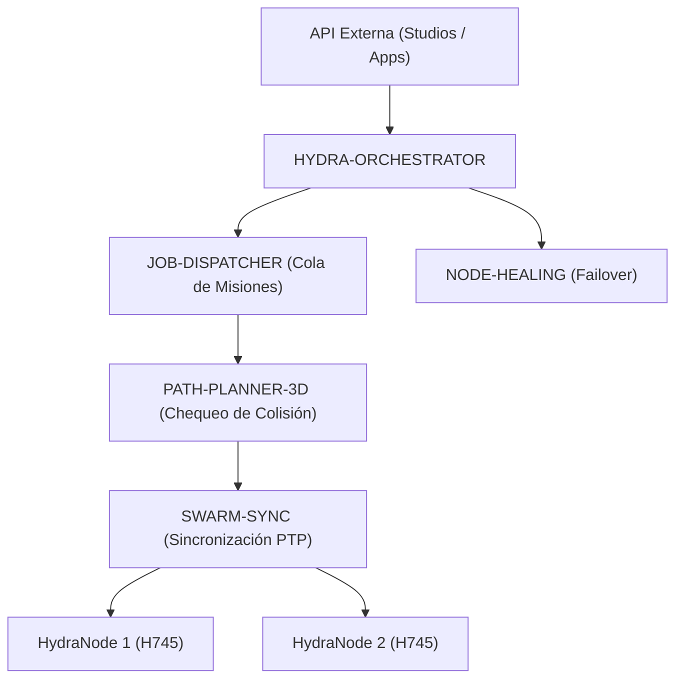

<p align="center">
  
</p>

# 🕸️ HYDRA-UMC-ORCHESTRATOR

<p align="center"><a href="README.md">🇺🇸 English</a> | 🇪🇸 <b>Español</b> | <a href="README_fra.md">🇫🇷 Français</a> | <a href="README_ita.md">🇮🇹 Italiano</a> | <a href="README_deu.md">🇩🇪 Deutsch</a> | <a href="README_zho.md">🇨🇳 简体中文</a> | <a href="README_jpn.md">🇯🇵 日本語</a></p>

### 🤖 Gestor de Enjambres Distribuido y Orquestador Multi-Nodo

<p align="left">
  
  
  
  
</p>

---

## 1. 🛠️ VISIÓN GENERAL TÉCNICA

**HYDRA-UMC-ORCHESTRATOR** es la capa de coordinación de alto nivel del ecosistema HYDRA-UMC. Gestiona múltiples HydraNodes (Kinematic Brains, Vision Nodes y Cognitive Nodes) como un enjambre único y unificado.

Se encarga de la planificación global de misiones, el balanceo de carga en toda la flota y la sincronización en tiempo real entre robots para evitar colisiones físicas y garantizar una precisión milimétrica en tareas colaborativas multi-robot.

### Características Clave:
* 🕸️ **Coordinación de Enjambres:** Orquesta hasta 32+ brazos robóticos independientes a través de múltiples controladores.
* ⚖️ **Balanceo de Carga:** Asigna misiones automáticamente al robot más disponible o mejor equipado.
* 🛡️ **Seguridad Centralizada:** Gestión global de E-STOP y monitorización de salud de toda la flota.
* 📡 **API Unificada:** Proporciona un único punto de entrada para que las Apps y Studios interactúen con toda la fábrica.

---

## 2. 🔄 ARQUITECTURA DE ORQUESTACIÓN



---

## 3. 🧠 ARQUITECTURA Y DECISIONES DE DISEÑO

> Las capas internas siguientes son el diseño previsto para la lógica que se
> situará detrás de este punto de entrada. Consulta «🔧 BUILD & RUN» más abajo
> para conocer lo que funciona hoy (un esqueleto mínimo).

**Capas internas planificadas**, que se desarrollarán de forma incremental
sobre el esqueleto actual:
* **Capa API** — recibe solicitudes de misión de alto nivel desde Studios y
  aplicaciones, y las traduce a acciones de flota.
* **Integración con la cola de misiones** — entrega las misiones aceptadas a
  JOB-DISPATCHER y sigue su ciclo de vida en toda la flota.
* **Despacho sincronizado por PTP** — coordina la temporización con
  SWARM-SYNC para que varios robots que ejecuten la misma misión permanezcan
  libres de colisiones según las comprobaciones de PATH-PLANNER-3D.
* **Agregación de salud de la flota** — integra las señales por nodo de
  NODE-HEALING en una única vista global; este es también el camino que
  recorrería un E-STOP global para llegar a todos los nodos a la vez.

### Por qué Rust para este servicio concreto

Este proceso es el que tiene mayor autoridad sobre la flota: emitiría un
E-STOP global y decidiría qué robot recibe cada misión. Esa función necesita
coordinación determinista y de baja latencia —sin pausas de recolector de
basura que puedan retrasar una parada crítica— y seguridad de memoria y tipos
en compilación. Un fallo o una condición de carrera no quedaría aislado: puede
dejar a todo el enjambre sin coordinador durante una misión. Dos hijos de este
orquestador (JOB-DISPATCHER y NODE-HEALING) usan Go, adecuado para sus trabajos
más simples y aislados; no es el compromiso que necesita este proceso central.

### Decisiones de diseño

* **Único proceso con un `docker-compose.yml` para toda la familia.** Como
  padre de integración de SWARM-SYNC, PATH-PLANNER-3D, JOB-DISPATCHER y
  NODE-HEALING, este repositorio describe cómo se ejecuta la familia completa;
  cada repositorio hijo conserva su propio enfoque.
* **Expone una «API unificada» para aplicaciones y Studios.** En vez de que
  cada cliente se comunique directamente con cuatro servicios hijos, usa este
  punto de entrada estable, libre para enrutar internamente a cada hijo.

---

## 📂 ESTRUCTURA DE DIRECTORIOS

```text
HYDRA-UMC-ORCHESTRATOR/
├── src/              # Código fuente (Núcleo, Red, API)
├── proto/            # Contrato gRPC compartido para tráfico nodo-a-nodo
│                     # en todo el ecosistema (ver proto/README.md) - no
│                     # solo la API de este repo
├── docs/             # Documentación y guías de arquitectura
├── build/            # Binarios compilados (salida de build.sh/build.bat)
├── images/           # Medios y diagramas
├── scripts/          # Scripts de utilidad
├── Cargo.toml        # Manifiesto del paquete Rust (nombre, versión, deps)
├── bump_version.py   # Bump de versión tipo cuentakilómetros, vía build.sh/.bat
├── build.sh/.bat     # Sube la versión y ejecuta `cargo build --release`
├── run.sh/.bat       # Ejecuta el binario compilado
├── docker-compose.yml # Integra este repo con sus 4 hijos reales
└── README.md
```

Podado de la plantilla original: `hardware/`, `firmware/` y `os/` — es un
servicio de software puro (binario Rust) sin hardware ni firmware propios,
y sin imagen de sistema operativo que mantener.

---

## 🔧 BUILD & RUN

Esqueleto real mínimo en Rust - compila y ejecuta hoy mismo.

```bash
# Windows
build.bat
run.bat

# Linux / macOS
./build.sh
./run.sh
```

`build.sh`/`build.bat` suben la versión en `Cargo.toml` (regla cuentakilómetros
del ecosistema, ver `bump_version.py`) y luego ejecutan
`cargo build --release`. `run.sh`/`run.bat` ejecutan directamente el binario
resultante.

Como proyecto padre de integración del ecosistema, este repo también incluye
un `docker-compose.yml` real que levanta este servicio junto a sus 4 hijos
(SWARM-SYNC, PATH-PLANNER-3D, JOB-DISPATCHER, NODE-HEALING), esperados como
carpetas hermanas:

```bash
docker compose up --build
```

---

## 🚀 HOJA DE RUTA
* **Fase 1:** Sincronización determinista de enjambre sobre TSN y reducción de jitter sub-ms.
* **Fase 2:** Planificación de trayectorias 3D con evitación dinámica de obstáculos en celdas multi-robot.
* **Fase 3:** Optimización del despacho de trabajos multi-robot utilizando disponibilidad de recursos en tiempo real.
* **Fase 4:** Implementación de clúster de failover de alta disponibilidad y soporte para robots heterogéneos.

---

## 🔗 Proyectos Relacionados

Este proyecto forma parte de un ecosistema de robótica más amplio del mismo autor (JuanenRac / Electro Hobby 3D), que abarca firmware, software de control, nodos de IA y herramientas de flota. Vale la pena conocerlo, ya que una petición podría en realidad ser sobre uno de estos proyectos en vez de sobre este repositorio.

### Familia

**Padre:** ninguno — este proyecto es en sí mismo el padre de integración de la familia Orchestration & Swarm.

**Hijos:**
- **[HYDRA-UMC-SWARM-SYNC](https://github.com/JuanenRac/HYDRA-UMC-SWARM-SYNC)** — reconciliación de estado basada en CRDT entre las células que coordina este orquestador.
- **[HYDRA-UMC-PATH-PLANNER-3D](https://github.com/JuanenRac/HYDRA-UMC-PATH-PLANNER-3D)** — planificación de rutas sin colisiones contra la que este orquestador despacha tareas.
- **[HYDRA-UMC-JOB-DISPATCHER](https://github.com/JuanenRac/HYDRA-UMC-JOB-DISPATCHER)** — la cola/planificador de trabajos que alimenta este orquestador.
- **[HYDRA-UMC-NODE-HEALING](https://github.com/JuanenRac/HYDRA-UMC-NODE-HEALING)** — detecta y evita un nodo sin respuesta que gestiona este orquestador.

### Relación Directa (fuera de la familia)

- **[HYDRA-UMC-SERVER](https://github.com/JuanenRac/HYDRA-UMC-SERVER)** — coordina múltiples instancias de este backend.
- **[HYDRA-UMC-COGNITIVE-NODE](https://github.com/JuanenRac/HYDRA-UMC-COGNITIVE-NODE)** — recibe órdenes de misión desde aquí.
- **[HYDRA-UMC-SUITE](https://github.com/JuanenRac/HYDRA-UMC-SUITE)** — el centro de mando de enjambre que respalda este orquestador.

### Resto del Ecosistema

**Plataforma HYDRA-UMC** — la célula de micro-fábrica multi-robot
- **[HYDRA-UMC](https://github.com/JuanenRac/HYDRA-UMC)** — la placa base CM5 + STM32H745 que orquesta hasta 8 brazos robóticos.
- **[HYDRA-UMC-SERVER](https://github.com/JuanenRac/HYDRA-UMC-SERVER)** — el backend Express/WebSocket con el que habla cada cliente de control.
- **[HYDRA-UMC-STUDIO](https://github.com/JuanenRac/HYDRA-UMC-STUDIO)** — panel de control web, visualización 3D multi-robot.
- **[HYDRA-UMC-ANDROID-CONTROL](https://github.com/JuanenRac/HYDRA-UMC-ANDROID-CONTROL)** — app de control Android por Wi-Fi/Bluetooth.
- **[HYDRA-UMC-IOS-CONTROL](https://github.com/JuanenRac/HYDRA-UMC-IOS-CONTROL)** — app de control iOS/iPadOS construida en Flutter.
- **[HYDRA-UMC-SUITE](https://github.com/JuanenRac/HYDRA-UMC-SUITE)** — centro de mando de enjambre de escritorio (Python/PySide6).
- **[HYDRA-UMC-EDITOR-URDF](https://github.com/JuanenRac/HYDRA-UMC-EDITOR-URDF)** — editor de modelos URDF de escritorio para el catálogo de robots.
- **[HYDRA-UMC-DSI](https://github.com/JuanenRac/HYDRA-UMC-DSI)** — interfaz táctil nativa para la pantalla DSI integrada.

**Plataforma URTC** — el controlador de cabezal de herramienta que lleva cada brazo HYDRA-UMC
- **[URTC](https://github.com/JuanenRac/URTC)** — controlador de cabezal de herramienta CAN, 25 perfiles de herramienta.
- **[URTC-FLASHER](https://github.com/JuanenRac/URTC-FLASHER)** — herramienta de escritorio de flasheo CAN-OTA + SWD/JTAG.
- **[URTC-TESTER](https://github.com/JuanenRac/URTC-TESTER)** — herramienta de escritorio de diagnóstico CAN en vivo.
- **[URTC-WEB-STUDIO](https://github.com/JuanenRac/URTC-WEB-STUDIO)** — alternativa basada en navegador vía Web Serial API.

**🎥 Vision AI Node (Hailo-8)**
- [HYDRA-UMC-VISION-NODE](https://github.com/JuanenRac/HYDRA-UMC-VISION-NODE)
- [HYDRA-UMC-VISION-STREAMER](https://github.com/JuanenRac/HYDRA-UMC-VISION-STREAMER)
- [HYDRA-UMC-DETECTION-HEF](https://github.com/JuanenRac/HYDRA-UMC-DETECTION-HEF)
- [HYDRA-UMC-SAFETY-ZONES](https://github.com/JuanenRac/HYDRA-UMC-SAFETY-ZONES)
- [HYDRA-UMC-VISUAL-SERVOING-API](https://github.com/JuanenRac/HYDRA-UMC-VISUAL-SERVOING-API)

**🧠 Cognitive AI Node (Hailo-10)**
- [HYDRA-UMC-COGNITIVE-NODE](https://github.com/JuanenRac/HYDRA-UMC-COGNITIVE-NODE)
- [HYDRA-UMC-VLA-ENGINE](https://github.com/JuanenRac/HYDRA-UMC-VLA-ENGINE)
- [HYDRA-UMC-VOICE-UI](https://github.com/JuanenRac/HYDRA-UMC-VOICE-UI)
- [HYDRA-UMC-SEMANTIC-PLANNER](https://github.com/JuanenRac/HYDRA-UMC-SEMANTIC-PLANNER)
- [HYDRA-UMC-DOCS-QA](https://github.com/JuanenRac/HYDRA-UMC-DOCS-QA)

**🎮 Digital Twin & Simulation**
- [HYDRA-UMC-TWIN](https://github.com/JuanenRac/HYDRA-UMC-TWIN)
- [HYDRA-UMC-PHYSICS-REPLICA](https://github.com/JuanenRac/HYDRA-UMC-PHYSICS-REPLICA)
- [HYDRA-UMC-HIL-BRIDGE](https://github.com/JuanenRac/HYDRA-UMC-HIL-BRIDGE)
- [HYDRA-UMC-SYNTHETIC-DATA-GEN](https://github.com/JuanenRac/HYDRA-UMC-SYNTHETIC-DATA-GEN)

**📊 Data & Analytics**
- [HYDRA-UMC-DATALAKE](https://github.com/JuanenRac/HYDRA-UMC-DATALAKE)
- [HYDRA-UMC-TELEMETRY-COLLECTOR](https://github.com/JuanenRac/HYDRA-UMC-TELEMETRY-COLLECTOR)
- [HYDRA-UMC-ANOMALY-DETECTOR](https://github.com/JuanenRac/HYDRA-UMC-ANOMALY-DETECTOR)
- [HYDRA-UMC-PRODUCTION-REPORTS](https://github.com/JuanenRac/HYDRA-UMC-PRODUCTION-REPORTS)

**🏭 Industrial Gateway**
- [HYDRA-UMC-GATEWAY-INDUSTRIAL](https://github.com/JuanenRac/HYDRA-UMC-GATEWAY-INDUSTRIAL)
- [HYDRA-UMC-OPCUA-SERVER](https://github.com/JuanenRac/HYDRA-UMC-OPCUA-SERVER)
- [HYDRA-UMC-MQTT-BROKER](https://github.com/JuanenRac/HYDRA-UMC-MQTT-BROKER)
- [HYDRA-UMC-MTCONNECT-ADAPTER](https://github.com/JuanenRac/HYDRA-UMC-MTCONNECT-ADAPTER)

**🛠️ Complementary Tools**
- [URTC-SMART-RACK](https://github.com/JuanenRac/URTC-SMART-RACK)
- [URTC-VISION-TOOL](https://github.com/JuanenRac/URTC-VISION-TOOL)
- [HYDRA-UMC-WATCH](https://github.com/JuanenRac/HYDRA-UMC-WATCH)
- [HYDRA-UMC-TOOL-CLI](https://github.com/JuanenRac/HYDRA-UMC-TOOL-CLI)
- [HYDRA-UMC-DASHBOARD-AI](https://github.com/JuanenRac/HYDRA-UMC-DASHBOARD-AI)


## 👤 AUTOR
**JuanenRac** (Electro Hobby 3D)
📧 electrohobby3d@gmail.com

## 📜 LICENCIA
GPL-3.0 - Ver archivo LICENSE para más detalles.
