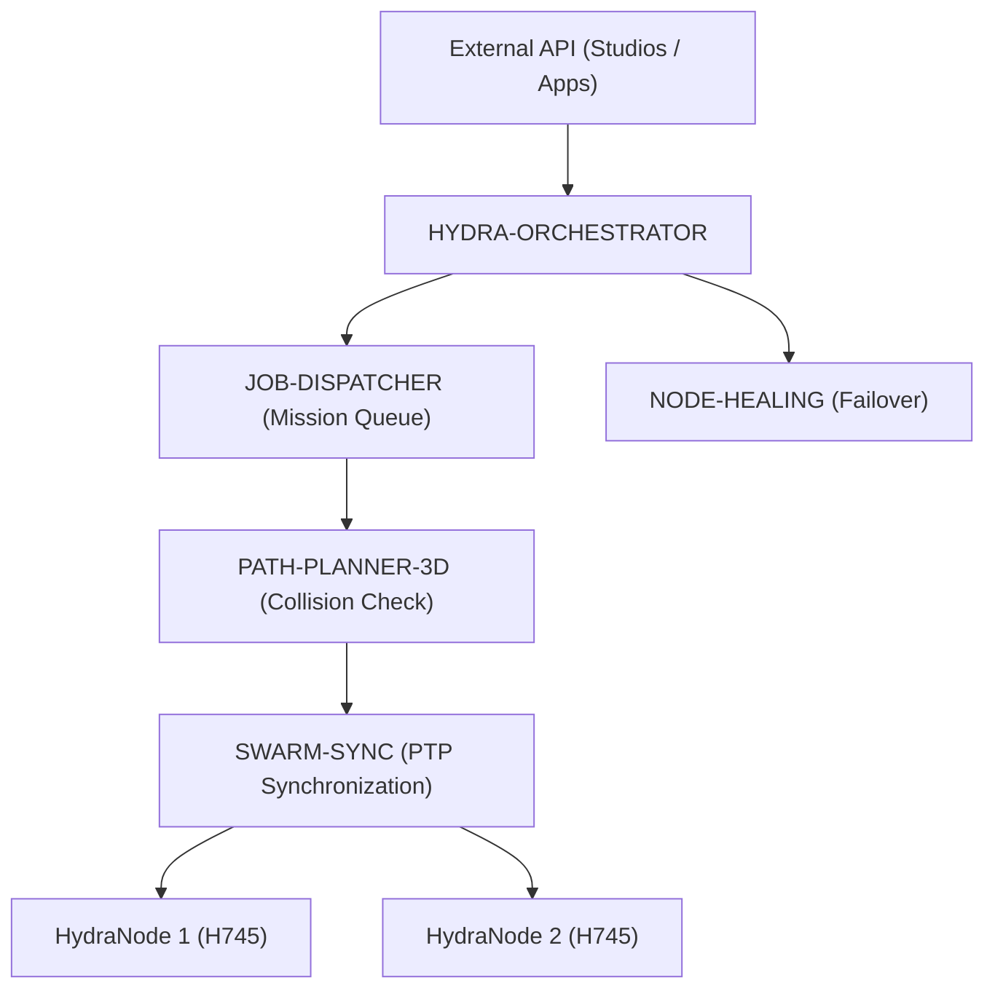

<p align="center">
  
</p>

# 🕸️ HYDRA-UMC-ORCHESTRATOR

<p align="center"><a href="README.md">🇺🇸 English</a> | <a href="README_spa.md">🇪🇸 Español</a> | <a href="README_fra.md">🇫🇷 Français</a> | <a href="README_ita.md">🇮🇹 Italiano</a> | <a href="README_deu.md">🇩🇪 Deutsch</a> | 🇨🇳 <b>简体中文</b> | <a href="README_jpn.md">🇯🇵 日本語</a></p>

### 🤖 分布式集群管理器与多节点协调器

<p align="left">
  
  
  
  
</p>

---

## 1. 🛠️ 技术概述

**HYDRA-UMC-ORCHESTRATOR** 是 HYDRA-UMC 生态系统的高层协调层。它将多个
HydraNode（运动学大脑、视觉节点和认知节点）作为一个统一的集群进行管理。

它负责全局任务规划、跨车队负载均衡，以及机器人之间的实时同步，以防止
物理碰撞，并确保多机器人协作任务中的毫米级精度。

### 关键特性：
* 🕸️ **集群协调：** 跨多个控制器编排最多 32+ 台独立机械臂。
* ⚖️ **负载均衡：** 自动将任务分配给最空闲或最适合的机器人。
* 🛡️ **集中式安全：** 全局 E-STOP 管理与全车队健康监控。
* 📡 **统一 API：** 为应用程序和 Studio 与整个工厂交互提供单一入口点。
* 🧩 **真实 v0 —— 任务状态机：** `mission.rs` 通过 `Pending -> Dispatched -> InProgress -> Completed`（外加 `Cancelled`/`Failed` 两个终止状态）跟踪每个任务，具备幂等取消和节点被报告为不可达/无效时的真实恢复——见下方 `mission-demo`。纯内存逻辑——运行或测试都不需要与 JOB-DISPATCHER/NODE-HEALING 的实时 gRPC 对端。

---

## 2. 🔄 编排架构



---

## 3. 🧠 架构与设计决策

> 下方的内部分层是本入口点背后逻辑的规划设计——目前实际运行的内容请见
> 下方"🔧 构建与运行"部分：一个真实的、纯内存中的任务状态机
> （`mission.rs`），目前还没有任何实时网络对端可供通信。

**计划中的内部分层**，将在已经存在的真实状态机基础上逐步构建：
* **API 层** —— 接收来自 Studio/应用程序的高层任务请求，并将其转化为车队级操作。
* **任务队列集成** —— 将已接受的任务移交给 JOB-DISPATCHER，并使用 `mission.rs` 中已经存在的真实 `Mission`/`MissionRegistry` 状态机在整个车队中跟踪其生命周期——目前仍缺少的是通往真实 JOB-DISPATCHER、用于移交任务的 gRPC 接线。
* **PTP 同步调度** —— 与 SWARM-SYNC 协调时序，使执行同一任务的多台机器人根据 PATH-PLANNER-3D 的检查结果保持无碰撞状态。
* **车队健康聚合** —— 将 NODE-HEALING 提供的各节点信号整合为统一的全车队视图，并在每个信号到达时调用（已经真实的）`MissionRegistry::recover_node_unavailable()`；这也是全局 E-STOP 到达每个节点所经过的路径。

### 为何这项特定服务使用 Rust
这个进程是对整个车队拥有最高权限的进程：它将发出全局 E-STOP 并仲裁哪个
机器人执行哪项任务。这一角色需要确定性的、低延迟的协调——不能有任何可能
延迟安全关键停止的垃圾回收停顿——以及编译期的内存/类型安全，因为这里的
一次崩溃或数据竞争不会局限于本地：它可能导致整个集群在任务执行过程中
失去协调者。本编排器自身的两个子项目（JOB-DISPATCHER、NODE-HEALING）
则使用 Go，这非常适合它们更简单、更独立的任务；但这并非本"大脑"进程所
需要的权衡取舍。

### 设计决策
* **唯一拥有全族 `docker-compose.yml` 的进程。** 作为 SWARM-SYNC、PATH-PLANNER-3D、JOB-DISPATCHER 和 NODE-HEALING 的集成父项目，本仓库是描述整个项目族如何协同运行的自然场所——每个子项目自身的仓库则专注于自身。
* **为应用程序/Studio 暴露"统一 API"。** 与其让每个客户端（移动应用程序、桌面版 Studio）直接与 4 个独立的子服务通信，不如让它们与这里的一个稳定入口点通信，该入口点可自由路由到底层任何变化的子实现。
* **为何 `cancel()` 是幂等的，而不是在已取消的任务上报错。** 一个取消请求完全可能合法地到达两次——客户端在响应丢失后重试，或操作员在看到确认之前再次点击取消。将第二次调用视为成功（`AlreadyCancelled`，而非错误）意味着调用方永远不需要区分「我的取消生效了」和「别人的取消已经生效了」——两者是同一个好结果。取消一个 `Completed`/`Failed` 的任务仍然会被拒绝：那是一种真正不同、非幂等的情形（撤销已完成的工作），而不是一次重试。
* **为何节点故障恢复是重新排队为 `Pending`，而不是直接判任务失败。** 一个报告 `UNREACHABLE` 的节点可能只是正在重启，而非永久消失（参见 `HYDRA-UMC-NODE-HEALING` 自身的限次重试逻辑，它在报告节点宕机之前就已经吸收了瞬时故障）——因此卡在该节点上的任务会通过 `Pending` 在另一个节点上获得新的机会，而不是在第一个问题迹象出现时就被标记为 `Failed`。`fail()` 仍然保留，用于重新调度真正耗尽所有选项的情形。

---

## 📂 目录结构

```text
HYDRA-UMC-ORCHESTRATOR/
├── src/
│   ├── mission.rs         # 真实的任务状态机（Mission、MissionRegistry）
│   ├── job_dispatcher.rs  # 面向 HYDRA-UMC-JOB-DISPATCHER 自身 HTTP API 的真实客户端
│   ├── server.rs          # 简洁的 JSON/HTTP 接口(tiny_http,阻塞式,无异步运行时)
│   └── main.rs            # 入口点 + 真实的 `mission-demo` 子命令
├── proto/            # 用于整个生态系统节点间通信的共享 gRPC 契约
│                     # （见 proto/README.md）——不仅仅是本仓库自身的 API
├── docs/             # 文档与架构指南
├── build/            # 编译后的二进制文件（build.sh/build.bat 的输出）
├── images/           # 媒体与图表
├── systemd/
│   └── hydra-umc-orchestrator.service # 本地 CM5 mission/dispatch API 的 systemd 单元
├── tools/
│   ├── build_test.py # 不递增版本号的构建检查
│   └── ci_validate.py # CI 使用的清单/CHANGELOG/文档校验
├── Cargo.toml        # Rust 包清单（名称、版本、依赖项）
├── bump_version.py   # 原生版本的里程表式递增，由 build.sh/.bat 运行
├── bump_manifest_version.py # 将 hydra-umc.project.json 的版本与原生版本同步(--sync)
├── build.sh/.bat     # 递增版本号，然后执行 `cargo build --release`
├── build-test.sh/.bat # 不递增版本号的构建检查
├── run.sh/.bat       # 运行编译后的二进制文件
├── docker-compose.yml # 将本仓库与其 4 个实际子项目集成
└── README.md
```

从原始模板中省略：`hardware/`、`firmware/` 和 `os/`——这是一个纯软件
服务（Rust 二进制文件），没有专属硬件或固件，也没有需要维护的操作系统
镜像。

---

## 🔧 构建与运行

裸调用仍然是一个最小骨架（打印身份信息，退出码 0）；真实的任务状态机
今天已经可以通过 `mission-demo` 体验。

```bash
# Windows
build.bat
run.bat
run.bat mission-demo

# Linux / macOS
./build.sh
./run.sh
./run.sh mission-demo
```

`build.sh`/`build.bat` 会递增 `Cargo.toml` 中的版本号（生态系统统一的
里程表规则，见 `bump_version.py`），然后执行 `cargo build --release`。
`run.sh`/`run.bat` 直接执行生成的二进制文件。

`mission-demo` 会针对 `mission.rs` 的 `MissionRegistry` 完整运行一个真实
场景，并打印每一次真实的状态转换：

```text
[orchestrator] mission-1: dispatched -> InProgress(node=node-a)
[orchestrator] mission-2: dispatched -> Dispatched(node=node-a)
[orchestrator] mission-3: dispatched -> InProgress(node=node-b)
[orchestrator] node-a reported UNREACHABLE by NODE-HEALING - recovering its missions
[orchestrator] mission-1: requeued -> Pending
[orchestrator] mission-2: requeued -> Pending
[orchestrator] mission-3: unaffected (different node) -> InProgress(node=node-b)
[orchestrator] mission-2: cancel() -> Cancelled -> Cancelled
[orchestrator] mission-2: cancel() again (idempotent) -> AlreadyCancelled -> Cancelled
[orchestrator] mission-3: complete() -> Completed(node=node-b)
[orchestrator] mission-4: fail() -> Failed(no healthy node accepted redispatch after 3 attempts)
[orchestrator] final registry state:
  mission-1: Pending (terminal=false)
  mission-2: Cancelled (terminal=true)
  mission-3: Completed(node=node-b) (terminal=true)
  mission-4: Failed(no healthy node accepted redispatch after 3 attempts) (terminal=true)
```

```bash
cargo test   # 42 个测试：每一次状态转换、每一次非法转换的拒绝、
             # 幂等取消，以及节点故障后的恢复
```

作为生态系统的集成父项目，本仓库还提供了一个真实的 `docker-compose.yml`，
可将本项目与其 4 个子项目（SWARM-SYNC、PATH-PLANNER-3D、JOB-DISPATCHER、
NODE-HEALING，作为同级文件夹检出）一同构建和运行：

```bash
docker compose up --build
```

---

## 🚀 路线图
* **第一阶段：** 基于 TSN 的确定性集群同步与亚毫秒级抖动降低。
* **第二阶段：** 多机器人单元中带动态避障的 3D 路径规划。
* **第三阶段：** 利用实时资源可用性进行多机器人任务分发优化。
* **第四阶段：** 高可用性故障转移集群的实现与异构机器人支持。

---

## 🔗 相关项目

本项目是同一作者（JuanenRac / Electro Hobby 3D）打造的更大规模机器人生态
系统的一部分，涵盖固件、控制软件、AI 节点和车队工具。值得了解，因为某个
需求实际上可能是关于这些项目之一，而非本仓库。

### 项目族

**父项目：** 无——本项目本身就是 编排与集群 系列的集成父项目。

**子项目：**
- **[HYDRA-UMC-SWARM-SYNC](https://github.com/JuanenRac/HYDRA-UMC-SWARM-SYNC)** —— 在本编排器协调的各单元之间进行基于 CRDT 的状态协调。
- **[HYDRA-UMC-PATH-PLANNER-3D](https://github.com/JuanenRac/HYDRA-UMC-PATH-PLANNER-3D)** —— 本编排器据以派发任务的无碰撞路径规划。
- **[HYDRA-UMC-JOB-DISPATCHER](https://github.com/JuanenRac/HYDRA-UMC-JOB-DISPATCHER)** —— 本编排器所输入的任务队列/调度器。
- **[HYDRA-UMC-NODE-HEALING](https://github.com/JuanenRac/HYDRA-UMC-NODE-HEALING)** —— 检测并绕过本编排器所管理的无响应节点。

### 直接相关（项目族之外）

- **[HYDRA-UMC-SERVER](https://github.com/JuanenRac/HYDRA-UMC-SERVER)** —— 协调此后端的多个实例。
- **[HYDRA-UMC-COGNITIVE-NODE](https://github.com/JuanenRac/HYDRA-UMC-COGNITIVE-NODE)** —— 从这里接收任务级指令。
- **[HYDRA-UMC-SUITE](https://github.com/JuanenRac/HYDRA-UMC-SUITE)** —— 本编排器所支撑的集群指挥中心。

### 生态系统的其余部分

**HYDRA-UMC 平台** —— 多机器人微工厂单元
- **[HYDRA-UMC](https://github.com/JuanenRac/HYDRA-UMC)** —— 协调最多 8 条机械臂的 CM5 + STM32H745 主板。
- **[HYDRA-UMC-SERVER](https://github.com/JuanenRac/HYDRA-UMC-SERVER)** —— 每个控制客户端所对接的 Express/WebSocket 后端。
- **[HYDRA-UMC-STUDIO](https://github.com/JuanenRac/HYDRA-UMC-STUDIO)** —— 基于 Web 的控制仪表盘，多机器人 3D 可视化。
- **[HYDRA-UMC-ANDROID-CONTROL](https://github.com/JuanenRac/HYDRA-UMC-ANDROID-CONTROL)** —— 通过 Wi-Fi/蓝牙的 Android 控制应用。
- **[HYDRA-UMC-IOS-CONTROL](https://github.com/JuanenRac/HYDRA-UMC-IOS-CONTROL)** —— 基于 Flutter 构建的 iOS/iPadOS 控制应用。
- **[HYDRA-UMC-SUITE](https://github.com/JuanenRac/HYDRA-UMC-SUITE)** —— 桌面端集群指挥中心（Python/PySide6）。
- **[HYDRA-UMC-EDITOR-URDF](https://github.com/JuanenRac/HYDRA-UMC-EDITOR-URDF)** —— 用于机器人目录的桌面端 URDF 模型编辑器。
- **[HYDRA-UMC-DSI](https://github.com/JuanenRac/HYDRA-UMC-DSI)** —— 机载 DSI 触摸屏的原生触控 UI。

**URTC 平台** —— 每台 HYDRA-UMC 机械臂搭载的工具头控制器
- **[URTC](https://github.com/JuanenRac/URTC)** —— CAN 总线工具头控制器，25 种工具配置。
- **[URTC-FLASHER](https://github.com/JuanenRac/URTC-FLASHER)** —— 桌面端 CAN-OTA + SWD/JTAG 刷写工具。
- **[URTC-TESTER](https://github.com/JuanenRac/URTC-TESTER)** —— 桌面端实时 CAN 总线诊断工具。
- **[URTC-WEB-STUDIO](https://github.com/JuanenRac/URTC-WEB-STUDIO)** —— 通过 Web Serial API 的浏览器端替代方案。

**🎥 视觉 AI 节点（Hailo-8）**
- [HYDRA-UMC-VISION-NODE](https://github.com/JuanenRac/HYDRA-UMC-VISION-NODE)
- [HYDRA-UMC-VISION-STREAMER](https://github.com/JuanenRac/HYDRA-UMC-VISION-STREAMER)
- [HYDRA-UMC-DETECTION-HEF](https://github.com/JuanenRac/HYDRA-UMC-DETECTION-HEF)
- [HYDRA-UMC-SAFETY-ZONES](https://github.com/JuanenRac/HYDRA-UMC-SAFETY-ZONES)
- [HYDRA-UMC-VISUAL-SERVOING-API](https://github.com/JuanenRac/HYDRA-UMC-VISUAL-SERVOING-API)

**🧠 认知 AI 节点（Hailo-10）**
- [HYDRA-UMC-COGNITIVE-NODE](https://github.com/JuanenRac/HYDRA-UMC-COGNITIVE-NODE)
- [HYDRA-UMC-VLA-ENGINE](https://github.com/JuanenRac/HYDRA-UMC-VLA-ENGINE)
- [HYDRA-UMC-VOICE-UI](https://github.com/JuanenRac/HYDRA-UMC-VOICE-UI)
- [HYDRA-UMC-SEMANTIC-PLANNER](https://github.com/JuanenRac/HYDRA-UMC-SEMANTIC-PLANNER)
- [HYDRA-UMC-DOCS-QA](https://github.com/JuanenRac/HYDRA-UMC-DOCS-QA)

**🎮 数字孪生与仿真**
- [HYDRA-UMC-TWIN](https://github.com/JuanenRac/HYDRA-UMC-TWIN)
- [HYDRA-UMC-PHYSICS-REPLICA](https://github.com/JuanenRac/HYDRA-UMC-PHYSICS-REPLICA)
- [HYDRA-UMC-HIL-BRIDGE](https://github.com/JuanenRac/HYDRA-UMC-HIL-BRIDGE)
- [HYDRA-UMC-SYNTHETIC-DATA-GEN](https://github.com/JuanenRac/HYDRA-UMC-SYNTHETIC-DATA-GEN)

**📊 数据与分析**
- [HYDRA-UMC-DATALAKE](https://github.com/JuanenRac/HYDRA-UMC-DATALAKE)
- [HYDRA-UMC-TELEMETRY-COLLECTOR](https://github.com/JuanenRac/HYDRA-UMC-TELEMETRY-COLLECTOR)
- [HYDRA-UMC-ANOMALY-DETECTOR](https://github.com/JuanenRac/HYDRA-UMC-ANOMALY-DETECTOR)
- [HYDRA-UMC-PRODUCTION-REPORTS](https://github.com/JuanenRac/HYDRA-UMC-PRODUCTION-REPORTS)

**🏭 工业网关**
- [HYDRA-UMC-GATEWAY-INDUSTRIAL](https://github.com/JuanenRac/HYDRA-UMC-GATEWAY-INDUSTRIAL)
- [HYDRA-UMC-OPCUA-SERVER](https://github.com/JuanenRac/HYDRA-UMC-OPCUA-SERVER)
- [HYDRA-UMC-MQTT-BROKER](https://github.com/JuanenRac/HYDRA-UMC-MQTT-BROKER)
- [HYDRA-UMC-MTCONNECT-ADAPTER](https://github.com/JuanenRac/HYDRA-UMC-MTCONNECT-ADAPTER)

**🛠️ 配套工具**
- [URTC-SMART-RACK](https://github.com/JuanenRac/URTC-SMART-RACK)
- [URTC-VISION-TOOL](https://github.com/JuanenRac/URTC-VISION-TOOL)
- [HYDRA-UMC-WATCH](https://github.com/JuanenRac/HYDRA-UMC-WATCH)
- [HYDRA-UMC-TOOL-CLI](https://github.com/JuanenRac/HYDRA-UMC-TOOL-CLI)
- [HYDRA-UMC-DASHBOARD-AI](https://github.com/JuanenRac/HYDRA-UMC-DASHBOARD-AI)


## 👤 作者
**JuanenRac** (Electro Hobby 3D)
📧 electrohobby3d@gmail.com
📺 [youtube.com/@electrohobby3d](https://youtube.com/@electrohobby3d)

## 📜 许可证
GPL-3.0 —— 详见 LICENSE。
